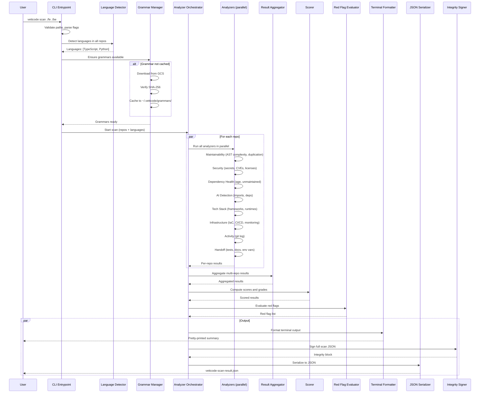
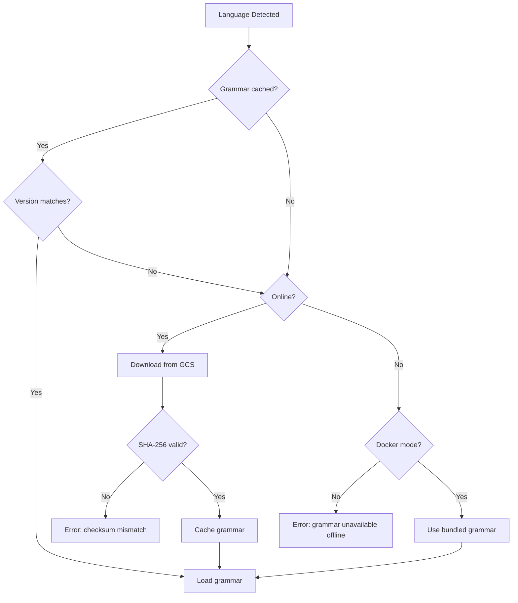

# VettCode Scanner (`vettcode-scanner`) -- Detailed Design Document

**Version:** 0.1-draft
**Status:** In Review
**Parent Document:** [00b-product-overview-technical.md](../00b-product-overview-technical.md)
**Milestone:** M1 -- Scanner MVP (Week 1-2)

---

## Table of Contents

1. [Component Overview](#1-component-overview)
2. [Functional Requirements](#2-functional-requirements)
3. [Technical Requirements](#3-technical-requirements)
4. [Architecture](#4-architecture)
5. [Solution Design](#5-solution-design)
6. [Tech Stack](#6-tech-stack)
7. [Inputs & Outputs](#7-inputs--outputs)
8. [Diagrams](#8-diagrams)
9. [Testing Plan](./01-scanner-testing.md) *(moved to separate document)*
10. [Capacity & Performance](#10-capacity--performance)
11. [Deployment & Distribution](#11-deployment--distribution)
12. [Milestones & Tickets](./01-scanner-tickets.md) *(moved to separate document)*
- [Appendix A: Secrets Detection Pattern Examples](#appendix-a-secrets-detection-pattern-examples)
- [Appendix B: AI Detection Pattern Examples](#appendix-b-ai-detection-pattern-examples)
- [Appendix C: Scoring Function Reference](#appendix-c-scoring-function-reference)

---

## 1. Component Overview

### Purpose

The `vettcode-scanner` is a privacy-first static analysis tool that analyzes software codebases and produces a structured health assessment. It is the foundational component of the VettCode platform -- every report begins with a scan. The scanner runs in two modes: **locally on the seller's machine** (CLI download) or **inside ephemeral Cloud Run containers** for GitHub-connected scans (see [02-platform-backend-design.md, FR-08](./02-platform-backend-design.md)). The same binary is used in both paths.

### Scope

The scanner:

- Accepts one or more local directory paths as input
- Detects languages, frameworks, infrastructure, and tooling
- Computes quantitative metrics across 9 categories (maintainability, security, dependency health, AI detection, tech stack, SRE/infra, development activity, ownership/handoff, codebase profile)
- Evaluates red flags (deal-killer conditions)
- Produces terminal-formatted summary output
- Produces a signed JSON file conforming to the Static Scan Result schema (Section 9a of product overview)
- In CLI mode, operates entirely on the seller's machine -- no source code, file names, or file paths ever leave the machine. In GitHub-connected mode, runs inside an ephemeral container that is destroyed after scanning.

### Boundaries

The scanner does NOT:

- Transmit any data over the network (except grammar downloads on first run)
- Perform LLM-based analysis (that is the Deep Scan, handled by the platform)
- Generate signed reports (that is the platform's responsibility)
- Provide recommendations or remediation advice (reserved for Deep Scan)
- Analyze Solidity/smart contracts (deferred to V2)
- Score AI moat or defensibility (Deep Scan only -- scanner only detects AI presence)

### Privacy Guarantees

**Two-audience design:** The scanner produces two outputs with different privacy levels:

1. **Terminal output** (seller-only, ephemeral, never uploaded) — shows **real file paths** so sellers can locate hotspots, fix issues, and rescan. This is displayed on the seller's own machine and is never transmitted anywhere.
2. **JSON output** (uploaded to platform, seen by buyers) — contains **only hashed file identifiers** (SHA-256 of paths). No file names, paths, or structural information is recoverable.

The following data categories NEVER appear in the **JSON output** (and therefore never leave the seller's machine):

- Source code (files, functions, classes, variables)
- File names and file paths (only SHA-256 hashes appear in JSON)
- Inline comments or documentation content
- Git commit messages or author emails
- Environment variable values (only counts)
- Secret values (only counts -- no content revealed)

The JSON output contains ONLY:

- Aggregate numeric metrics (averages, counts, percentages)
- Hashed file identifiers (SHA-256)
- Package names and versions (from public dependency manifests)
- CVE identifiers (public knowledge)
- Binary detection flags (yes/no)
- Computed scores and grades

**Co-signing network call:** By default, the scanner makes two brief API calls to VettCode's platform during scanning to obtain a co-signature (see Section 5.8). These calls transmit only a cryptographic hash and a nonce — no scan content, source code, or metrics. The `--offline` flag disables these calls entirely for fully airgapped operation, at the cost of lower report trust level.

---

## 2. Functional Requirements

### FR-1: CLI Installation and Usage

**User Story:** As a seller, I want to install VettCode with a single command so I can scan my code immediately.

**Acceptance Criteria:**

- AC-1.1: Go binary distributed for macOS (ARM64 + AMD64), Linux (AMD64), and Windows (AMD64) via GitHub Releases
- AC-1.2: Installation via `curl -sSfL https://get.vettcode.com | sh` (macOS/Linux) or direct download
- AC-1.3: Homebrew tap available: `brew install vettcode/tap/vettcode`
- AC-1.4: Binary is statically linked, requires no runtime dependencies. Language analyzers are downloaded on first run (see FR-4).
- AC-1.5: `vettcode version` prints version, build date, commit hash, and OS/arch
- AC-1.6: `vettcode help` (or `vettcode --help`, or `vettcode` with no arguments) prints usage with all available commands and flags. See Section 7.1a for the full help output text.
- AC-1.7: `vettcode scan --help` prints scan-specific usage with examples. See Section 7.1a for the full help output text.

### FR-2: Docker Image

**User Story:** As a seller, I want a Docker image with all analyzers bundled so I can scan in any environment — including air-gapped networks.

**Acceptance Criteria:**

- AC-2.1: Official Docker image published to Docker Hub and GitHub Container Registry
- AC-2.2: Image includes all language analyzers for V1 languages (JS/TS, Python, Go, PHP, Ruby, Java)
- AC-2.3: Usage: `docker run -v $(pwd):/scan vettcode/scanner scan /scan`
- AC-2.4: Docker image defaults to **co-signing enabled** (same behavior as the native binary). If the container has network access, it co-signs with the platform automatically.
- AC-2.5: If the container has **no network access**, co-signing fails gracefully and the scanner falls back to `--offline` mode automatically (report carries `verification_level: "self_reported"`)
- AC-2.6: User can explicitly pass `--offline` to skip co-signing: `docker run -v $(pwd):/scan vettcode/scanner scan --offline /scan`
- AC-2.7: Image works fully offline with all grammars pre-bundled (no grammar downloads needed)
- AC-2.8: Output JSON is written to mounted volume
- AC-2.9: Terminal output is printed to stdout

### FR-3: Multi-Repo Scanning

**User Story:** As a seller with a multi-repo product (frontend, backend, infra), I want to scan all repos in one command so the report reflects my full product.

**Acceptance Criteria:**

- AC-3.1: `vettcode scan ./fe ./be ./infra` scans all three directories
- AC-3.2: Each repo is analyzed independently and results are aggregated
- AC-3.3: Repo labels default to directory names but can be overridden: `vettcode scan --label frontend:./fe --label backend:./be`
- AC-3.4: Per-repo metrics are preserved in the JSON output (`repositories` array)
- AC-3.5: Aggregated metrics (total LOC, category scores) span all repos
- AC-3.6: Red flags are evaluated across the full product, not per-repo
- AC-3.7: Non-existent paths produce a clear error and abort the scan

### FR-4: Language Detection and Grammar Management

**User Story:** As a seller, I want the scanner to automatically detect my languages and download only the grammars it needs so the CLI stays small.

**Acceptance Criteria:**

- AC-4.1: Language detection runs before analysis by scanning file extensions and dependency manifests
- AC-4.2: Slim CLI binary (<30MB) contains core engine and all V1 analyzers (compiled-in); only parser grammars are downloaded on demand
- AC-4.3: Grammars are WASM files (platform-independent, single build per grammar) downloaded from GCS multi-region bucket with SHA-256 checksum verification
- AC-4.4: Downloaded grammars are cached in `~/.vettcode/grammars/` and reused across scans
- AC-4.5: If a required grammar is not cached and network is unavailable, the scanner prints a clear error listing missing grammars and how to proceed (`--offline` with pre-cached grammars or Docker image)
- AC-4.6: V1 has no user-facing grammar management commands; grammar lifecycle is automatic at scan time
- AC-4.7: Docker image bundles all V1 grammars (no download needed)
- AC-4.8: Grammar version is checked against scanner version on download; incompatible versions produce a clear error with upgrade instructions

### FR-5: Code Maintainability Analysis

**User Story:** As a buyer (via the report), I want to understand how maintainable the codebase is so I can estimate post-acquisition engineering effort.

**Acceptance Criteria:**

- AC-5.1: Cyclomatic complexity computed per function via language-specific AST parsing
- AC-5.2: Output includes avg complexity, p90 complexity, and max complexity
- AC-5.3: Nesting depth computed per function; output includes avg and max
- AC-5.4: File size distribution computed (file count by LOC buckets)
- AC-5.5: Code duplication percentage computed via token-based detection
- AC-5.6: Hotspot files identified (top files by complexity). **Terminal output** shows real file paths (e.g., `src/services/payment.ts`) so sellers can locate and fix issues. **JSON output** includes only file path hash, complexity score, LOC, and repo label — no file names.
- AC-5.7: Maintainability score (0-100) and letter grade computed from weighted combination of complexity, duplication, nesting depth, and file size metrics

### FR-6: Security Posture Analysis

**User Story:** As a buyer, I want to know if there are hardcoded secrets, known vulnerabilities, or license issues so I can assess security risk.

**Acceptance Criteria:**

- AC-6.1: Hardcoded secrets detected via regex patterns + Shannon entropy analysis (truffleHog-style)
- AC-6.2: Secret count reported without revealing content, file names, or locations
- AC-6.3: Known CVEs detected by parsing dependency lockfiles and querying OSV database
- AC-6.4: CVE output includes CVE ID, severity (critical/high/medium/low), package name, current version, fixed version, and repo label
- AC-6.5: CVE summary with counts per severity level
- AC-6.6: Outdated dependency count computed by comparing locked versions to latest published versions
- AC-6.7: License compatibility issues detected via SPDX license identification in dependency manifests
- AC-6.8: Security score (0-100) and letter grade computed from secrets count, CVE severity, outdated deps ratio, and license issues

### FR-7: Dependency Health Analysis

**User Story:** As a buyer, I want to know the age and maintenance status of dependencies so I can assess supply chain risk.

**Acceptance Criteria:**

- AC-7.1: Median dependency age computed from package registry publish dates
- AC-7.2: Percentage of unmaintained dependencies (no update in 2+ years) computed
- AC-7.3: Oldest dependency identified by name and age
- AC-7.4: Dependency count reported per repo

### FR-8: AI Detection

**User Story:** As a buyer, I want to know if the product uses AI/ML and in what capacity so I can assess the AI moat (or lack thereof).

**Acceptance Criteria:**

- AC-8.1: LLM API usage detected via import/dependency scanning (openai, anthropic, cohere, google-generativeai, etc.)
- AC-8.2: Vector database detected (pinecone, weaviate, chromadb, qdrant, milvus, pgvector, etc.)
- AC-8.3: RAG pipeline detected via combination of vector DB + LLM API + document loading patterns
- AC-8.4: MCP (Model Context Protocol) server/client detected
- AC-8.5: Fine-tuning scripts or model artifacts detected
- AC-8.6: Training pipeline code detected
- AC-8.7: Proprietary dataset indicators detected (ETL patterns, data processing, custom dataset loading)
- AC-8.8: All outputs are binary flags (yes/no) with provider/tool names where applicable

### FR-9: Tech Stack Detection

**User Story:** As a buyer, I want to know exactly what technologies the product uses so I can assess compatibility with my team.

**Acceptance Criteria:**

- AC-9.1: Frameworks detected from dependency files (package.json, requirements.txt, go.mod, Gemfile, etc.)
- AC-9.2: Runtime versions detected from config/lockfiles (e.g., .nvmrc, .python-version, go.mod)
- AC-9.3: Databases detected from dependencies + config files (connection strings, ORM configs)
- AC-9.4: External services detected from dependency/import scanning (Stripe, SendGrid, Twilio, AWS SDK, etc.)

### FR-10: SRE and Infrastructure Detection

**User Story:** As a buyer, I want to know if proper infrastructure tooling is in place so I can assess operational maturity.

**Acceptance Criteria:**

- AC-10.1: IaC presence detected (Dockerfile, docker-compose.yml, Terraform, Pulumi, CloudFormation, K8s manifests)
- AC-10.2: CI/CD presence detected (GitHub Actions, GitLab CI, CircleCI, Jenkins, etc.)
- AC-10.3: Monitoring/observability detected (Datadog, Sentry, New Relic, Prometheus, Grafana, etc.)
- AC-10.4: Each detection includes type/provider name

### FR-11: Development Activity Analysis

**User Story:** As a buyer, I want to understand the development velocity and recency so I can assess whether the product is actively maintained.

**Acceptance Criteria:**

- AC-11.1: Last commit date extracted from git log
- AC-11.2: Commit velocity computed as average commits per month over the last 12 months
- AC-11.3: Monthly commit counts for the last 12 months reported as an array
- AC-11.4: Trend classified as "increasing", "stable", or "declining" based on linear regression of monthly counts
- AC-11.5: Active development months (months with >0 commits) counted out of the last 12
- AC-11.6: If `.git` directory is not present, activity metrics are omitted with a note in the output
- AC-11.7: Days since last commit computed

### FR-12: Ownership and Handoff Readiness

**User Story:** As a buyer, I want to understand how easy it would be to take over this codebase so I can plan onboarding.

**Acceptance Criteria:**

- AC-12.1: Estimated test coverage percentage computed via test-effectiveness heuristic (`min(100, testLOC / sourceLOC × 4)` for Tier 1 languages). See Section 5.6 for detection patterns and computation.
- AC-12.2: Documentation density classified as high/medium/low based on README presence, inline comment ratio, and doc file count
- AC-12.3: Environment variable count computed from .env.example, .env.template, or config schema files
- AC-12.4: Boolean flags for: has_readme, has_contributing_guide, has_env_template, has_setup_script
- AC-12.5: Handoff readiness score (0-100) and letter grade computed (contributor count is NOT scored — it is surfaced as raw data in Development Activity)
- AC-12.6: HEAD commit SHA (`git rev-parse HEAD`) captured per repository and included in the scan JSON (stored for V2 dedup fingerprinting)

### FR-13: Red Flags Detection

**User Story:** As a buyer, I want deal-killer issues surfaced immediately so I can make a quick go/no-go decision.

**Acceptance Criteria:**

- AC-13.1: The following conditions trigger red flags:
  - Secrets detected (any count > 0) -- severity: critical
  - Critical or high CVEs found -- severity: critical
  - No tests found (0% coverage) -- severity: high
  - No CI/CD detected -- severity: medium
  - Last commit > 6 months ago -- severity: high
  - No README in any repository -- severity: medium
  - 50%+ dependencies unmaintained -- severity: high
- AC-13.2: Red flags are prominently displayed at the top of terminal output
- AC-13.3: Red flags include a human-readable detail string and severity level
- AC-13.4: Red flag count is displayed as a headline number

### FR-14: Terminal Output

**User Story:** As a seller, I want a clear, well-formatted terminal summary so I can understand my scan results immediately.

**Acceptance Criteria:**

- AC-14.1: Output follows the exact format specified in Section 8 of the product overview
- AC-14.2: Color-coded output (red for red flags, green for good scores, yellow for warnings) when terminal supports it
- AC-14.3: Grades displayed as letter grades (e.g., "B+") — no numeric scores shown
- AC-14.4: Deep scan upsell message shown at the bottom
- AC-14.5: Path to JSON output file shown
- AC-14.6: Scan duration shown
- AC-14.7: `--no-color` flag disables color output
- AC-14.8: `--quiet` flag suppresses terminal output (JSON only)

### FR-15: JSON Output

**User Story:** As a seller, I want a machine-readable JSON file so I can upload it to the VettCode platform for a signed report.

**Acceptance Criteria:**

- AC-15.1: JSON output conforms exactly to the schema in Section 9a of the product overview
- AC-15.2: Default output path is `./vettcode-scan-result.json`; overridable with `--output <path>`
- AC-15.3: JSON includes scan_id (UUID v4), timestamp (ISO-8601), and scanner_version
- AC-15.4: Integrity block includes SHA-256 checksum of the metrics+detection blob and Ed25519 signature
- AC-15.5: Pricing tier auto-determined based on total LOC

### FR-16: Offline Mode

**User Story:** As a seller in a restricted network environment, I want the scanner to work fully offline after initial setup.

**Acceptance Criteria:**

- AC-16.1: After grammars are cached locally, no network calls are made during scanning
- AC-16.2: CVE lookup uses a bundled OSV database snapshot when offline. In offline mode, CVE lookup for PHP, Ruby, and Java is skipped (snapshot covers npm, PyPI, and Go only). The scan result will indicate which ecosystems were not checked via a `cve_ecosystems_skipped` field in the security metrics (e.g., `["packagist", "rubygems", "maven"]`).
- AC-16.3: Dependency age/outdated checks are skipped when offline, with a note in output
- AC-16.4: `--offline` flag forces offline mode even if network is available
- AC-16.5: Docker image is fully self-contained for scanning (all grammars pre-bundled). Co-signing still requires network access; without it, the image falls back to offline mode automatically (see FR-2)

### FR-17: Version Check

**User Story:** As a seller, I want to know when a newer scanner version is available so I get the latest security patches and language support.

**Acceptance Criteria:**

- AC-17.1: On each scan (when online), check the latest version via `GET /api/v1/scanner/latest-version`. This is a lightweight, unauthenticated endpoint returning `{ "version": "1.4.2", "min_supported": "1.2.0", "download_url": "https://vettcode.com/download" }`
- AC-17.2: Check is throttled to **at most once per 24 hours** — result cached in `~/.vettcode/version-check.json` with a timestamp. Subsequent scans within 24h skip the check.
- AC-17.3: If a newer version is available, print a one-line notice **after** scan output (never before or during): `NOTE: A newer scanner version is available (v1.3.0 → v1.4.2). Run 'brew upgrade vettcode' or download from https://vettcode.com/download`
- AC-17.4: If the current version is below `min_supported`, print a **warning** instead: `WARN: This scanner version (v1.1.0) is no longer supported. Please upgrade to v1.4.2 or later.` (Scan still completes — the platform may reject uploads from unsupported versions in the future.)
- AC-17.5: Version check is **non-blocking** — runs concurrently with the scan in a separate goroutine. If the check times out (2s) or fails, it is silently ignored.
- AC-17.6: Skipped entirely in `--offline` mode
- AC-17.7: Can be disabled via `VETTCODE_NO_UPDATE_CHECK=true`
- AC-17.8: No auto-update — users control when they upgrade (critical for a security tool where binary integrity matters)

---

## 3. Technical Requirements

### Performance Targets

| Metric | Target |
| --- | --- |
| Scan time: 100K LOC | < 5 minutes |
| Scan time: 300K LOC | < 15 minutes |
| Scan time: 30K LOC | < 2 minutes |
| Peak memory usage | < 2 GB for 300K LOC |
| Slim CLI binary size | < 30 MB |
| Docker image size | < 250 MB |
| Plugin size (per language) | < 15 MB |

### Compatibility

| Requirement | Specification |
| --- | --- |
| macOS | ARM64 (Apple Silicon) + AMD64 (Intel), macOS 12+ |
| Linux | AMD64, glibc 2.17+ (CentOS 7+) |
| Windows | AMD64, Windows 10+ |
| Go version (build) | Go 1.22+ |
| Git version (for activity metrics) | Git 2.20+ (validated at scan start; warning + `--no-git` fallback if older or absent) |
| Docker (for Docker mode) | Docker 20.10+ (documented in README and install page; no runtime validation — cannot check host Docker version from inside the container) |

### Supported Languages (V1) — Tier 1: Full Analysis

| Language | Dependency Manifest | Lockfile | AST Complexity |
| --- | --- | --- | --- |
| JavaScript/TypeScript | package.json | package-lock.json, yarn.lock, pnpm-lock.yaml | Yes (via tree-sitter) |
| Python | requirements.txt, setup.py, pyproject.toml | Pipfile.lock, poetry.lock | Yes (via tree-sitter) |
| Go | go.mod | go.sum | Yes (via Go AST stdlib) |
| PHP | composer.json | composer.lock | Yes (via tree-sitter) |
| Ruby | Gemfile, *.gemspec | Gemfile.lock | Yes (via tree-sitter) |
| Java | pom.xml, build.gradle, build.gradle.kts | (Maven/Gradle lockfiles) | Yes (via tree-sitter) |

### Language Support Tiers

Not all languages require the same level of analysis. VettCode uses a tiered support model based on the target market (SaaS, e-commerce, and content businesses traded on Flippa, Acquire.com, and similar marketplaces).

| Tier | What it means | Languages | Timeline |
| --- | --- | --- | --- |
| **Tier 1 — Full Analysis** | AST complexity + dependency parsing + secrets + all metrics | JS/TS, Python, Go, PHP, Ruby, Java | V1 |
| **Tier 2 — Detection + LOC** | Language detected, LOC counted, included in tech stack report. No complexity or dependency analysis | HTML, CSS, SQL, Shell/Bash, Markdown, YAML, XML, Dockerfile, Terraform/HCL | V1 |
| **Tier 3 — Future Full Analysis** | Full Tier 1 analysis, added when market demands | Swift, Kotlin, Dart, Rust, C#/.NET, Elixir | Post-MVP |

**Rationale:**

- **Tier 1** covers ~95% of web/SaaS code traded on target marketplaces. E-commerce (~50% of Flippa listings) runs on PHP (Laravel, WordPress, Shopify), JS/TS (React, Next.js), and Python. SaaS (fastest-growing segment, +19% YoY) uses all six Tier 1 languages. Content sites (~25% of listings) are overwhelmingly PHP (WordPress).
- **Tier 2** languages appear in most projects but don't have meaningful complexity metrics. HTML/CSS have no cyclomatic complexity. Shell scripts, YAML, and Dockerfiles are infrastructure files. These are detected by the language detector (file extension matching) and counted in LOC/tech stack, but no AST parsing is performed.
- **Tier 3** targets mobile apps, which are a small and declining segment of the marketplace (mobile app profit multiples dropped from 9.92x to 2.93x on Flippa between 2022–2024). Cross-platform mobile apps built with React Native (JS/TS — already Tier 1) are already covered. Native Swift/Kotlin and Flutter/Dart will be added when market demand justifies the effort. Rust, C#/.NET, and Elixir are emerging in SaaS but remain niche for now.

**Tier 2 implementation:** The file walker and language detector already handle Tier 2 languages — they are identified by file extension, counted in total LOC, and reported in the tech stack section. No additional analyzer code is needed. If a project is 100% Tier 2 languages (e.g., a static HTML site), the scanner will report LOC, tech stack, and infrastructure metrics but complexity and dependency scores will be marked as "N/A — no supported languages detected."

### Offline Capability

- Grammars cached in `~/.vettcode/grammars/<lang>/<version>/`
- OSV database snapshot bundled with scanner binary (updated with each scanner release)
- Package registry lookups (for dependency age) require network; gracefully degrade when offline

---

## 4. Architecture

### 4.1 Component Diagram

```
+------------------------------------------------------------------+
|                      vettcode-scanner CLI                         |
|                                                                   |
|  +--------------------+    +--------------------+                 |
|  | CLI Entrypoint     |    | Config Loader      |                |
|  | (cobra commands)   |--->| (flags, env, file)  |                |
|  +--------------------+    +--------------------+                 |
|           |                         |                             |
|           v                         v                             |
|  +--------------------+    +--------------------+                 |
|  | Language Detector   |    | Grammar Manager    |                |
|  | (file ext + manifest|    | (download, cache,  |                |
|  |  scanning)          |    |  verify, load)     |                |
|  +--------------------+    +--------------------+                 |
|           |                         |                             |
|           v                         v                             |
|  +----------------------------------------------------------+    |
|  |              Analyzer Orchestrator                         |   |
|  |  (parallel execution per repo, collects results)          |   |
|  +----------------------------------------------------------+    |
|       |         |         |         |         |         |         |
|       v         v         v         v         v         v         |
|  +--------+ +--------+ +--------+ +--------+ +--------+ +-----+ |
|  |Maintain| |Security| |Dep     | |AI      | |Tech    | |SRE  | |
|  |ability | |Analyzer| |Health  | |Detect  | |Stack   | |Infra | |
|  |Analyzer| |        | |Analyzer| |Analyzer| |Detect  | |Detect| |
|  +--------+ +--------+ +--------+ +--------+ +--------+ +-----+ |
|       |         |         |         |         |         |         |
|       v         v         v         v         v         v         |
|  +--------+ +--------+                                           |
|  |Activity| |Handoff |                                           |
|  |Analyzer| |Analyzer|                                           |
|  +--------+ +--------+                                           |
|       |         |                                                 |
|       +----+----+                                                 |
|            v                                                      |
|  +----------------------------------------------------------+    |
|  |                    Result Aggregator                       |   |
|  |  (merge per-repo results, compute totals)                 |   |
|  +----------------------------------------------------------+    |
|            |                                                      |
|            v                                                      |
|  +--------------------+    +--------------------+                 |
|  | Scorer             |    | Red Flag Evaluator |                 |
|  | (metrics -> grades)|    | (threshold checks) |                 |
|  +--------------------+    +--------------------+                 |
|            |                         |                            |
|            v                         v                            |
|  +----------------------------------------------------------+    |
|  |                  Output Pipeline                           |   |
|  |  +------------------+  +------------------+  +-----------+|   |
|  |  |Terminal Formatter|  |JSON Serializer   |  |Integrity  ||   |
|  |  |(pretty-printer)  |  |(schema-compliant)|  |Signer     ||   |
|  |  +------------------+  +------------------+  +-----------+|   |
|  +----------------------------------------------------------+    |
+------------------------------------------------------------------+
```

### 4.2 CLI Command Structure

```
vettcode
  |-- scan <path...>           # Run static scan on one or more directories
  |     |-- --output, -o       # Output JSON file path (default: ./vettcode-scan-result.json)
  |     |-- --label            # Label repos: --label name:path (repeatable)
  |     |-- --offline          # Skip remote co-signing (fully local, no network calls; report carries "self_reported" trust level)
  |     |-- --no-color         # Disable color output
  |     |-- --quiet, -q        # Suppress terminal output
  |     |-- --format           # Output format: terminal, json, both (default: both)
  |     |-- --verbose, -v      # Verbose/debug output
  |
  |-- version                  # Print version info
  |-- help                     # Print usage
```

### 4.3 Analyzer Components Detail

#### Maintainability Analyzer

- **Input:** Source files (filtered by detected languages)
- **Process:** AST parsing per language for complexity/nesting; token-based duplication detection; file size histogram
- **Output:** `MaintainabilityResult` struct with complexity stats, duplication %, hotspot list, file size distribution

#### Security Analyzer

- **Input:** All files (for secrets), dependency lockfiles (for CVEs), dependency manifests (for licenses)
- **Process:** Regex + entropy scan for secrets; OSV lookup for CVEs; SPDX detection for licenses; version comparison for outdated deps
- **Output:** `SecurityResult` struct with secrets count, CVE list, outdated dep count, license issue list

#### Dependency Health Analyzer

- **Input:** Dependency lockfiles
- **Process:** Query package registry APIs for publish dates (online) or use cached data (offline)
- **Output:** `DependencyHealthResult` struct with median age, unmaintained %, oldest dep

#### AI Detection Analyzer

- **Input:** Dependency manifests, import statements
- **Process:** Pattern matching against curated lists of AI/ML packages and import patterns
- **Output:** `AIDetectionResult` struct with binary flags per AI category

#### Tech Stack Detector

- **Input:** Dependency manifests, config files, lockfiles
- **Process:** Pattern matching against known framework/runtime/database/service signatures
- **Output:** `TechStackResult` struct with framework list, runtime versions, database list, external service list

#### Infrastructure Detector

- **Input:** File system scan for known config file names and patterns
- **Process:** Check for Dockerfile, docker-compose.yml, .github/workflows/, .gitlab-ci.yml, terraform/, k8s manifests, monitoring tool configs/dependencies
- **Output:** `InfraResult` struct with IaC type, CI/CD provider, monitoring tool flags

#### Activity Analyzer

- **Input:** `.git` directory (git log output)
- **Process:** Parse git log for commit dates, compute monthly counts, trend, active months, contributor count
- **Output:** `ActivityResult` struct with last commit date, velocity array, trend, contributor count

#### Handoff Analyzer

- **Input:** File system scan, test configs, .env files
- **Process:** Compute estimated test coverage via file ratio (see Section 5.6); count docs; scan .env.example; check for README, CONTRIBUTING, setup scripts. Contributor count is NOT included in handoff scoring — it penalizes solo founders (the primary target market) without adding handoff signal. It is surfaced as raw data in Development Activity instead.
- **Output:** `HandoffResult` struct with estimated test coverage %, doc density, env var count, boolean flags (`has_test_config`, `has_coverage_config`)

### 4.4 Scorer

The scorer converts raw metrics into scores (0-100) and letter grades. Only categories with quantifiable, scoreable metrics get a grade. The remaining categories produce structured data and flags but no grade — buyers interpret this data based on what matters for their deal.

**Scored categories (letter grade):** *(quick reference — authoritative weights and formulas in [06 — Scoring Methodology](./06-scoring-methodology.md))*

| Category | Components |
| --- | --- |
| Maintainability | Complexity (40%), Duplication (30%), Nesting (15%), File sizes (15%) |
| Security | Secrets (35%), CVEs (45%), Licenses (20%) |
| Handoff Readiness | Est. test coverage (50%), Doc density (25%), Env vars (25%) |
| Dependency Health | Median age (50%), Unmaintained % (50%) |
| Development Activity | Recency (40%), Velocity (30%), Consistency (30%) |
| SRE & Infrastructure | IaC (35%), CI/CD (40%), Monitoring (25%) |

**Data-only categories (no grade — structured data and flags):**

| Category | Output Type |
| --- | --- |
| AI Detection | Binary flags (LLM API, Vector DB, RAG, MCP, proprietary data pipeline) |
| Tech Stack | Detected frameworks, runtimes, databases, external services |
| Codebase Profile | LOC, file count, language breakdown, repo count |

**Grade scale and scoring formulas:** See [06 — Scoring Methodology](./06-scoring-methodology.md) for the complete grade scale (A through F, no A+), all per-metric scoring functions, thresholds, and rationale. Doc 06 is the single source of truth for all scoring logic.

**Overall grade weights** (for quick reference — authoritative source is doc 06 Section 4):

| Category | Weight |
| --- | --- |
| Security | 25% |
| Maintainability | 20% |
| Handoff Readiness | 20% |
| Development Activity | 15% |
| Dependency Health | 10% |
| SRE & Infrastructure | 10% |

### 4.5 Red Flag Evaluator

Runs after scoring. Evaluates threshold conditions against aggregated results. Each triggered flag produces a `RedFlag` struct with `flag` (enum), `detail` (human-readable string), and `severity` (critical/high/medium).

### 4.6 Integrity Signer

- Scanner ships with a hardcoded Ed25519 public key ID
- Private key is embedded in the binary (obfuscated, but this is "scanner attestation" not a security boundary -- the real tamper protection comes from the platform's signature on the report)
- Signs a SHA-256 hash of the entire scan JSON (excluding the `integrity` block itself)
- Output: `integrity.scan_checksum`, `integrity.scanner_public_key_id`, `integrity.scanner_signature`

---

## 5. Solution Design

### 5.1 Cyclomatic Complexity Computation

**Approach:** Language-specific AST parsing using tree-sitter for JS/TS, Python, PHP, Ruby, and Java, and Go's native `go/ast` package for Go.

**Algorithm per function:**

1. Parse source file into AST
2. Walk the AST and identify function/method definitions
3. For each function, count decision points:
   - `if`, `else if`, `elif`, `elsif` (Ruby), `elseif` (PHP) -- +1 each
   - `for`, `while`, `do-while`, `foreach` (PHP), `until` (Ruby) -- +1 each
   - `case` (in switch/match/when) -- +1 each
   - `catch`/`except`/`rescue` (Ruby) -- +1 each
   - `&&`, `||` (boolean operators) -- +1 each
   - `?.` (optional chaining in JS/TS), `&.` (safe navigation in Ruby) -- +1 each
   - Ternary operator -- +1 each
   - `and`, `or` (Python, Ruby, PHP keyword boolean operators) -- +1 each
4. Base complexity = 1 (for the function itself)
5. Total = 1 + decision point count

**Language-specific function detection:**

| Language | Function/method node types |
| --- | --- |
| JS/TS | `function_declaration`, `method_definition`, `arrow_function`, `function_expression` |
| Python | `function_definition`, `lambda` |
| Go | `function_declaration`, `method_declaration`, `func_literal` |
| PHP | `function_definition`, `method_declaration`, `anonymous_function_creation_expression` |
| Ruby | `method`, `singleton_method`, `lambda`, `block` (when > 5 lines) |
| Java | `method_declaration`, `constructor_declaration`, `lambda_expression` |

**Nesting depth:** During AST walk, track current nesting level. Record max and accumulate for average.

**Why tree-sitter:** It provides a unified C library with Go bindings, supports incremental parsing, handles syntax errors gracefully (important for real-world codebases), and supports all V1 languages. Grammars are distributed as WASM files (platform-independent, no OS/arch matrix). For Go specifically, we use the stdlib `go/ast` parser since it is more accurate and idiomatic.

**Implementation detail:** Each language analyzer package exports a `ComputeComplexity(filePath string) (*ComplexityResult, error)` function. The orchestrator fans out across files using a worker pool (bounded by `runtime.NumCPU()`).

### 5.2 Code Duplication Detection

**Approach:** Token-based detection (similar to PMD-CPD).

**Algorithm:**

1. Tokenize source files using tree-sitter (reuse AST from complexity pass)
2. Normalize tokens: strip whitespace, normalize identifiers (replace variable/function names with placeholders), keep structure tokens
3. Generate rolling hash sequences (Rabin-Karp) with a window of 50 tokens (configurable)
4. Build a hash-to-location index
5. Sequences appearing 2+ times are potential duplicates
6. Merge adjacent duplicate sequences into duplicate blocks
7. Filter blocks shorter than 6 lines (minimum meaningful duplication)
8. Compute duplication percentage: (duplicated LOC / total LOC) * 100

**Why token-based (not line-based or AST-based):**

- Line-based misses reformatted duplicates
- AST-based (structural clone detection) is more accurate but significantly slower and complex to implement cross-language
- Token-based provides a good balance of accuracy, speed, and cross-language applicability

### 5.3 Secrets Detection

**Approach:** Multi-layered detection combining regex patterns and Shannon entropy analysis.

**Layer 1 -- Regex patterns (~200 patterns):**

- API keys: AWS, GCP, Azure, OpenAI, Stripe, SendGrid, Twilio, etc.
- Tokens: JWT, OAuth, GitHub PAT, npm tokens
- Connection strings: database URLs with credentials
- Private keys: PEM-encoded RSA, DSA, EC keys
- Generic patterns: `password=`, `secret=`, `api_key=` assignments with string values

**Layer 2 -- Shannon entropy analysis:**

- For strings that match structural patterns (e.g., `AKIA` prefix for AWS) but also for unmatched high-entropy strings
- Compute Shannon entropy of candidate strings
- Threshold: entropy > 4.5 for hex strings, > 4.0 for base64 strings (calibrated to reduce false positives)
- Minimum string length: 16 characters
- Snake_case / kebab-case identifiers (e.g., `legacy_cloud_feature_flag`) are excluded — these are config keys, not secrets

**Layer 3 -- Allowlist filtering:**

- Exclude known false positives: example values in docs, test fixtures, placeholder strings
- Exclude files matching common test/fixture patterns (`tests/`, `docs/`, `doc/`, `readme`, `examples/`, etc.)
- Exclude template variable references: `${{ secrets.* }}` (GitHub Actions), `{{ .Env.* }}` (Go templates), `${VAR}` (shell), `process.env.*` (Node.js), `os.environ` (Python)
- Exclude regex pattern definition lines (all Tier 1 languages) to prevent the scanner from flagging its own patterns

**Output:** Count only in the **JSON output** — no file names, line numbers, or secret content. The **terminal output** shows file paths where secrets were detected (e.g., `src/config.ts: 2 potential secrets`) so the seller can locate and remove them before rescanning. Secret values are never shown in either output.

### 5.4 CVE Lookup

**Online mode:**

1. Parse dependency lockfiles to extract package name + exact version
2. Query the OSV.dev API (`https://api.osv.dev/v1/query`) per package ecosystem
3. Map OSV results to CVE IDs, severity (CVSS), affected version ranges, and fix versions
4. Cache results in `~/.vettcode/cache/osv/` with 24-hour TTL

**Offline mode:**

1. Scanner binary bundles a compressed OSV database snapshot (updated with each scanner release)
2. Snapshot contains a pre-built index: `ecosystem:package:version -> [CVE entries]`
3. Snapshot is ~5-10 MB compressed. The bundled snapshot covers npm, PyPI, and Go ecosystems. PHP (Packagist), Ruby (RubyGems), and Java (Maven Central) CVE lookups require online API access and are not available in offline mode (`--offline`). When running offline, the scan result JSON will include a note in the CVE section indicating that PHP/Ruby/Java CVE data was not checked.
4. Lookup is a local hash map query -- fast and fully offline

**Outdated dependency detection (online only):**

1. Query package registry APIs for latest version:
   - npm: `https://registry.npmjs.org/<package>/latest`
   - PyPI: `https://pypi.org/pypi/<package>/json`
   - Go: `https://proxy.golang.org/<module>/@latest`
2. Compare locked version to latest; flag if major version behind or >12 months old
3. When offline, skip outdated check and note in output

### 5.5 AI Detection

**Approach:** Pattern matching against curated detection lists.

**Detection matrix:**

| Category | Detection Method | Example Matches |
| --- | --- | --- |
| LLM API | Dependency name matching | `openai`, `anthropic`, `cohere`, `google-generativeai`, `langchain`, `llama-index` |
| Vector DB | Dependency name matching | `pinecone-client`, `weaviate-client`, `chromadb`, `qdrant-client`, `pgvector` |
| RAG Pipeline | Combination signal | Vector DB + LLM API + document loader patterns (e.g., `langchain.document_loaders`) |
| MCP | Dependency/config matching | `@modelcontextprotocol/sdk`, `mcp` in config files |
| Fine-tuning | File pattern matching | Files matching `*fine*tune*`, `*train*`, wandb/mlflow configs |
| Training Pipeline | Import pattern matching | `torch`, `tensorflow`, `transformers.Trainer`, `datasets` library |
| Proprietary Data | Pattern matching | ETL frameworks (`airflow`, `prefect`, `dagster`), custom data loading patterns, `pandas` + file I/O patterns |

**Implementation:** Each detection rule is a struct with:

```
type AIDetectionRule struct {
    Category    string           // e.g., "llm_api"
    Type        string           // "dependency" | "import" | "file_pattern" | "config"
    Patterns    []string         // regex or exact match patterns
    Ecosystems  []string         // which ecosystems to check ("npm", "pypi", "go")
    Confidence  string           // "high" | "medium"
}
```

Rules are loaded from a YAML/JSON config bundled with the scanner, making them easy to update without code changes.

### 5.6 Test Coverage Estimation

The scanner cannot execute test suites (that would require installing dependencies, build tools, and language runtimes — out of scope for a static analysis tool). V1 uses a **test-effectiveness heuristic** as a proxy.

**Test file detection — naming conventions per language:**

| Language | Test file patterns |
| --- | --- |
| Go | `*_test.go` |
| JS/TS | `*.test.{js,ts,jsx,tsx}`, `*.spec.{js,ts,jsx,tsx}`, files under `__tests__/` |
| Python | `test_*.py`, `*_test.py`, files under `tests/` |
| Java | `*Test.java`, `*Tests.java`, files under `src/test/` |
| Ruby | `*_spec.rb`, files under `spec/` |
| PHP | `*Test.php`, files under `tests/` |

Detection runs during the file walker pass — each file is classified as test or source based on the patterns above. Only **Tier 1 languages** are included in the coverage estimate; Tier 2 files (Markdown, YAML, etc.) have no test conventions and would dilute the estimate.

**Coverage computation:**

```
estimated_test_coverage_pct = min(100, testLOC / sourceLOC * 4 * 100)
```

- Uses a **4× test-effectiveness multiplier** — each line of test code typically exercises ~4 lines of source through setup, assertions, and mocking
- Calibrated against real projects with known test coverage (e.g., a project with 70% actual Jest line coverage and a 0.167 test/source LOC ratio yields `0.167 × 4 = 67%`)
- Only Tier 1 language LOC is counted; if sourceLOC is 0, coverage is 0
- Example: 2000 source LOC + 250 test LOC → `250/2000 * 4 * 100 = 50%` estimated coverage

**Test framework config detection (bonus signals — not scored):**

| Signal | Files checked |
| --- | --- |
| Test framework config | `jest.config.*`, `vitest.config.*`, `pytest.ini`, `pyproject.toml` `[tool.pytest]`, `phpunit.xml`, `.rspec`, `build.gradle` `test {}` block |
| Coverage config | `.nycrc`, `istanbul.yml`, `.coveragerc`, `coverage` key in `package.json` |

These produce boolean flags (`has_test_config`, `has_coverage_config`) in the output. They provide context alongside the ratio but do not affect the score.

**Output field:** `estimated_test_coverage_pct` — terminal and report display as "Est. Test Coverage" to make clear this is a file-ratio proxy, not actual execution coverage.

### 5.7 Analyzer Plugin System

**V1 approach — embedded analyzers with lazy initialization:**

V1 ships all six language analyzers (JS/TS, Python, Go, PHP, Ruby, Java) as **compiled-in packages** for simplicity and reliability. The slim CLI achieves its size target through tree-sitter WASM grammar files being downloaded on demand rather than the analyzer code itself. The "plugin" concept is preserved in the architecture for future extensibility (V2+), but V1 does not use dynamic loading.

**Tree-sitter grammar download flow:**

1. Scanner detects languages in the target repos
2. For each detected language, check `~/.vettcode/grammars/<lang>/<version>/`
3. If grammar is cached, verify the cached version matches the scanner's expected grammar version (from hardcoded manifest). If mismatched, re-download.
4. If grammar not cached or version mismatched, download from GCS: `https://storage.googleapis.com/vettcode-grammars/<version>/tree-sitter-<lang>.wasm`
5. Verify SHA-256 checksum against hardcoded manifest in the binary
6. Cache grammar file for future scans
7. Load WASM grammar at runtime for tree-sitter parsing

**Grammar hosting: GCS multi-region bucket.**

- Bucket: `vettcode-grammars`, multi-region (US + EU + Asia auto-replication)
- Public read access, no authentication needed
- CI uploads WASM grammar files on each scanner release (GoReleaser post-hook) — one `.wasm` file per language (no OS/arch matrix)
- Cost: effectively $0/mo — ~225 MB storage ($0.006/mo), egress within GCS 100 GB/mo free tier (supports ~5,000 users/month before any charges)
- Multi-region ensures low latency globally without a CDN layer — GCS automatically serves from the nearest region

**Grammar download UX: auto-download with notice (no prompt).**

When the scanner needs a grammar that isn't cached, it downloads automatically and prints progress to stderr:

```
Downloading TypeScript grammar (2.8 MB)... done
Downloading Python grammar (1.9 MB)... done
```

No interactive prompt — the user ran `vettcode scan`, they expect it to work. This follows the same pattern as `go mod download` and `rustup`. Users who want to prevent any network access use `--offline` (scanner errors with a clear message listing missing grammars) or the Docker image (all grammars pre-bundled).

**Docker image:** Bundles all grammars. No downloads needed.

**Why WASM grammars (not native .so/.dylib/.dll):** Native shared libraries require an OS/arch build matrix (linux/darwin × amd64/arm64 = 4+ builds per grammar), and macOS Gatekeeper quarantines downloaded `.dylib` files — a real problem for non-developer users. WASM grammars are platform-independent (one `.wasm` file per language works everywhere), immune to Gatekeeper/code-signing issues, and safe to download through corporate firewalls. The ~2-5x parsing slowdown vs native is negligible for a CLI that runs once per scan. This eliminates the #1 cross-platform distribution risk.

**Why not Go plugins (`plugin` package):** Go's plugin system requires exact build-environment matching (same Go version, same dependency versions), making it impractical for distributing plugins separately from the main binary. Compiled-in with lazy grammar download is more reliable.

### 5.8 Scanner Signature (Integrity)

> See also: [Product Overview, Section 13 — Ed25519 Key Management](../00b-product-overview-technical.md#ed25519-key-management) for the overall key management policy. The scanner owns key embedding; the platform backend owns verification; infrastructure owns key lifecycle.

**Purpose:** Prove to the platform that a scan result was produced by an official VettCode scanner, not hand-crafted or tampered with.

**Mechanism:**

1. Scanner embeds an Ed25519 private key (rotated with each major release)
2. After the entire scan JSON is assembled, serialize all fields except the `integrity` block using **canonical JSON serialization** (rules below)
3. Compute SHA-256 hash of the serialized output
4. Sign the hash with the embedded Ed25519 private key
5. Output:
   - `integrity.scan_checksum`: the SHA-256 hash of the full scan JSON (excluding `integrity` block)
   - `integrity.scanner_public_key_id`: identifier for the key pair (e.g., "vettcode-scanner-key-2026-03")
   - `integrity.scanner_signature`: the Ed25519 signature (base64-encoded)

**Canonical JSON serialization rules:**

Both the scanner (Go) and platform (Python) must produce byte-identical output for the same logical JSON. The rules follow [RFC 8785 (JCS)](https://www.rfc-editor.org/rfc/rfc8785) with these specifics:

| Rule | Spec | Why it matters |
| --- | --- | --- |
| Key ordering | Recursive lexicographic sort by Unicode code point (all nesting levels) | Go `encoding/json` and Python `json.dumps(sort_keys=True)` both do this |
| Whitespace | No whitespace — `separators=(",", ":")` in Python, `json.Marshal` default in Go | Prevents formatting differences |
| Unicode escaping | Characters U+0000–U+001F escaped as `\uXXXX`. All other characters output as literal UTF-8 (no `\uXXXX` for printable chars) | Go's `json.Marshal` escapes `<`, `>`, `&` by default — **must use `json.Encoder` with `SetEscapeHTML(false)`** |
| Number formatting | Integers as integers (no `.0`), floats with no trailing zeros, no scientific notation for values representable as fixed-point | Go and Python differ on float formatting — all VettCode metrics are integers, so this is enforced by schema |
| Null handling | Explicit `null` values are included (not omitted) | Go `omitempty` must NOT be used on nullable fields in the integrity-signed portion |
| Encoding | UTF-8, no BOM | Both languages default to this |

**Cross-language test vectors** (scanner and platform must both produce these exact bytes for the given input):

```
Input:  {"z": 1, "a": {"c": true, "b": [3, 1, 2]}, "m": null}
Output: {"a":{"b":[3,1,2],"c":true},"m":null,"z":1}
SHA-256: ad507d446db1dec51409507e057e5904c5507aecc69126227b28bf79c77e06f3

Input:  {"name": "Acme™ SaaS", "loc": 42600, "score": 87, "flags": []}
Output: {"flags":[],"loc":42600,"name":"Acme™ SaaS","score":87}
SHA-256: eba6b376ec325015a44114dd546bff5650df60b5f49beab4cb2f95d594261c6f

Input:  {"emoji": "🔒", "path": "src/auth/login.ts", "null_field": null}
Output: {"emoji":"🔒","null_field":null,"path":"src/auth/login.ts"}
SHA-256: f5611ee69af536c6027950e16e198e2438555b8fefb0faa7c52b3c580090c245
```

These test vectors are included in the scanner's unit test suite (SC-053) and the platform's signature service tests (T6.2). Both must produce identical SHA-256 hashes for the same input.

**Why hash the full JSON, not just metrics?** All fields matter — `repositories` (LOC, repo count), `summary` (top risks, top strengths), `pricing_tier`, `activity`, `tech_stack`. Hashing only `metrics` + `detection` would leave these fields unprotected and allow tampering without invalidating the signature.

**Verification by platform:**

- Platform stores the corresponding public key for each `scanner_public_key_id` in a public key registry
- On JSON upload, platform verifies the signature
- If verification fails, reject the upload with an error

**Key rotation coordination:**

- The scanner key is rotated with each **major** scanner release (not minor/patch)
- Key ID format: `vettcode-scanner-key-YYYY-MM` (e.g., `vettcode-scanner-key-2026-03`)
- Before each major release, the new public key must be registered in the platform backend's public key registry. This is a **release checklist item** — shipping a scanner with a key the platform doesn't recognize will cause all uploads from that version to fail.
- Old public keys remain valid on the platform for the version compatibility overlap period (see [Section 9, Version Compatibility Policy](../00b-product-overview-technical.md#version-compatibility-policy-applies-to-all-data-contracts))

**Compromise response:**

- If the embedded private key is extracted and used to forge scan data: publish a security advisory, revoke the compromised key ID on the platform (reject new uploads signed with it), and issue an emergency scanner release with a new key
- Existing reports signed with the compromised key retain their signatures but the platform can flag them with a warning via the public key registry's revocation status

**Remote Co-Signing (V1 — Default Behavior):**

After computing the local scan hash and scanner signature, the scanner co-signs with the platform to prevent forgery:

1. Scanner calls `POST /api/v1/cosign/init` → receives `{ session_id, nonce, expires_at }` (nonce valid 15 min)
2. Scanner includes `nonce` in the integrity block before computing the final hash
3. Scanner signs locally with the embedded key (as above)
4. Scanner calls `POST /api/v1/cosign/complete` with `{ session_id, scan_checksum, scanner_signature, scanner_public_key_id }`
5. Platform verifies the nonce is valid/unused, verifies the scanner signature, then co-signs the checksum
6. Platform returns `{ platform_cosignature, platform_public_key_id }`
7. Scanner embeds both signatures in the integrity block

**Privacy guarantee:** Only a hash and nonce are sent to VettCode's API — no scan content, no source code, no metrics. The "privacy-first" promise remains intact.

**`--offline` flag:**
- Skips co-signing entirely. The integrity block contains only the scanner signature (`platform_cosignature` is null)
- Use cases: airgapped environments, regulated industries, pre-acquisition stealth
- Reports from offline scans carry `verification_level: "self_reported"` — the platform accepts them but displays a trust notice to buyers: "This scan was not co-signed by VettCode's platform."
- The `--offline` flag is advisory — the scanner still produces valid output, but with lower trust

**Co-Sign API Contract (scanner perspective):**

The scanner calls two endpoints on `https://api.vettcode.com`. Both are unauthenticated (scanner has no user credentials). Full backend spec: see [02 Platform Backend, Sections 7.2a–7.2b](./02-platform-backend-design.md).

| Step | Endpoint | Request | Success | Error Responses |
| --- | --- | --- | --- | --- |
| Init | `POST /api/v1/cosign/init` | `{}` (empty body) | `201` → `{ session_id, nonce, expires_at }` | `429` rate limited |
| Complete | `POST /api/v1/cosign/complete` | `{ session_id, scan_checksum, scanner_signature, scanner_public_key_id }` | `200` → `{ platform_cosignature, platform_public_key_id }` | `400` invalid signature / unknown key; `404` unknown session; `410` nonce expired or used; `429` rate limited |

**Error response format** (all non-2xx responses):

```json
{ "error": "error_code", "message": "Human-readable description" }
```

**Error classification and scanner behavior:**

| HTTP Status | Error Code | Retryable? | Scanner Action |
| --- | --- | --- | --- |
| `429` | `rate_limit_exceeded` | Yes (after delay) | Wait for `Retry-After` header (seconds), retry up to 2 times. If still 429, fall back to offline mode. |
| `404` | `session_not_found` | No | Log warning, restart co-sign flow from init (fresh session). Retry once. |
| `410` | `nonce_expired` | No | Log warning, restart co-sign flow from init (fresh nonce). Retry once. |
| `410` | `nonce_already_used` | No | Fatal — this should never happen in normal operation. Abort with error: "Co-sign nonce conflict. Please retry the scan." |
| `400` | `invalid_signature` | No | Fatal — likely tampered binary. Abort with error: "Scanner signature rejected by platform. This may indicate a corrupted or tampered scanner binary. Please re-download from vettcode.com." |
| `400` | `unknown_key_id` | No | Fatal — likely outdated binary. Abort with error: "Scanner signing key not recognized. Please update to the latest version." |
| `400` | `revoked_key` | No | Fatal — key has been revoked. Abort with error: "This scanner version has been revoked. Please update to the latest version immediately." |
| `5xx` | (any) | Yes | Retry up to 2 times with exponential backoff (1s, 3s). If still failing, fall back to offline mode. |
| Network error / timeout | — | Yes | Same as 5xx: retry up to 2 times, then fall back to offline mode. |

**Timeouts:**
- Connect timeout: 5 seconds
- Read timeout: 10 seconds (co-sign is a lightweight hash operation)

**Offline fallback behavior:** When the scanner falls back to offline mode (due to network errors, timeouts, or rate limiting), it prints a warning to stderr: `"⚠ Co-signing unavailable — scan will be self-reported. Use --offline to suppress this warning."` The scan completes normally with `cosigned: false`.

**Verification level mapping (`scan_origin` → `verification_level`):**

> **Note:** `scan_origin` is a conceptual label for this mapping table, not a field in the scanner's JSON output. For CLI scans, the backend derives `verification_level` from the `cosigned` boolean in the integrity block. For provider-connected scans (GitHub, GitLab), the backend knows the origin from its own dispatch context.

| `scan_origin` | `cosigned` | `verification_level` |
| --- | --- | --- |
| `cli_local` | `true` | `"platform_cosigned"` |
| `cli_local` | `false` (offline) | `"self_reported"` |
| `github_connected` | N/A | `"provider_verified"` (set by backend, not scanner) |
| `gitlab_connected` | N/A | `"provider_verified"` (set by backend, not scanner) |
| `gitlab_self_hosted_connected` | N/A | `"provider_verified"` (set by backend, not scanner) |
| `bitbucket_connected` (V2) | N/A | `"provider_verified"` (set by backend, not scanner) |

**Security note:** The embedded private key can theoretically be extracted by a determined attacker through binary reverse engineering. However, V1 ships with remote co-signing by default, which mitigates this risk: even if an attacker extracts the scanner key, they cannot obtain a platform co-signature without calling VettCode's API — and the API verifies the nonce and scanner signature before co-signing. Forging a co-signed scan would require compromising both the scanner key AND the platform's signing infrastructure. Only `--offline` scans retain the embedded-key-only risk, and those reports are clearly labeled as "self-reported" to buyers.

### 5.9 Multi-Repo Aggregation

> See also: [Product Overview, Section 7 — Multi-Repo Aggregation Rules](../00b-product-overview-technical.md#multi-repo-aggregation-rules) for the high-level design principles.

**Flow:**

1. User provides multiple paths: `vettcode scan ./fe ./be ./infra`
2. Scanner validates all paths exist and are directories
3. For each path:
   a. Detect languages
   b. If no Tier 1 languages found: print a warning, record the repo in the output with `"status": "unsupported"` and the detected languages (e.g., `"detected_languages": ["swift"]`), and **skip analysis for this repo**. Tier 2 languages (HTML, YAML, etc.) are still counted for LOC/tech stack even in unsupported repos.
   c. If Tier 1 languages found: run all analyzers, produce a per-repo result
4. If **all** repos are unsupported → fatal error (exit code 1). If **at least one** repo has Tier 1 languages → continue.
5. Aggregation step (see rules table below) — only repos with `"status": "scanned"` contribute to scored metrics. Unsupported repos contribute only to tech stack (language breakdown) and LOC counts.
6. Compute category scores from aggregated metrics
7. Evaluate red flags on aggregated results

**Design principle:** Aggregation should never hide problems. Grades are computed from aggregated (combined) metrics rather than averaged from per-repo grades, because averaging can mask a terrible repo behind a good one. Red flags use OR logic — one repo with zero tests triggers the red flag even if other repos are well-tested. The buyer needs to see the worst-case signal, not a blended average.

**Aggregation rules by metric type:**

| Metric Type | Aggregation Rule | Example |
| --- | --- | --- |
| **Counts** (LOC, file count, CVE count, secrets count, outdated deps, env vars) | Sum across repos | Frontend: 2 CVEs + Backend: 1 CVE = 3 CVEs total |
| **Percentages** (duplication %, unmaintained deps %, est. test coverage %) | LOC-weighted average | Frontend (30K LOC, 6% dup) + Backend (10K LOC, 2% dup) = 5% weighted avg |
| **Grades** (maintainability, security, handoff readiness, dependency health, development activity, SRE & infrastructure) | Computed from aggregated metrics, NOT averaged from per-repo grades | Aggregated complexity, duplication, file size metrics → single maintainability grade |
| **Complexity stats** (avg, p90, max) | Avg is LOC-weighted; p90 and max are global (worst across all repos) | Max complexity = highest single file across all repos |
| **Hotspot files** | Merged list, sorted by complexity descending, top N shown | Top 5 hotspots across all repos |
| **Contributor count** | Unique contributors across all repos (union by git author email, not sum) | 2 in frontend + 2 in backend, 1 overlapping = 3 unique |
| **Last commit date** | Most recent across all repos | Frontend: 3 days ago, Backend: 10 days ago → 3 days ago |
| **Commit velocity** | Summed across repos | Frontend: 20/mo + Backend: 18/mo = 38/mo total |
| **Active months** | Union of months with activity across any repo | Frontend active 10/12, Backend active 8/12 (overlapping) → 11/12 |
| **Language breakdown** | LOC-weighted percentage across all repos | Frontend: 30K LOC (100% TS) + Backend: 10K LOC (100% Python) = 75% TS, 25% Python |
| **Tech stack** (frameworks, runtimes, databases, services) | Union of all detected items | Frontend: [Next.js, Node 20] + Backend: [FastAPI, Python 3.12] = all four |
| **Detection flags** (AI, infra) | OR across repos (true if detected in any repo) | Frontend has no LLM API, Backend has OpenAI → LLM API: Yes |
| **Dependencies** (for health metrics) | Merged deduplicated list across repos; shared deps counted once | `lodash` in both repos → counted once for age/maintenance checks |
| **Duplication %** | Rerun duplication detection across all repos combined (cross-repo duplication matters) | Shared utility code copied across repos is caught |
| **Documentation density** | Evaluated per-repo, worst grade shown with per-repo detail | Frontend: High, Backend: Low → overall: Low (with breakdown) |
| **Red flags** | Union — triggered if condition met in any repo | Backend has 0 tests → red flag, even if frontend has 80% coverage |
| **Boolean flags** (has_readme, has_env_template, etc.) | OR across repos (true if any repo has it) | Frontend has README, Backend does not → has_readme: true |

**Per-repo breakdowns:** The JSON output retains full per-repo results in the `repositories` array. The aggregated values are in the top-level `metrics`, `activity`, `detection`, and `summary` fields. The platform can use per-repo data for drill-down views in the report.

### 5.10 Error Handling and Cleanup

**Principle:** A failed scan must never leave behind a partial JSON file. The user should see a clear error in the terminal and the scanner should exit with a non-zero exit code.

**Error categories and behavior:**

| Category | Example | Terminal output | JSON file | Exit code |
| --- | --- | --- | --- | --- |
| **Fatal — pre-scan** | Invalid path, no supported languages found across **all** provided paths, grammar download failed (offline + not cached) | Error message with cause and suggested fix | Not created | 1 |
| **Fatal — mid-scan** | All analyzers failed, disk full, permission denied on output path | Error message with cause; partial results shown if available | Not created (temp file cleaned up) | 1 |
| **Partial — unsupported repo** | Multi-repo scan where one or more repos have no Tier 1 languages (e.g., Swift-only repo) | Warning per unsupported repo listing detected languages; scan continues with supported repos | Created; unsupported repos listed in `repositories[]` with `"status": "unsupported"` and `"detected_languages"` — scored metrics exclude them | 0 (scan succeeded with warnings) |
| **Partial — analyzer failure** | One analyzer timed out or crashed (circuit breaker triggered) | Warning for the failed analyzer; remaining results displayed normally | Created with available metrics; failed sections marked as `null` with `"warnings"` array explaining what was skipped | 0 (scan succeeded with warnings) |
| **Partial — network failure** | OSV API timeout, grammar download failed for one language but others succeeded | Warning printed; scan continues with available data | Created with available metrics; affected sections use fallback data (bundled OSV snapshot) or `null` | 0 |

**Cleanup behavior:**

1. JSON output is written to a temp file first (`<output_path>.tmp`), then atomically renamed to the final path on success. If the scan fails fatally, the temp file is deleted.
2. Scan temp files (in OS temp directory) are cleaned up on both success and failure via a `defer` cleanup function.
3. Grammar cache (`~/.vettcode/grammars/`) is never cleaned up on failure — partially downloaded grammars are deleted, but successfully cached grammars are preserved.

**Terminal error format:**

```
ERROR: <short description>

  Cause:  <what went wrong>
  Fix:    <what the user can do>

No scan results produced.
```

**Examples — fatal errors:**

```
ERROR: No supported languages detected

  Cause:  No Tier 1 language files found in ./my-project
  Fix:    Ensure the directory contains source code in a supported
          language (JS/TS, Python, Go, PHP, Ruby, Java).
          Run 'vettcode scan --help' for usage.

No scan results produced.
```

```
ERROR: Grammar download failed for TypeScript

  Cause:  Network request to storage.googleapis.com timed out
  Fix:    Check your internet connection and retry, or use the
          Docker image for fully offline scanning:
          docker run -v $(pwd):/scan vettcode/scanner scan /scan

No scan results produced.
```

```
ERROR: Cannot write scan results

  Cause:  Permission denied: /opt/output/vettcode-scan.json
  Fix:    Choose a writable output path with --output flag:
          vettcode scan ./my-project --output ~/vettcode-scan.json

No scan results produced.
```

**Examples — warnings (scan continues):**

```
WARN: Repo ./swift-app has no supported languages (detected: Swift)
  → Skipping analysis for this repo. It will appear in the report
    as "unsupported" so buyers know it was not evaluated.
    Supported Tier 1 languages: JS/TS, Python, Go, PHP, Ruby, Java.
```

```
WARN: CVE lookup timed out (30s)
  → Using bundled OSV database (last updated: 2026-03-01).
    CVE results may be up to 30 days old.
    To retry: run scan with network access.
```

```
WARN: Duplication detection exceeded time budget
  → Switched to sampling mode (analyzing every 3rd file).
    Duplication percentage is approximate.
```

```
WARN: Git not found or version < 2.20
  → Skipping development activity analysis.
    Install Git 2.20+ to enable commit history metrics.
```

```
WARN: PHP complexity analyzer timed out on 3 files
  → Skipped files with >10K LOC. Complexity metrics are based
    on 97% of PHP files analyzed.
```

**Exit codes:**

| Code | Meaning |
| --- | --- |
| 0 | Scan completed successfully (may include warnings) |
| 1 | Scan failed — no results produced |
| 2 | Invalid usage (bad flags, missing arguments) |

---

## 6. Tech Stack

### Core

| Component | Choice | Rationale |
| --- | --- | --- |
| Language | **Go 1.22+** | Single binary, cross-platform, fast compilation, excellent concurrency, small binaries |
| CLI framework | **cobra** (`github.com/spf13/cobra`) | Industry standard Go CLI library; subcommand support, flag parsing, help generation |
| Configuration | **viper** (`github.com/spf13/viper`) | Companion to cobra; supports flags and env vars |

### AST Parsing

| Component | Choice | Rationale |
| --- | --- | --- |
| JS/TS parsing | **tree-sitter** (`github.com/smacker/go-tree-sitter`) | Fast, error-tolerant, incremental parsing; Go bindings available |
| Python parsing | **tree-sitter** (same library) | Same parser infrastructure as JS/TS |
| Go parsing | **`go/ast`** (stdlib) | Native Go parser; more accurate than tree-sitter for Go |
| Tree-sitter grammars | WASM files, downloaded on demand | `tree-sitter-javascript.wasm`, `tree-sitter-typescript.wasm`, `tree-sitter-python.wasm` — platform-independent, no OS/arch matrix |

### Security

| Component | Choice | Rationale |
| --- | --- | --- |
| Secrets detection | **Custom implementation** | Curated regex patterns + Shannon entropy; similar to truffleHog but purpose-built |
| CVE database | **OSV.dev** (API + bundled snapshot) | Open, comprehensive, multi-ecosystem, free API |
| License detection | **`github.com/google/licenseclassifier`** | Google's license classification library; SPDX-compatible |
| Ed25519 signing | **`crypto/ed25519`** (stdlib) | Go standard library; no external dependency needed |

### Output

| Component | Choice | Rationale |
| --- | --- | --- |
| Terminal formatting | **`github.com/charmbracelet/lipgloss`** | Beautiful terminal styling; colors, borders, layout |
| Progress indicator | **`github.com/charmbracelet/bubbletea`** | Terminal UI framework; spinner, progress bars |
| JSON serialization | **`encoding/json`** (stdlib) | Standard library; canonical output via `json.Marshal` with sorted keys |
| UUID generation | **`github.com/google/uuid`** | Standard UUID v4 generation |

### Testing

| Component | Choice | Rationale |
| --- | --- | --- |
| Test framework | **`testing`** (stdlib) | Go standard; sufficient with testify for assertions |
| Assertions | **`github.com/stretchr/testify`** | Richer assertions than stdlib |
| Fixtures | **Embedded test repos** | Committed fixture repos with known metrics for validation |

### Build & Distribution

| Component | Choice | Rationale |
| --- | --- | --- |
| Build tool | **GoReleaser** (`goreleaser.com`) | Cross-compilation, binary signing, GitHub Releases, Homebrew tap, Docker image |
| Docker base | **`alpine:3.19`** | Minimal image; required for git (activity analysis) and CGo (tree-sitter bindings) |
| CI/CD | **GitHub Actions** | Free for open-source; GoReleaser integration |

---

## 7. Inputs & Outputs

### 7.1 CLI Arguments and Flags

```
Usage:
  vettcode scan [paths...] [flags]

Arguments:
  paths    One or more directory paths to scan (required, at least one)

Flags:
  -o, --output string      Output JSON file path (default "./vettcode-scan-result.json")
      --label strings       Label repos as name:path (e.g., --label frontend:./fe)
      --offline              Skip remote co-signing (fully local, no network calls; report carries "self_reported" trust level)
      --no-color            Disable color terminal output
  -q, --quiet              Suppress terminal output (JSON only)
      --format string       Output format: terminal, json, both (default "both")
  -v, --verbose            Enable verbose/debug logging
      --no-git              Skip git-based analysis (activity, contributors)
      --timeout duration    Maximum scan duration (default 30m)
```

### 7.1a CLI Help Output

The following are the exact help text outputs for the CLI. Cobra generates these from command/flag definitions, but the descriptions and examples below are the target content.

**`vettcode` / `vettcode help` / `vettcode --help`:**

```
VettCode — Privacy-first technical due diligence for software M&A.
Scan your codebase locally. No source code ever leaves your machine.

Usage:
  vettcode [command]

Available Commands:
  scan        Scan one or more directories for technical health assessment
  version     Print version, build date, and platform info
  help        Help about any command

Get Started:
  1. Scan your code     vettcode scan .
  2. Upload the JSON    Upload vettcode-scan-result.json at https://vettcode.com/upload
  3. Pay for report     Get a signed, verifiable report to share with buyers

Common Examples:
  vettcode scan .                              Scan current directory
  vettcode scan ./backend ./frontend           Scan multiple repos as one project
  vettcode scan . -o my-scan.json              Custom output file name
  vettcode scan . --offline                    Fully local, no network calls

Guides & Help:
  Scanner guide         https://vettcode.com/guide#scanner
  Report guide          https://vettcode.com/guide#reports
  Full documentation    https://vettcode.com/guide

Use "vettcode [command] --help" for more information about a command.
```

**`vettcode scan --help`:**

```
Scan one or more directories and produce a technical health assessment.

Results are displayed in the terminal and saved as a JSON file. To get a
signed report you can share with buyers, upload the JSON at vettcode.com.

Usage:
  vettcode scan [paths...] [flags]

Arguments:
  paths    One or more directory paths to scan (default: current directory)

Examples:
  # Scan a single project
  vettcode scan .

  # Scan multiple repos as one product (combined report)
  vettcode scan ./backend ./frontend ./infra

  # Label repos for clarity in the report
  vettcode scan --label api:./backend --label web:./frontend --label infra:./deploy

  # Scan with custom output path
  vettcode scan . -o ~/Desktop/my-scan.json

  # Fully offline — no network calls, no co-signing
  vettcode scan . --offline

  # JSON output only (no terminal display)
  vettcode scan . --format json -q

Flags:
  -o, --output string      Output JSON file path (default "./vettcode-scan-result.json")
      --label strings      Label repos as name:path (e.g., --label frontend:./fe)
      --offline            Skip remote co-signing (fully local, no network calls)
      --no-color           Disable color terminal output
  -q, --quiet              Suppress terminal output (JSON only)
      --format string      Output format: terminal, json, both (default "both")
  -v, --verbose            Enable verbose/debug logging
      --no-git             Skip git-based analysis (activity, contributors)
      --timeout duration   Maximum scan duration (default 30m)

Multi-Repo Scanning:
  If your product spans multiple repositories, pass all paths in a single
  command. VettCode aggregates metrics across repos into one combined scan
  — grades reflect the full codebase, not individual repos.

  Example: vettcode scan ./api ./web ./worker

  Use --label to give each repo a human-readable name in the output:
    vettcode scan --label api:./api --label web:./web --label worker:./worker

Guides & Help:
  Full documentation    https://vettcode.com/guide
```

### 7.2 Environment Variables

| Variable | Purpose | Default |
| --- | --- | --- |
| `VETTCODE_HOME` | Base directory for grammar cache, API cache, and config | `~/.vettcode` |
| `VETTCODE_OFFLINE` | Force offline mode | `false` |
| `VETTCODE_NO_COLOR` | Disable color output | `false` |
| `VETTCODE_LOG_LEVEL` | Logging level (debug, info, warn, error) | `info` |
| `VETTCODE_NO_UPDATE_CHECK` | Disable version check on scan | `false` |

### 7.3 No Config File — By Design

VettCode intentionally does **not** support a config file (no `.vettcode.yaml`, no `~/.vettcode/config.yaml`). All scan parameters are controlled via CLI flags and environment variables (Section 7.1 and 7.2).

**Rationale:** VettCode reports must be standardized and comparable across sellers. A config file or user-defined exclusions would allow sellers to hide unfavorable directories, effectively gaming their scores. Since buyers rely on VettCode scores to compare acquisition targets, every scan must use identical rules. Exclusions are limited to the hardcoded defaults below — sellers cannot add custom exclusions. If a common vendored/generated directory pattern is missing from the defaults, it is added in a scanner update (version check nudges sellers to upgrade).

### 7.4 Default Exclusions (Always Applied)

The scanner always excludes the following directories/patterns (not configurable -- these are never user code):

- `node_modules/`, `vendor/`, `.git/`, `__pycache__/`, `.venv/`, `venv/`
- `dist/`, `build/`, `out/`, `.next/`, `.nuxt/`
- `coverage/`, `.nyc_output/`, `storybook-static/` (generated test/build output)
- `*.min.js`, `*.min.css`, `*.bundle.js`, `*.map`
- Binary files (detected by content, not extension)
- Generated files (detected by header comments like "DO NOT EDIT", "auto-generated")

### 7.5 Terminal Output Format

The terminal output follows the exact format from Section 8 of the product overview:

```
VettCode Scan Complete -- <date>
=====================================
Repositories:  <N> scanned
Languages:     <lang> (<pct>%), <lang> (<pct>%), ...
Total LOC:     <N>
Tech Stack:    <framework>, <framework>, <database>, ...
Runtimes:      <runtime> <version>, ...

RED FLAGS:     <N> found
  <flag description or "No secrets detected", etc.>
  ...

MAINTAINABILITY          <grade>
  Avg Complexity:        <N>
  Code Duplication:      <pct>%
  Hotspot Files:         <N>
    1. <repo>/<file_path>    complexity: <N>  LOC: <N>
    2. <repo>/<file_path>    complexity: <N>  LOC: <N>
    3. <repo>/<file_path>    complexity: <N>  LOC: <N>

SECURITY                 <grade>
  Secrets Found:         <N>
    <repo>/<file_path>: <N> potential secret(s)
    ...
  Known CVEs:            <N> (<breakdown>)
    1. <severity>  <package>@<version>  (fix: <fixed_version>)
    ...
  Outdated Deps:         <N>/<total>
  License Issues:        <N>

DEPENDENCY HEALTH        <grade>
  Median Dep Age:        <N> months
  Unmaintained (2yr+):   <pct>% (<N>/<total>)
  Oldest:                <package> (<age> -- <note>)

DEVELOPMENT ACTIVITY     <grade>
  Last Commit:           <date> (<N> days ago)
  Commit Velocity:       <N>/mo avg (last 12 months)
  Trend:                 <Increasing|Stable|Declining>
  Active Months:         <N> of 12

AI DETECTION
  LLM API:               <Yes (provider)|No>
  Vector DB:             <Yes (name)|No>
  RAG Pipeline:          <Yes|No>
  MCP Servers:           <Yes|No>
  Proprietary Data:      <Yes|No>
  [Deep Scan adds: AI moat scoring & defensibility analysis]

INFRASTRUCTURE           <grade>
  IaC:                   <Yes (types)|No>
  CI/CD:                 <Yes (provider)|No>
  Monitoring:            <Yes (tool)|No>
  External Services:     <service>, <service>, ...

HANDOFF READINESS        <grade>
  Est. Test Coverage:    <pct>%
  Doc Density:           <High|Medium|Low>
  Env Vars:              <N>

OVERALL GRADE            <grade>

=====================================
Full results: <output_path>
Upload to platform.vettcode.com for signed report

Ready to go beyond the numbers? Upgrade to Deep Scan for
AI-powered insights: defensibility scoring, architecture
risk analysis, hidden tech debt estimates, and a 90-day
post-acquisition action plan. → vettcode.com/deep
```

**Note:** Terminal output shows real file paths (hotspots, secrets locations) so the seller can fix issues and rescan. This output is ephemeral and local — never uploaded. The JSON output (Section 7.6) uses only hashed file identifiers for buyer privacy.

### 7.6 JSON Output Format

The JSON output conforms exactly to the schema defined in Section 9a of the product overview. See that section for the complete schema. Key structural elements:

- `version`, `scan_id`, `timestamp`, `scanner_version` -- metadata
- `repositories[]` -- per-repo details (name, path_hash, languages, file_count, loc)
- `total_loc`, `total_file_count`, `repo_count` -- aggregates
- `tech_stack` -- frameworks, runtimes, databases, external_services
- `metrics` -- maintainability, security, dependency_health, handoff_readiness, development_activity, sre_infrastructure (each with grades and detailed sub-metrics). The security metrics include a `cve_ecosystems_skipped` array listing ecosystems whose CVE data was not checked (e.g., `["packagist", "rubygems", "maven"]` in offline mode; empty array when online).
- `activity` -- git-based development activity metrics
- `detection` -- AI detection flags, infrastructure detection flags
- `red_flags` -- list of triggered red flags with severity
- `summary` -- overall_grade, scored_categories, top_risks, top_strengths
- `pricing_tier` -- auto-determined tier and reason
- `integrity` -- scan_checksum, scanner_public_key_id, scanner_signature, cosign_nonce, platform_cosignature, platform_public_key_id, cosigned

**Integrity block example:**

```jsonc
"integrity": {
  "scan_checksum": "sha256-of-canonical-json",
  "scanner_public_key_id": "vettcode-scanner-key-2026-03",
  "scanner_signature": "ed25519-signature-by-scanner",
  "cosign_nonce": "server-issued-nonce-hex",         // null if --offline
  "platform_cosignature": "ed25519-cosignature",     // null if --offline
  "platform_public_key_id": "vettcode-platform-key-2026-03",  // null if --offline
  "cosigned": true                                    // false if --offline
}
```

---

## 8. Diagrams

### 8.1 Scan Execution Flow



### 8.2 Plugin/Grammar Download Flow



### 8.3 Multi-Repo Aggregation Flow

```
                    +-------------------+
                    | vettcode scan     |
                    | ./fe ./be ./infra |
                    +-------------------+
                            |
              +-------------+-------------+
              |             |             |
              v             v             v
        +-----------+ +-----------+ +-----------+
        | Scan ./fe | | Scan ./be | | Scan      |
        | (TS/CSS)  | | (Python)  | | ./infra   |
        |           | |           | | (Terraform|
        |           | |           | |  Shell)   |
        +-----------+ +-----------+ +-----------+
              |             |             |
              v             v             v
        +-----------+ +-----------+ +-----------+
        | FE Result | | BE Result | |Infra Res. |
        +-----------+ +-----------+ +-----------+
              |             |             |
              +-------------+-------------+
                            |
                            v
                  +-------------------+
                  | Result Aggregator |
                  |                   |
                  | - Sum LOC         |
                  | - Merge langs     |
                  | - Weighted avg    |
                  |   complexity      |
                  | - Cross-repo      |
                  |   duplication     |
                  | - Union tech      |
                  |   stack           |
                  | - Merge CVEs      |
                  | - OR detection    |
                  |   flags           |
                  | - Unique contribs |
                  +-------------------+
                            |
                            v
                  +-------------------+
                  | Scorer + Red Flag |
                  | Evaluator         |
                  +-------------------+
                            |
                            v
                  +-------------------+
                  | Terminal + JSON   |
                  | Output            |
                  +-------------------+
```

### 8.4 Internal Module Dependency Diagram

```
cmd/
  vettcode/
    main.go                    # Entrypoint
    scan.go                    # Scan command (cobra)
    version.go                 # Version command

internal/
  config/
    config.go                  # Flag/env/file config loading

  detect/
    language.go                # Language detection
    techstack.go               # Framework/runtime/database detection
    infra.go                   # IaC/CI/CD/monitoring detection
    ai.go                      # AI/ML detection

  analyze/
    orchestrator.go            # Parallel analyzer execution
    maintainability/
      complexity.go            # Cyclomatic complexity (per-language)
      duplication.go           # Token-based duplication detection
      filesize.go              # File size distribution
    security/
      secrets.go               # Regex + entropy secret detection
      cve.go                   # OSV database CVE lookup
      licenses.go              # SPDX license detection
      outdated.go              # Outdated dependency detection
    dependency/
      health.go                # Dependency age and maintenance status
    activity/
      git.go                   # Git log parsing and metrics
    handoff/
      tests.go                 # Test coverage detection
      docs.go                  # Documentation density
      envvars.go               # Environment variable counting

  score/
    scorer.go                  # Metric-to-score conversion
    grades.go                  # Score-to-grade conversion
    redflags.go                # Red flag threshold evaluation

  aggregate/
    aggregator.go              # Multi-repo result merging

  output/
    terminal.go                # Terminal pretty-printer
    json.go                    # JSON serializer
    integrity.go               # Ed25519 signing

  grammar/
    manager.go                 # WASM grammar download/cache/verify
    manifest.go                # Bundled checksum manifest (one .wasm per language)

  parser/
    treesitter.go              # Tree-sitter wrapper
    goast.go                   # Go AST wrapper

  model/
    types.go                   # All data types / result structs
    schema.go                  # JSON output schema types
```

---

## 9. Testing Plan

> **Moved to [01-scanner-testing.md](./01-scanner-testing.md)**

---

## 10. Capacity & Performance

### 10.1 Scan Time Targets

| LOC Range | Target Time | Primary Bottleneck |
| --- | --- | --- |
| < 10K | < 30 seconds | Startup + language detection |
| 10K - 30K | < 2 minutes | AST parsing |
| 30K - 100K | < 5 minutes | AST parsing + duplication detection |
| 100K - 300K | < 15 minutes | Duplication detection (quadratic potential) |
| 300K+ | Best effort | May need to sample for duplication |

**Performance strategy:**

The main bottlenecks are AST parsing (CPU-bound) and duplication detection (CPU + memory). The following techniques ensure we hit the targets above:

1. **Parallel file processing.** The analyzer orchestrator uses a bounded worker pool (`runtime.NumCPU()` goroutines). Each file is parsed and analyzed independently — results are reduced to metrics immediately and the AST is discarded. On an 8-core machine, this gives ~8x throughput vs sequential.

2. **Single-pass AST reuse.** Each file is parsed into a tree-sitter AST exactly once. The same AST walk extracts complexity, nesting depth, and tokens (for duplication) in a single pass. This avoids re-parsing the same file for each analyzer.

3. **Streaming file walker with early filtering.** The file walker applies exclusion patterns and binary file detection *before* reading file contents. Skipped files never hit the parser. For a typical Node.js project, this eliminates `node_modules/` (often 80%+ of files) immediately. **Symlink handling:** The file walker does NOT follow symbolic links (uses `filepath.WalkDir` with `DirEntry.Type()` check — symlinks have `fs.ModeSymlink` set). This prevents: (a) infinite recursion from circular symlinks (common in `node_modules/.package-name` self-references), (b) double-counting files linked from multiple locations, and (c) escaping the scan directory via symlinks pointing outside the project root. Symlinked files/directories are silently skipped — no warning, since symlinks are common and harmless. A `symlinks_skipped` count is included in the scan metadata for transparency.

4. **Duplication detection with bounded cost.** Token-based rolling hashes (Rabin-Karp) are O(n) per file. The hash map grows with unique token sequences, not total files. For repos > 300K LOC, sampling (every Nth file) bounds worst-case time to match the 100K-300K tier.

5. **Network calls are non-blocking.** OSV API and package registry lookups run concurrently with local analysis in a separate goroutine group. If network is slow, local analysis completes first and the scanner only waits for outstanding network calls at the end. Timeouts: 10s per API call, 30s total network budget. On timeout, the scanner falls back to the bundled OSV snapshot and marks registry data as "unavailable."

6. **Per-phase time budgets with circuit breakers.** The scan orchestrator tracks elapsed time per phase. If any single analyzer exceeds its time budget (e.g., duplication detection on a very large repo), it is terminated early with partial results and a warning in the output. This prevents a single pathological case from blowing the overall scan time.

| Phase | Time Budget (% of total) | Circuit Breaker |
| --- | --- | --- |
| File walking + language detection | 5% | Abort if > 60s |
| AST parsing + complexity + nesting | 40% | Per-file timeout: 5s (skip file with warning) |
| Duplication detection | 25% | Switch to sampling if > budget |
| Security (secrets + CVEs) | 15% | Per-file timeout: 2s for secrets; network timeout: 30s for CVEs |
| Detection + activity + handoff | 10% | Best effort |
| Scoring + output | 5% | Always completes (pure computation) |

7. **Benchmarking in CI.** Performance benchmarks (SC-066) run on every release against fixture repos of known sizes. Regressions that exceed the time targets fail the build.

### 10.2 Memory Usage Targets

| LOC Range | Peak Memory Target |
| --- | --- |
| < 30K | < 256 MB |
| 30K - 100K | < 512 MB |
| 100K - 300K | < 1.5 GB |
| 300K+ | < 2 GB |

**Memory management strategy:**

- Stream file processing where possible (do not load entire repo into memory)
- AST parsing is per-file; results are reduced to metrics immediately (AST is discarded)
- Duplication detection uses rolling hashes (constant memory per window) with a hash map that grows with unique token sequences
- For repos > 300K LOC, duplication detection samples (every Nth file) to bound memory

### 10.3 Disk Usage

| Item | Size | Location |
| --- | --- | --- |
| Slim CLI binary | < 30 MB | User's PATH |
| Tree-sitter WASM grammars (5 Tier 1 languages¹) | ~13 MB | `~/.vettcode/grammars/` |
| OSV database snapshot | ~10 MB | Bundled in binary |
| OSV API cache | < 5 MB | `~/.vettcode/cache/osv/` |
| Scan temp files | < 50 MB | OS temp directory (cleaned up after scan) |
| Docker image | < 250 MB | Docker storage |

¹ Go uses the stdlib `go/ast` package, so only 5 of the 6 Tier 1 languages require tree-sitter WASM grammars: JS/TS (shared grammar), Python, PHP, Ruby, Java.

### 10.4 Network Usage

| Operation | When | Data Volume |
| --- | --- | --- |
| Grammar download | First scan per language | ~2-3 MB per language |
| OSV API queries | Each scan (online mode) | ~100 KB per scan (batch queries) |
| Package registry queries | Each scan (online mode) | ~200 KB per scan |
| Version check | At most once per 24h (online mode) | < 1 KB |
| **Total per scan** | | **< 500 KB** (after initial grammar download) |

---

## 11. Deployment & Distribution

> Component-specific deployment configuration. Shared infrastructure (GCP project, VPC, Cloud SQL, monitoring framework) is in [05-infrastructure-sre-design.md](./05-infrastructure-sre-design.md).

### 11.1 Scan Worker — Cloud Run Configuration

The scan worker runs the same VettCode scanner binary inside an ephemeral Cloud Run container for GitHub-connected scans.

| Setting | Value |
| --- | --- |
| Service name | `vettcode-scan-worker` |
| Custom domain | None (internal only, triggered by Cloud Tasks) |
| CPU | 2 vCPU |
| Memory | 2 GB |
| Ephemeral disk | 10 GB |
| Request timeout | 15 minutes |
| Concurrency | 1 (one scan per instance) |
| Scaling — Month 1-3 | min 0, max 5 |
| Scaling — Month 4-6 | min 0, max 10 |
| Scaling — Month 7-12 | min 0, max 20 |
| Service account | `vettcode-scan-worker` — Cloud Storage (write scan results), no Cloud SQL direct access |

### 11.2 Cloud Tasks Queue

| Queue | Target | Timeout | Retry | Concurrency Limit |
| --- | --- | --- | --- | --- |
| `github-scan-queue` | Scan worker (Cloud Run) | 15 min | 2x with exponential backoff | Matches max instances |

### 11.3 Scanner CLI Release Pipeline

> Lives in `vettcode-scanner/.github/workflows/release.yml`.

**Trigger:** Release tag (`v*`)

**Steps:**
1. Lint (`golangci-lint`)
2. Unit + integration tests
3. Cross-compile via GoReleaser:
   - macOS ARM64 (Apple Silicon)
   - macOS AMD64 (Intel)
   - Linux AMD64
   - Windows AMD64
4. Create GitHub Release with pre-built binaries
5. Update Homebrew tap (`vettcode/homebrew-tap`)
6. Build and push Docker image to Docker Hub + GitHub Container Registry

**Release checklist:**
- [ ] All tests pass on CI
- [ ] Changelog updated (`CHANGELOG.md`)
- [ ] Version bumped in `cmd/version.go`
- [ ] OSV database snapshot updated (bundled with binary)
- [ ] Grammar compatibility verified against new scanner version
- [ ] Create signed release tag: `git tag -s v1.x.x`
- [ ] GoReleaser publishes binaries + Docker image
- [ ] Homebrew tap formula auto-updated
- [ ] `get.vettcode.com` install script tested with new version

### 11.4 Docker Image

```dockerfile
# Multi-stage build: golang:1.22-alpine (builder) → alpine:3.19 (runtime)
# Builder: CGO_ENABLED=1 for tree-sitter bindings, version injected via ldflags
# Runtime: git + ca-certificates, scanner binary, all V1 grammars pre-bundled
# Entrypoint: vettcode (same CLI as native binary)
# Implementation: see Dockerfile
```

- Published to: `docker.io/vettcode/scanner` and `ghcr.io/vettcode/scanner`
- Tags: `latest`, `v1.x.x`, `v1.x` (minor), `v1` (major)
- Image size target: < 250 MB (all grammars bundled)

### 11.5 DNS

| Record | Target | Purpose |
| --- | --- | --- |
| `get.vettcode.com` | GitHub Pages or Vercel | Scanner install script (`curl -sSfL https://get.vettcode.com \| sh`) |

### 11.6 Scan Worker CI/CD Pipeline

> Lives in the scanner repo; triggered separately from the CLI release pipeline.

**Trigger:** Push to `main` (scan worker Dockerfile changes), or release tag (picks up new scanner binary)

**Steps:**
1. Build scan worker Docker image (scanner binary + Cloud Run entrypoint)
2. Push to GCP Artifact Registry (`us-central1-docker.pkg.dev/vettcode-prod/vettcode/scan-worker`)
3. Deploy to Cloud Run (staging on push to main, prod on release tag)

---

## 12. Milestones & Tickets

> **Moved to [01-scanner-tickets.md](./01-scanner-tickets.md)**

---

## Appendix A: Secrets Detection Patterns

~200 regex patterns for secrets detection, maintained in `internal/analyze/security/patterns.yaml`. Each pattern has a `name`, `regex`, and `confidence` level (high or medium).

**Categories covered:** AWS keys (access key, secret key), GitHub PATs, OpenAI/Anthropic API keys, Stripe secret keys, GCP service account JSON, private key PEM blocks, JWT tokens, database connection strings, generic API key assignments, and ~190 more provider-specific patterns.

**Confidence levels:** `high` = deterministic format match (e.g., `AKIA` prefix for AWS access keys, `ghp_` prefix for GitHub PATs). `medium` = heuristic match requiring context (e.g., generic `api_key=` assignments, JWT-format strings that could be non-secret).

> Implementation: see `internal/analyze/security/patterns.yaml` in the scanner repo.

## Appendix B: AI Detection Patterns

Dependency-based and import-based patterns for detecting AI/ML capabilities, maintained in the scanner's detection config. Organized by capability:

| Capability | Detection method | Examples |
| --- | --- | --- |
| LLM API usage | Dependency manifest match | `openai`, `anthropic`, `cohere`, `langchain`, `llamaindex` (npm, PyPI, Go) |
| Vector databases | Dependency manifest match | `pinecone`, `chromadb`, `weaviate`, `qdrant`, `pymilvus` |
| MCP integration | Dependency + file pattern match | `@modelcontextprotocol/sdk`, `mcp.json` |
| Training pipelines | Dependency manifest match | `torch`, `tensorflow`, `transformers`, `wandb`, `mlflow` |
| Proprietary data ETL | Dependency + import pattern match | `airflow`, `dagster`, `dbt-core`, `pandas.read_*`, `spark.read.*` |

> Implementation: see `internal/analyze/detection/ai_patterns.yaml` in the scanner repo.

## Appendix C: Scoring Function Reference

> **Canonical source:** [06 — Scoring Methodology](./06-scoring-methodology.md) is the single source of truth for all scoring formulas, weights, thresholds, and the grade scale. Refer to that document for implementation. This appendix is intentionally empty to prevent duplication drift.
