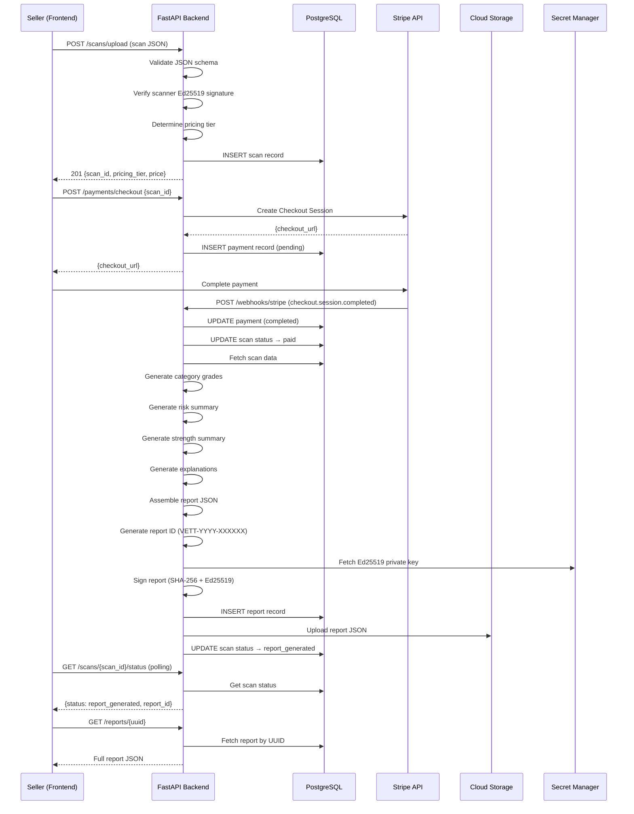
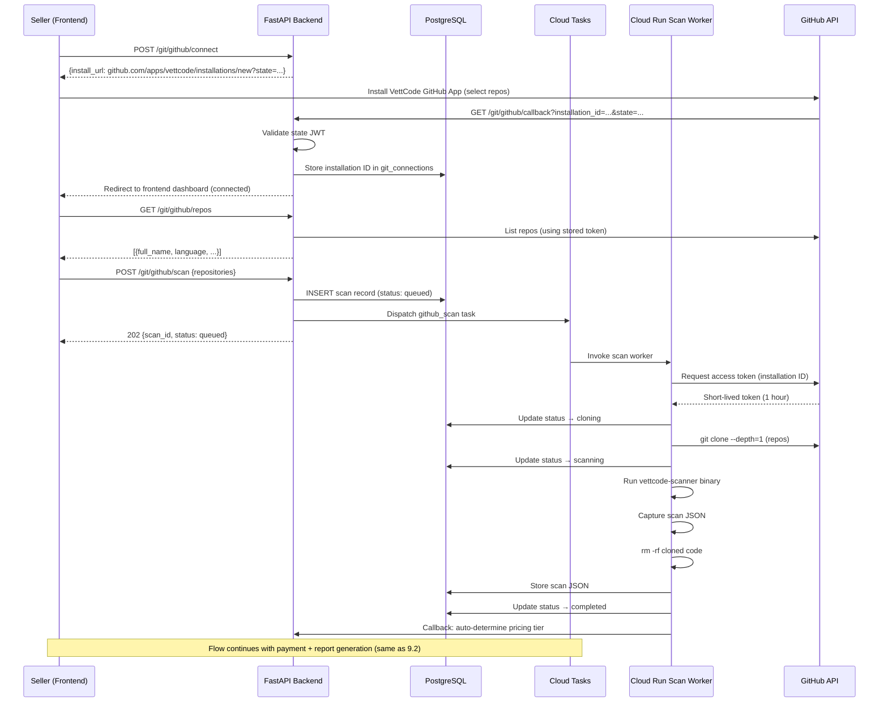
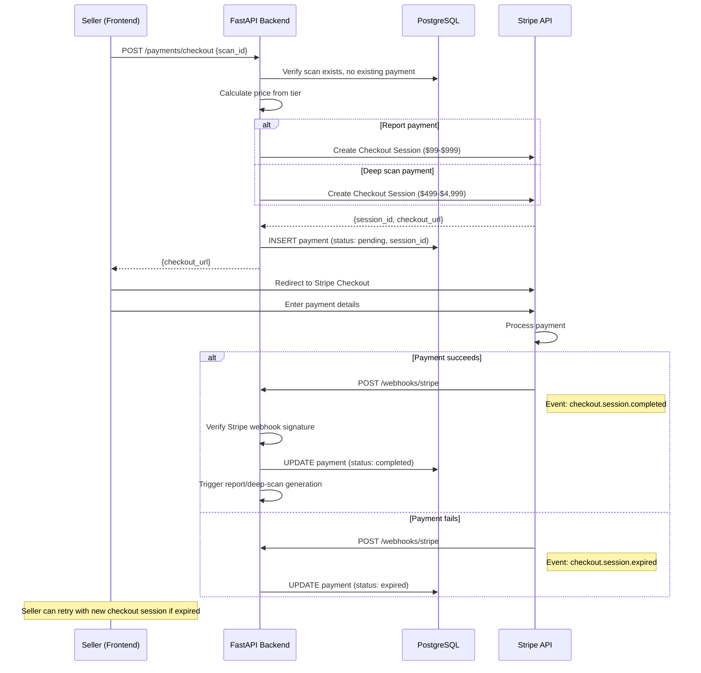
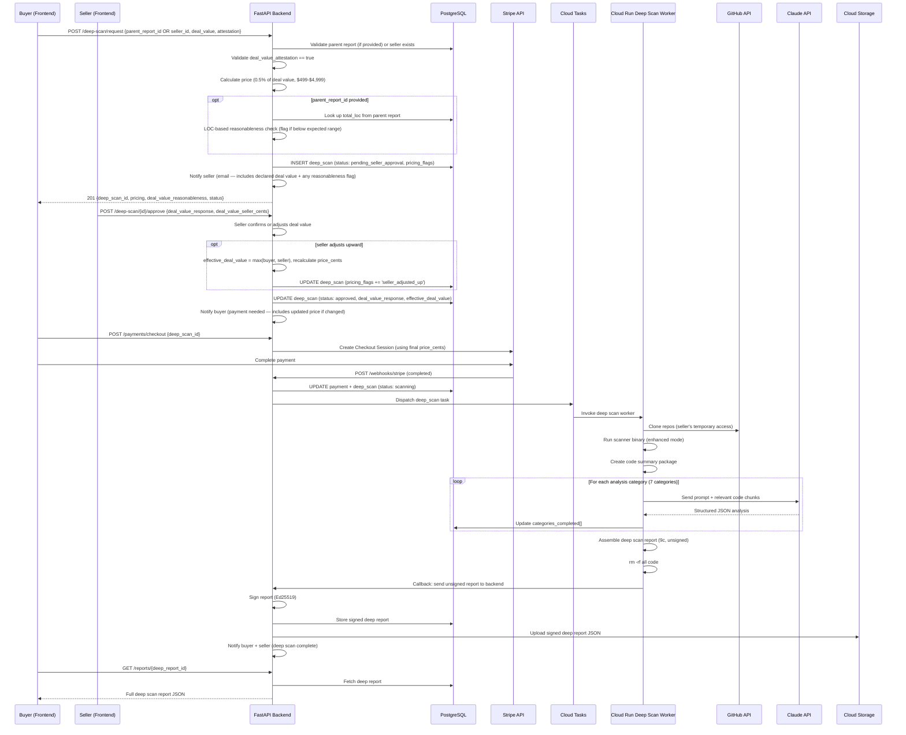

# VettCode Platform Backend — Detailed Design Document

**Component:** `vettcode-platform-be`
**Version:** 0.1-draft
**Status:** In Review
**Parent Document:** [00b-product-overview-technical.md](../00b-product-overview-technical.md)

---

## Table of Contents

1. [Component Overview](#1-component-overview)
2. [Functional Requirements](#2-functional-requirements)
3. [Technical Requirements](#3-technical-requirements)
4. [Architecture](#4-architecture)
5. [Solution Design](#5-solution-design)
6. [Tech Stack](#6-tech-stack)
7. [API Design](#7-api-design)

7B. [Notification Subsystem](#7b-notification-subsystem)
8. [Database Schema](#8-database-schema)  
9. [Diagrams](#9-diagrams)
10. [Testing Plan](#10-testing-plan)
11. [Capacity & Performance](#11-capacity--performance)
12. [Deployment & Operations](#12-deployment--operations)
13. [Milestones & Tickets](#13-milestones--tickets)

---

## 1. Component Overview

### Purpose

The `vettcode-platform-be` is the central backend service for the VettCode platform. It is the "brain" that receives scan data from the CLI scanner (or GitHub-connected scans), validates integrity, enforces pricing, generates signed reports with risk/strength summaries and plain-English explanations, handles payments, manages authentication, orchestrates deep scans, and serves reports to authenticated buyers.

### Scope

The backend is responsible for:

- **Authentication & Authorization** — Clerk social login (Google, GitHub, Apple), JWT validation
- **Scan Ingestion** — Accepting uploaded static scan JSON, verifying scanner Ed25519 signatures, determining pricing tier
- **Report Generation Engine** — Enriching raw scan data with risk/strength summaries, plain-English explanations, and deep scan upsell messaging (benchmarks deferred to V2)
- **Digital Signature Service** — Ed25519 signing of generated reports, verification endpoint for buyers
- **Payment Processing** — Stripe integration for one-time report purchases (size-based pricing tiers)
- **Buyer Report Access** — Authenticated-only access to reports via login + report ID (no public URLs)
- **GitHub Integration** — GitHub App for repo connection, triggering ephemeral Cloud Run scan containers
- **Deep Scan Orchestration** — Post-LOI workflow: seller grants temp access, LLM-powered code analysis via Claude API
- **File Storage** — GCS for signed reports, short-lived signed URL generation for downloads
- **Scan Status Tracking** — Async job status for GitHub-connected and deep scans

### Boundaries

The backend does NOT:

- Run the static code scanner (that is the Go CLI in `vettcode-scanner`)
- Serve the frontend (that is `vettcode-platform-fe` on Vercel)
- Manage infrastructure (that is `vettcode-platform-infra` via Terraform)
- Generate marketing content (that is the Drumbeat GTM service — separate product)

The backend DOES interact with:

- The scanner via its JSON output format (data contract 9a)
- The frontend via REST API
- GCP services (Cloud SQL, Cloud Tasks, Cloud Storage, Cloud Run for scan workers)
- Third-party services (Clerk, Stripe, GitHub API, Claude API)

---

## 2. Functional Requirements

### FR-01: User Registration and Authentication

**User Story:** As a seller or buyer, I can create an account and log in so that I can access VettCode platform features.

**Acceptance Criteria:**

- Social login only (no email/password) via **Clerk** — simplest setup, built-in UI components, free tier covers V1 volume (10K MAU)
- Supported providers: **Google**, **GitHub**, **Apple Sign In**
  - Google: most common, everyone has one
  - GitHub: natural for developer sellers, also used for GitHub-connected scans
  - Apple: privacy-first branding aligns with VettCode, growing adoption
- The backend receives and validates JWTs issued by Clerk on every authenticated request
- No role field — every user is just a user. Seller/buyer behavior is derived from their actions (has uploads = seller, has purchases = buyer). One dashboard for all users.
- A webhook endpoint receives user creation/update events from Clerk to sync the local `users` table
- Unauthenticated requests to protected endpoints return 401
- No custom rate limiting in V1 — Cloud Run concurrency limits provide natural protection, Clerk rate-limits auth endpoints, Stripe rate-limits payment calls. If abuse becomes a problem, add GCP Cloud Armor or simple middleware later.

### FR-02: Static Scan JSON Upload

**User Story:** As a seller, I can upload my scan result JSON so that I can get a signed report with buyer-readable risk and strength analysis.

**Acceptance Criteria:**

- `POST /api/v1/scans/upload` accepts the scan JSON (max 10 MB) along with `company_name` (required)
- `company_name` is the seller's official company or business name — this will appear on the final signed report and cannot be changed after report generation
- Backend validates the JSON schema conforms to data contract 9a
- Backend verifies `integrity.scanner_signature` using the known VettCode scanner public key (Ed25519)
- If signature is invalid, return 400 with `"error": "invalid_scanner_signature"`
- Backend auto-determines pricing tier from `total_loc` and returns it in the response
- Backend cross-checks the scanner-declared `pricing_tier` against its own calculation; if mismatch, the backend's calculation wins
- **Repo deduplication (V2):** Scanner captures `head_commit_sha` per repository. V1 stores this data in the scans table for future use. V2 will add cross-user matching and alerts.
- **Unsupported language tracking:** At ingestion, extract `detected_languages` from any repo with `"status": "unsupported"` in the scan JSON. Store in `scans.unsupported_languages` and emit a structured log event for product analytics (Tier 3 prioritization).
- Upload creates a `scans` record with status `uploaded` and returns `scan_id` + `pricing_tier` + `price`
- The raw scan JSON is stored in the `scans` table (JSONB) only — no GCS upload at this stage. Reports are generated and stored in GCS only after successful payment.

### FR-03: Report Generation Engine

**User Story:** As a seller, after paying, I receive a signed report that adds trust context, risk/strength analysis, and plain-English explanations to my raw scan data.

**Acceptance Criteria:**

- `POST /api/v1/reports/generate` triggers report generation for a given `scan_id` (requires successful payment)
- The report generation pipeline:
  1. Embeds seller identity block (company name, scan origin, verification level, attestation timestamp)
  2. Generates buyer disclosure based on scan origin — `cli_local` scans get trust warnings about self-reported data; `github_connected` scans get verified trust notes
  3. If `cve_ecosystems_skipped` is non-empty, adds a **CVE coverage notice** to the buyer disclosure: "CVE checks were not performed for the following ecosystems: {list}. The security grade reflects only the ecosystems that were checked." This notice also appears in the risk summary as a medium-severity item.
  4. Embeds the original scan JSON verbatim
  5. **(V2)** Computes market benchmarks (percentile rankings against historical data)
  6. Generates risk summary (top 5 risks with severity, description, buyer impact)
  7. Generates strength summary (top 5 strengths with buyer impact)
  8. Generates plain-English explanations for each scored category
  8. Adds deep scan upsell preview
  9. Signs the complete report with Ed25519 platform key
  10. Assigns a human-readable report ID: `VETT-YYYY-XXXXXX`
- Report generation target: p95 < 30 seconds (includes DB reads, signing, GCS upload)
- The generated report conforms to data contract 9b
- Report is stored in the `reports` table (JSONB) and in GCS as a JSON file

### FR-04: Digital Signature Service

**User Story:** As a buyer, I can verify that a VettCode report is authentic and has not been tampered with.

**Acceptance Criteria:**

- Reports are signed using Ed25519 with the platform private key
- The signed payload is the SHA-256 hash of the full report content (excluding the `report_signature` block itself)
- `GET /api/v1/reports/{id}/verify` verifies the stored report by UUID and returns `{"valid": true/false, "details": {...}}`
- `POST /api/v1/reports/verify` accepts full report JSON for independent/offline verification workflows
- **(V2)** Public key endpoint (`GET /api/v1/keys/platform`) for independent offline verification — deferred; V1 uses the verify endpoint
- Key rotation: new keys are issued with a unique `platform_public_key_id`; old keys remain valid for verification of previously signed reports
- The verification endpoint does NOT require authentication (public, so anyone can verify)

### FR-05: Payment Flow

**User Story:** As a seller, I can pay for a signed report based on my codebase size tier.

**Acceptance Criteria:**

- After scan upload, the response includes `pricing_tier`, `price`, and a `payment_url` (Stripe Checkout Session)
- Pricing tiers enforced by backend (scanner tier is advisory only) — see [Section 5.6](#56-how-pricing-tier-is-enforced) for tier boundaries and prices
- `POST /api/v1/payments/checkout` creates a Stripe Checkout Session and returns the session URL
- Stripe webhook endpoint (`POST /api/v1/webhooks/stripe`) processes `checkout.session.completed` events
- On successful payment, the `payments` record is updated and report generation is triggered automatically
- After report generation completes, the seller receives an email from VettCode (`reports@vettcode.com`) containing:
  - Report ID (`VETT-YYYY-XXXXXX`)
  - Report summary (category grades, red flag count)
  - PDF report as attachment
  - Link to view the full interactive report on the platform
  - Payment receipt details
- Email is sent via Resend (transactional email)
- Failed/expired payments are tracked: Stripe handles in-session failures (user retries on Stripe's page). For expired sessions, the scan remains in `uploaded` status — user can create a new checkout session for the same `scan_id` via `POST /api/v1/payments/checkout`. UX flow (how user finds their unpaid scan) deferred to frontend design doc (04).
- Stripe test mode is used in development/staging; live mode in production
- ~~Bundle discount~~ — **DEFERRED TO V2.** Different payers (seller pays static report, buyer pays deep scan) make V1 bundling impractical. See 00a Section 10.

### FR-06: Buyer Report Access

**User Story:** As a buyer, I can view a seller's report by logging in and navigating to it via a shared link or report lookup.

**Acceptance Criteria:**

- `GET /api/v1/reports/{id}` (UUID) returns the full report JSON
- This endpoint requires authentication (valid JWT)
- Any authenticated user can view any report by UUID (V1 — no per-buyer access grants)
- Reports are NEVER accessible without authentication — no public URLs, no unauthenticated endpoints
- **Anti-enumeration:** All API lookups use the report's UUID primary key, NOT the sequential `report_id` (`VETT-YYYY-XXXXXX`). The human-readable `report_id` is display-only (shown in the UI and embedded in the report JSON) but is never used as a URL/API path parameter for authenticated endpoints.
- Seller shares the report link (containing UUID) off-platform (e.g., in Acquire.com listing, email). Alternatively, seller shares the human-readable `VETT-YYYY-XXXXXX` and the buyer uses the report lookup box which resolves it to the UUID internally via `GET /api/v1/reports/lookup?report_id=VETT-2026-000042`.
- V2 consideration: per-buyer access grants, audit trail, revocation

### FR-07: Report Download

**User Story:** As an authenticated user, I can download a report as a PDF or JSON file.

**Acceptance Criteria:**

- `GET /api/v1/reports/{id}/download?format=pdf|json` (UUID) returns a short-lived signed GCS URL (15-minute expiry)
- `format` defaults to `pdf` if omitted — PDF is the primary deliverable for M&A buyers
- Requires authentication
- The signed URL points directly to the GCS object — the download happens from GCS, not through the backend
- After 15 minutes, the URL expires; the user must request a new one

### FR-08: Git Provider Integration

**User Story:** As a seller, I can connect my GitHub, GitLab (including self-hosted), or Bitbucket (V2) account and scan repos without downloading the CLI.

> **Provider rollout:** V1 ships with GitHub and GitLab (including self-hosted). Bitbucket is V2. The architecture uses a provider abstraction layer (see Section 4.7) so adding providers requires only a new `GitProvider` implementation — no changes to scanning, reports, or payment logic.
>
> **Why GitLab in V1:** Self-hosted GitLab users are disproportionately privacy-conscious — exactly VettCode's target audience. Launching without GitLab would exclude ~15% of the addressable market, including the segment most aligned with the "Privacy-First" brand. The incremental effort (~4 days) is justified by market fit.
>
> **Why this matters:** VettCode's target market is indie hackers and small SaaS teams on Acquire.com/Flippa. While GitHub dominates (~75%), a meaningful portion use GitLab (~15%, especially privacy-conscious sellers and teams with self-hosted instances) and Bitbucket (~10%, common with Atlassian/Jira shops). Sellers on GitLab/Bitbucket can always use the **CLI scanner** (provider-agnostic, same signed reports), but connected scans and deep scans require platform integration.
>
> **GitLab is the priority after GitHub** because self-hosted GitLab is particularly relevant: sellers who chose self-hosted GitLab for privacy reasons are exactly the audience that values VettCode's privacy-first positioning.

**Acceptance Criteria (V1 — GitHub):**

- `POST /api/v1/git/github/connect` returns the GitHub App installation URL (`https://github.com/apps/vettcode/installations/new`)
- GitHub App installation callback (`GET /api/v1/git/github/callback`) stores the **installation ID** in `git_connections` table (with `provider: "github"`). Short-lived installation access tokens (1 hour) are requested from GitHub API on demand using the App's private key — never stored.
- `GET /api/v1/git/github/repos` lists the user's accessible repositories
- **Ownership verification:** For each repo selected for scanning, the backend checks the seller's GitHub role via the GitHub API (`GET /repos/{owner}/{repo}/collaborators/{username}/permission`). Only users with `admin` or `maintain` permission are allowed to scan. If the seller has lower permissions (e.g., `write`, `read`), reject with 403 and message: `"You must have admin or maintain access to scan this repository."`
- Reports generated from provider-connected scans are marked with `verification_level: "provider_verified"` (see Section 4.7 for provider-specific verification details). CLI uploads are `"platform_cosigned"` (co-signature verified) or `"self_reported"` (offline, no co-signature).
- `POST /api/v1/git/github/scan` accepts `company_name` (required) and a list of repository URLs, creates a scan job
- The scan job triggers an ephemeral Cloud Run container that:
  1. Requests a short-lived access token from GitHub using the installation ID, clones the selected repos
  2. Runs the VettCode scanner binary inside the container
  3. Captures the scan JSON output
  4. Deletes the cloned code
  5. Returns the scan JSON to the backend
- The seller can track scan progress via `GET /api/v1/scans/{scan_id}/status`
- Status progression: `queued` → `cloning` → `scanning` → `completed` → (payment) → `paid` → `report_generated` / `failed`
- Installation ID is stored in plaintext (not sensitive — it only identifies the installation; access tokens are requested on demand and never stored)

**Acceptance Criteria (V1 — GitLab, including self-hosted):**

- `POST /api/v1/git/gitlab/connect` initiates GitLab OAuth2 flow (works for both gitlab.com and self-hosted instances)
- For self-hosted GitLab: seller provides their instance URL during connection setup (e.g., `https://gitlab.mycompany.com`). Backend validates the URL, stores it in `git_connections.instance_url`
- GitLab OAuth callback (`GET /api/v1/git/gitlab/callback`) stores the **access token** (encrypted) in `git_connections` (GitLab doesn't use GitHub-style installation IDs; it uses OAuth2 personal or group access tokens with `read_repository` scope)
- `GET /api/v1/git/gitlab/repos` lists the user's accessible projects via GitLab API
- **Ownership verification:** Backend checks the seller's GitLab role via `GET /api/v4/projects/:id/members/:user_id`. Only users with `Maintainer` or `Owner` access level are allowed to scan.
- `POST /api/v1/git/gitlab/scan` accepts `company_name` (required) and triggers ephemeral scanning (same Cloud Run pipeline as GitHub — only the clone step differs)
- All downstream logic (scan processing, payment, report generation, deep scan) is identical — the `GitProvider` abstraction handles the differences

**Bitbucket (V2):** Provider implementation deferred. See [00a Section 16](../00a-product-overview-business.md#16-v2-roadmap). Provider abstraction from GitHub/GitLab work supports incremental addition.

### FR-09: Deep Scan Orchestration

**User Story:** As a buyer (post-LOI), I can request a deep scan that provides LLM-powered analysis of the codebase.

**Acceptance Criteria:**

- `POST /api/v1/deep-scan/request` creates a deep scan request (buyer must be authenticated)
- Deep scan is an **independent feature** — it does NOT require a prior static scan or report. A buyer can request a deep scan directly if the seller has GitHub connected.
- Request includes `deal_value_declared` (for pricing), `deal_value_attestation` (required, buyer confirms accuracy), and either `parent_report_id` (if requesting from an existing report) OR `seller_id` (if requesting independently). At least one must be provided.
- Deep scan pricing: 0.5% of declared deal value, floor $499, cap $4,999
- **Deal value verification (5 layers):** (1) buyer attests to accuracy at request time, (2) if `parent_report_id` exists, backend performs LOC-based reasonableness check and includes informational flag in response, (3) seller **confirms or adjusts** the declared deal value during approval — if seller provides a higher value, `effective_deal_value = max(buyer, seller)` and price is recalculated, (4) declared and seller-confirmed values are embedded in the signed deep scan report, (5) pricing anomalies are flagged in `pricing_flags` for operational monitoring
- Seller must approve the deep scan request (receives notification, confirms via platform). On approval, seller confirms deal value, selects which GitHub repos to include in the deep scan, and **accepts an explicit privacy disclosure** stating that source code will be sent to Anthropic's Claude API for analysis (see [Deep Scan Design (03), Seller Privacy Disclosure](./03-deep-scan-design.md#seller-privacy-disclosure)).
- After seller approval + payment, the backend dispatches a Cloud Tasks job to the deep scan worker. The worker handles code ingestion, LLM analysis, and report assembly (see [Deep Scan Design (03)](./03-deep-scan-design.md)). The backend receives the assembled result, signs it, and stores it.
- Deep scan status tracked via `GET /api/v1/deep-scan/{scan_id}/status`
- Status progression: `requested` → `pending_seller_approval` → `approved` → `payment_pending` → `scanning` → `analyzing` → `completed` / `failed`
- Target completion time: < 10 minutes
- If initiated from a report, deep scan report links back to the parent static report via `parent_report_id`

### FR-10: Scan Status Tracking

**User Story:** As a seller, I can check the status of my GitHub-connected or deep scan jobs.

**Acceptance Criteria:**

- `GET /api/v1/scans/{scan_id}/status` returns current status, progress percentage, estimated time remaining
- Status updates are stored in PostgreSQL for polling (frontend polls every 5 seconds)
- On completion, the response includes the `report_id` of the generated report
- On failure, the response includes an error message and suggests retry or support contact

### FR-11: GDPR Account Deletion

**User Story:** As a user, I can delete my account and all associated data so my personal data is erased per GDPR requirements.

**Acceptance Criteria:**

- `DELETE /api/v1/account` with `{ "confirm": "DELETE" }` body permanently deletes the user's account
- Deletes: user record, scans (DB + raw JSON), git_connections (revokes provider access), notifications (V2 — no-op in V1)
- Payment records: user association anonymized (`user_id` set to null, email removed) but records retained for 7 years (tax/legal compliance)
- Reports already purchased by buyers: PDF/JSON in GCS is retained (buyer paid for it), but seller's `user_id` and `company_name` are anonymized in the DB record. The signed PDF itself is immutable (changing it would invalidate the signature).
- Clerk user account is deleted via Clerk API
- Returns 204 No Content on success
- Rate limit: 1/hour/user
- Irreversible — no undo

---

## 3. Technical Requirements

### Performance


| Metric                              | Target       |
| ----------------------------------- | ------------ |
| API response time (read endpoints)  | p95 < 200ms  |
| API response time (write endpoints) | p95 < 500ms  |
| Static report generation            | p95 < 30 seconds |
| Deep scan report generation         | < 10 minutes |
| Scan JSON upload + validation       | < 5 seconds  |
| GCS signed URL generation           | < 100ms      |
| Ed25519 signature verification      | < 10ms       |


### Scale


| Metric                                 | Month 1-3 | Month 4-6 | Month 7-12   |
| -------------------------------------- | --------- | --------- | ------------ |
| API requests/day                       | 100-500   | 500-3,000 | 3,000-15,000 |
| Concurrent scan workers (GitHub scans) | 5         | 10        | 20           |
| Concurrent deep scan workers           | 2         | 5         | 5            |
| Reports generated/month                | 10-25     | 30-100    | 80-200       |
| Deep scans/month                       | 1-3       | 5-15      | 15-40        |
| Active users (MAU)                     | 50-200    | 300-1,000 | 800-2,500    |


### Compatibility

- Python 3.12 runtime
- PostgreSQL 15+
- GCP Cloud Tasks (async job dispatch)
- Compatible with GCP Cloud Run (stateless, container-based)
- CORS configured for Vercel frontend domain(s)

### Uptime

- Target: 99.9% availability (< 8.77 hours downtime/year)
- Health check endpoint: `GET /api/v1/health`
- Graceful degradation: if Cloud Tasks is unavailable for GitHub scans and deep scans, queue jobs in PostgreSQL and process via polling. Report generation falls back to synchronous processing within the webhook handler (risky under load but functional)

### Data Retention


| Data Type               | Retention                       | Notes                                                                     |
| ----------------------- | ------------------------------- | ------------------------------------------------------------------------- |
| Reports (signed)        | Indefinite                      | Core product — reports must remain verifiable forever                     |
| Scan JSON (raw uploads) | 1 year                          | Can be re-derived; kept for audit/debugging                               |
| Payment records         | 7 years                         | Tax/legal compliance                                                      |
| User accounts           | Until deletion requested        | GDPR compliance — `DELETE /api/v1/account` (see FR-11)                    |
| GitHub installation IDs | Until disconnected              | Revoked on disconnect; access tokens are ephemeral (1 hour, never stored) |
| Deep scan working data  | Deleted after report generation | Ephemeral — no code persisted                                             |
| API logs                | 90 days                         | Structured JSON logs in Cloud Logging                                     |


---

## 4. Architecture

### 4.1 Application Structure

```
vettcode-platform-be/
├── app/
│   ├── __init__.py
│   ├── main.py                    # FastAPI app, middleware, lifespan
│   ├── config.py                  # Settings (pydantic-settings, env vars)
│   ├── dependencies.py            # Dependency injection (db session, auth, etc.)
│   │
│   ├── routers/                   # API route handlers (thin — delegate to services)
│   │   ├── __init__.py
│   │   ├── auth.py                # Auth webhook/callback endpoints
│   │   ├── scans.py               # Scan upload, status
│   │   ├── reports.py             # Report generation, retrieval, download, verify
│   │   ├── payments.py            # Checkout, Stripe webhooks
│   │   ├── github.py              # GitHub connect, scan
│   │   ├── deep_scan.py           # Deep scan request, status
│   │   ├── health.py              # Health check
│   │   └── keys.py                # Public key endpoint
│   │
│   ├── services/                  # Business logic layer
│   │   ├── __init__.py
│   │   ├── auth_service.py        # JWT validation, user sync
│   │   ├── scan_service.py        # Scan ingestion, validation, tier detection
│   │   ├── report_service.py      # Report generation pipeline
│   │   ├── scoring_service.py     # Scoring algorithm, benchmarks
│   │   ├── signature_service.py   # Ed25519 signing and verification
│   │   ├── payment_service.py     # Stripe integration
│   │   ├── git_provider_service.py # Git provider abstraction (GitProvider interface + implementations)
│   │   ├── github_service.py      # GitHubProvider: GitHub App integration, repo listing, scan triggers
│   │   ├── deep_scan_service.py   # Deep scan request/approval workflow, job dispatch, result ingestion
│   │   ├── storage_service.py     # GCS operations, signed URLs
│   │   └── notification_service.py # Email/webhook notifications (seller approval, etc.)
│   │
│   ├── models/                    # SQLAlchemy ORM models
│   │   ├── __init__.py
│   │   ├── base.py                # Declarative base, common mixins
│   │   ├── user.py
│   │   ├── scan.py
│   │   ├── report.py
│   │   ├── payment.py
│   │   ├── git_connection.py
│   │   ├── deep_scan.py
│   │   └── notification.py        # (V2) In-app notification model — not used in V1
│   │
│   ├── schemas/                   # Pydantic request/response schemas
│   │   ├── __init__.py
│   │   ├── scan.py
│   │   ├── report.py
│   │   ├── payment.py
│   │   ├── github.py
│   │   ├── deep_scan.py
│   │   └── common.py
│   │
│   ├── tasks/                     # Cloud Tasks async handlers
│   │   ├── __init__.py
│   │   ├── task_client.py         # GCP Cloud Tasks client + dispatch helpers
│   │   ├── github_scan_tasks.py   # GitHub scan worker orchestration
│   │   └── deep_scan_tasks.py     # Deep scan worker orchestration
│   │
│   ├── core/                      # Cross-cutting concerns
│   │   ├── __init__.py
│   │   ├── exceptions.py          # Custom exception classes
│   │   ├── middleware.py           # Request logging, error handling, CORS
│   │   ├── security.py            # Auth helpers, permission checks
│   │   └── constants.py           # App-wide constants
│   │
│   └── utils/                     # Pure utility functions
│       ├── __init__.py
│       ├── crypto.py              # Ed25519 helpers
│       ├── pricing.py             # Tier calculation logic
│       └── report_id.py           # VETT-YYYY-XXXXXX ID generation
│
├── alembic/                       # Database migrations
│   ├── alembic.ini
│   ├── env.py
│   └── versions/
│
├── tests/
│   ├── conftest.py                # Fixtures (test DB, test client, mock auth)
│   ├── unit/
│   │   ├── test_scoring_service.py
│   │   ├── test_signature_service.py
│   │   ├── test_pricing.py
│   │   └── test_report_id.py
│   ├── integration/
│   │   ├── test_scan_upload.py
│   │   ├── test_report_generation.py
│   │   ├── test_payment_flow.py
│   │   └── test_report_access.py
│   └── e2e/
│       └── test_full_workflow.py
│
├── Dockerfile
├── docker-compose.yml             # Local dev (Postgres, API)
├── pyproject.toml
├── requirements.txt
└── README.md
```

### 4.2 Database Schema Design

See [Section 8](#8-database-schema) for full schema definitions.

**Entity Relationships:**

```
users 1──M scans         (a user uploads many scans)
users 1──M reports        (a user owns many reports)
users 1──M payments       (a user makes many payments)
users 1──M git_connections    (a user can connect multiple git provider accounts — GitHub, GitLab, Bitbucket)
users 1──M notifications   (V2 — a user receives many in-app notifications)
scans 1──1 reports        (a scan produces one report)
scans 1──1 payments       (a scan has one payment)
reports 1──M deep_scans   (a report can have multiple deep scan requests)
deep_scans 1──1 payments  (a deep scan has one payment)
```

### 4.3 Queue Architecture (GCP Cloud Tasks)

Cloud Tasks dispatches all async jobs to Cloud Run workers, including report generation.

1. **GitHub Scan Queue** (`github-scan-queue`)
  - Triggered when seller starts a GitHub-connected scan
  - Target: Scan Worker (Cloud Run service)
  - Timeout: 15 minutes (clone + scan can be slow for large repos)
  - Retry: 2 times with exponential backoff
  - Concurrency limit: matches scan worker count (5 → 20)
2. **Deep Scan Queue** (`deep-scan-queue`)
  - Triggered after seller approval + payment
  - Target: Deep Scan Worker (Cloud Run service)
  - Timeout: 20 minutes (LLM analysis is slow)
  - Retry: 1 time
  - Concurrency limit: 2 → 5 (LLM API rate limits)
3. **Report Generation Queue** (`report-generation-queue`)
  - Triggered by Stripe webhook after successful payment
  - Target: Backend API (self-invocation via internal endpoint)
  - Timeout: 2 minutes (report generation target < 30 seconds, with margin)
  - Retry: 2 times with exponential backoff
  - Concurrency limit: 10 (report generation is fast but should not overload DB)

**Why async report generation:** Stripe webhooks must respond within 30 seconds. Report generation involves Secret Manager fetch, scoring computation, DB writes, and GCS upload — all of which can exceed 30s under load. Decoupling via Cloud Tasks ensures the webhook always returns 200 immediately, and report generation retries automatically on transient failures.

**Scan status tracking:** Stored in PostgreSQL `scans` table (`status` column). Frontend polls `GET /api/v1/scans/{scan_id}/status` every 5 seconds. Workers update status via internal API callback on completion/failure.

### 4.4 Report Generation Pipeline

```
Input: Validated scan JSON (from upload or GitHub scan)
  │
  ├─1. Embed original scan JSON verbatim
  │
  ├─2. Generate risk summary
  │     └─ Score all findings by severity × category weight
  │     └─ Select top 5 risks
  │     └─ Generate plain-English descriptions and buyer impact statements
  │
  ├─3. Generate strength summary
  │     └─ Identify top-scoring categories/metrics
  │     └─ Select top 5 strengths
  │     └─ Generate plain-English descriptions and buyer impact
  │
  ├─4. Generate category explanations
  │     └─ Template-based with dynamic data insertion
  │     └─ Covers: maintainability, security, dependency health,
  │        handoff readiness, development activity, AI detection, infra
  │
  ├─5. Add deep scan upsell preview
  │     └─ Static content block listing deep scan capabilities
  │
  ├─6. Assign report ID (VETT-YYYY-XXXXXX)
  │
  ├─7. Sign report
  │     └─ SHA-256 hash of report content (minus signature block)
  │     └─ Ed25519 sign the hash
  │     └─ Embed signature + key ID + verify URL
  │
  ├─8. Render PDF
  │     └─ Load HTML/CSS report template
  │     └─ Populate template with report data (scores, explanations, risks, strengths)
  │     └─ Render HTML → PDF
  │     └─ Embed QR code (UUID-based verify URL)
  │     └─ Include digital signature info and verification instructions
  │
  └─9. Store report
        └─ Write to `reports` table (JSONB — internal data model)
        └─ Upload PDF to GCS as `reports/{report_id}.pdf`
        └─ Upload JSON to GCS as `reports/{report_id}.json` (internal, powers platform viewer)
```

### 4.5 Scoring Algorithm Design

See [Section 5.1](#51-how-the-scoring-algorithm-works) for the backend scoring pipeline and [06 — Scoring Methodology](./06-scoring-methodology.md) for all formulas, weights, thresholds, and grade mappings. **(V2)** Market benchmarks (percentile rankings against historical data) deferred to V2.

### 4.6 Digital Signature Service

> **Policy reference:** This component implements the key *usage* responsibilities defined in [00b Section 13 — Ed25519 Key Management](../00b-product-overview-technical.md). Key lifecycle (provisioning, rotation, backup, IAM) is owned by [Infrastructure / SRE (05)](./05-infrastructure-sre-design.md).

**Platform Key Management:**

- Platform Ed25519 keypair stored in GCP Secret Manager (provisioned by Infra)
- Key ID format: `vettcode-platform-key-YYYY-MM` (rotated annually; `YYYY-MM` identifies minting date)
- Private key accessed only by the `vettcode-api` Cloud Run service account (`secretmanager.versions.access`)
- No human access to the private key in production
- Old private keys are archived but never deleted (needed if re-signing is ever required)

**Public Key Registry:**

- The backend maintains an internal registry of all valid public keys (scanner + platform) indexed by key ID
- **(V2)** Public endpoint `GET /api/v1/keys/platform` for offline verification — deferred (see Section 7.7). V1 uses the verify endpoints (7.5, 7.6) which perform key lookup internally.
- Each key entry includes: `key_id`, `algorithm`, `public_key` (base64), `status` (active / revoked), `created_at`, `revoked_at` (nullable), `revocation_reason` (nullable)
- Revoked keys remain in the registry — verification still works but the response surfaces a revocation warning
- The registry is the source of truth for both scanner signature verification and report signature verification

**Compromise Response (Platform Key):**

1. Infra rotates to a new key in Secret Manager (see 05 doc)
2. Backend detects new key version on next Secret Manager read (or is redeployed)
3. Backend marks the compromised key as **revoked** in the public key registry with reason and timestamp
4. Backend audits all reports signed with the compromised key — if forgery is suspected, re-signs affected reports with the new key
5. Affected buyers are notified via email
6. Security advisory published

**Signing Process:**

1. Serialize the report JSON (excluding `report_signature` block) with canonical JSON (sorted keys, no extra whitespace)
2. Compute SHA-256 hash of the canonical JSON
3. Sign the hash with Ed25519 private key
4. Embed `{ algorithm, platform_public_key_id, signed_payload_hash, signature, verify_url }` into the report

**Verification Process:**

1. Extract `report_signature` block from report
2. Re-serialize the report JSON without the `report_signature` block (canonical JSON)
3. Compute SHA-256 hash
4. Verify the hash matches `signed_payload_hash`
5. Look up the public key by `platform_public_key_id`
6. Verify the Ed25519 signature against the hash
7. Return `{ valid: true/false, signed_at, key_id, report_id }`

### 4.7 Git Provider Integration Service

The platform supports multiple git hosting providers via a **provider abstraction layer** (same pattern as the `LLMProvider` in the deep scan engine). V1 ships with `GitHubProvider` and `GitLabProvider` (including self-hosted). `BitbucketProvider` is V2.

**Provider Abstraction:**

```python
# services/git_provider.py

from abc import ABC, abstractmethod

class GitProvider(ABC):
    """Provider-agnostic interface for git hosting integrations.
    V1: GitHubProvider + GitLabProvider. V2: BitbucketProvider."""

    @abstractmethod
    def get_connect_url(self, user_id: str, state_token: str) -> str:
        """Return the OAuth/App installation URL for this provider."""
        ...

    @abstractmethod
    async def handle_callback(self, params: dict) -> ConnectionResult:
        """Process OAuth/installation callback, return connection details."""
        ...

    @abstractmethod
    async def list_repos(self, connection: GitConnection) -> list[RepoInfo]:
        """List accessible repos for the given connection."""
        ...

    @abstractmethod
    async def verify_ownership(self, connection: GitConnection, repo: str, user: str) -> bool:
        """Verify user has admin/maintain access to the repo."""
        ...

    @abstractmethod
    async def get_clone_credentials(self, connection: GitConnection) -> CloneCredentials:
        """Return short-lived credentials for cloning (token + clone URL format)."""
        ...

    @property
    @abstractmethod
    def provider_name(self) -> str:
        """'github', 'gitlab', or 'bitbucket'."""
        ...
```

**Provider implementations:**

| Provider | Auth Mechanism | Token Storage | Ownership Check | Clone Method |
| --- | --- | --- | --- | --- |
| **GitHub (V1)** | GitHub App (installation flow) | Installation ID only (plaintext, not sensitive) | `GET /repos/{owner}/{repo}/collaborators/{username}/permission` → `admin` or `maintain` | Installation access token (1h, requested on demand) |
| **GitLab (V1)** | OAuth2 (`read_repository` + `read_user` scope) | Encrypted OAuth token in `git_connections` | `GET /api/v4/projects/:id/members/:user_id` → `Maintainer` (40) or `Owner` (50) | OAuth token passed to `git clone` |
| **GitLab Self-Hosted (V1)** | Same OAuth2 flow, seller provides instance URL | Same + `instance_url` in `git_connections` | Same API, different base URL | Same |
| **Bitbucket (V2)** | OAuth2 (`repository` scope) | Encrypted OAuth token | `GET /2.0/repositories/{workspace}/{repo}/permissions-config/users/{user_id}` → `admin` | OAuth token |

**Scan origin and verification level mapping:**

| Provider | `scan_origin` | `verification_level` |
| --- | --- | --- |
| GitHub | `github_connected` | `provider_verified` |
| GitLab | `gitlab_connected` | `provider_verified` |
| GitLab Self-Hosted | `gitlab_self_hosted_connected` | `provider_verified` |
| Bitbucket | `bitbucket_connected` | `provider_verified` |
| CLI (co-signed) | `cli_local` | `platform_cosigned` |
| CLI (offline) | `cli_local` | `self_reported` |

> **Note on `verification_level` simplification:** V1 used `github_verified`; this is generalized to `provider_verified` for all provider-connected scans. The specific provider name is available in `scan_origin` for buyers who care which platform verified access. All provider-connected scans carry the same trust level — the platform verified the seller has admin/maintain access to the repos and ran the scanner on its own infrastructure.

**GitHub App Installation Flow (V1):**

1. Seller clicks "Connect GitHub" → redirected to `https://github.com/apps/vettcode/installations/new`
2. Seller installs the VettCode GitHub App on their account/org, selecting which repos to grant access to
3. GitHub redirects to callback URL with `installation_id`
4. Backend stores installation ID in `git_connections` (with `provider: "github"`)
5. When repo access is needed, backend generates a JWT from the App's private key, then requests a short-lived installation access token (expires in 1 hour) from `POST https://api.github.com/app/installations/{installation_id}/access_tokens`

**GitLab OAuth Flow (V1):**

1. Seller clicks "Connect GitLab" → chooses gitlab.com or enters self-hosted instance URL
2. Redirected to GitLab OAuth authorization page (`/oauth/authorize` with `read_repository+read_user` scope)
3. GitLab redirects to callback with authorization code
4. Backend exchanges code for access token, stores encrypted token in `git_connections` (with `provider: "gitlab"` or `"gitlab_self_hosted"` and `instance_url`)
5. Token is refreshed automatically using the refresh token before each use

**Ephemeral Scanning (provider-agnostic):**

1. Backend dispatches a Cloud Tasks job to the scan worker service (Cloud Run)
2. Backend calls `provider.get_clone_credentials(connection)` to get a short-lived token
3. The worker container receives: clone credentials, repo URLs, scan config
4. Worker clones repos to ephemeral disk (tmpfs or local SSD)
5. Worker runs the VettCode scanner binary against cloned repos
6. Worker captures the scan JSON output
7. Worker deletes all cloned code (explicit `rm -rf` + container is destroyed)
8. Worker sends scan JSON back to the backend via internal API or pub/sub
9. Backend processes the scan JSON identically to a manual upload

**Security Guarantees:**

- Code is never written to persistent storage
- Container is destroyed after scan (Cloud Run ephemeral)
- Access token is short-lived (1 hour for GitHub; OAuth token for GitLab, used only during clone) and never persisted beyond `git_connections`
- Scan worker has no outbound network access except to the git provider API and the backend internal API

### 4.8 Deep Scan Service

> The deep scan engine (`vettcode-deep-scan`) is a separate component with its own design doc. See [Deep Scan Design (03)](./03-deep-scan-design.md) for LLM orchestration, prompt templates, analysis categories, code chunking, file selection, cost control, and the full processing pipeline.

**Platform backend responsibilities (this doc):**

- **Request/approval workflow:** Buyer requests deep scan → seller receives notification → seller approves or rejects → buyer pays after approval (see FR-09, Sections 7.13, 7.22-7.23)
- **Job dispatch:** After payment, backend creates a Cloud Tasks job on `deep-scan-queue` with the job payload (see Section 4.3)
- **Receiving results:** Deep scan worker sends assembled report back via internal API callback. Backend signs the report (Ed25519), stores in DB + GCS, and notifies both buyer and seller.
- **Status tracking:** `GET /api/v1/deep-scan/{scan_id}/status` (see Section 7.14)

**What the platform backend does NOT do:**

- Clone repos (worker does this via GitHub App token)
- Run LLM prompts (worker calls Claude API directly)
- Chunk or select code files (worker handles file selection)
- Assemble the deep scan report (worker returns the assembled result)

### 4.9 File Storage Service

**GCS Bucket Structure:**

```
vettcode-reports-{env}/
├── reports/
│   ├── VETT-2026-000001.json      # Internal data model (powers platform viewer)
│   ├── VETT-2026-000001.pdf       # Buyer-facing PDF deliverable
│   ├── VETT-2026-000002.json
│   ├── VETT-2026-000002.pdf
│   └── ...
└── deep-reports/
    ├── VETT-2026-000001-DEEP.json
    ├── VETT-2026-000001-DEEP.pdf
    └── ...
```

**Signed URL Generation:**

- After auth check, generate a GCS signed URL with 15-minute expiry
- Use the backend service account's credentials (IAM-based signing, no local key file)
- Content-Disposition header set to `attachment; filename="{report_id}.json"`

---

## 5. Solution Design

### 5.1 How the Scoring Algorithm Works

The backend re-computes scores server-side from uploaded scan metrics (scanner-computed scores are treated as advisory only). All formulas, weights, thresholds, grade mappings, and red flag triggers are defined in [06 — Scoring Methodology](./06-scoring-methodology.md) — the single source of truth. The backend implements doc 06 exactly; no scoring logic is specified here.

**Backend scoring pipeline:**
1. Extract raw metrics from validated scan JSON
2. Compute 6 category scores (0–100) using doc 06 formulas
3. Map each score to a letter grade (doc 06 Section 2)
4. Compute overall grade as weighted average (doc 06 Section 4)
5. Evaluate red flags independently of grades (doc 06 Section 6)
6. **(V2)** Compute benchmark percentiles against historical data per LOC bucket

### 5.2 How Scan JSON Integrity is Verified

1. Extract `integrity` block from uploaded JSON
2. Extract `scan_checksum` — this is the SHA-256 of the full scan JSON (excluding the `integrity` block)
3. Recompute the checksum: serialize all fields except `integrity` using canonical JSON (sorted keys, no whitespace), then SHA-256 hash
4. If checksums don't match → reject (JSON was tampered with)
5. Look up the scanner public key by `scanner_public_key_id`
6. Verify the Ed25519 `scanner_signature` against `scan_checksum`
7. If signature is invalid → reject (not from an official VettCode scanner)
8. If both pass → accept the scan as authentic

**Co-signature verification (V1):**

After verifying the scanner signature (steps 1-8 above), check for platform co-signature:

9. If `integrity.cosigned` is `true`:
   a. Look up `integrity.platform_public_key_id` from the public key registry
   b. Verify `integrity.platform_cosignature` against `integrity.scan_checksum`
   c. If co-signature is valid → accept as `verification_level: "platform_cosigned"`
   d. If co-signature is invalid → reject (possible tampering with co-signed scan)
10. If `integrity.cosigned` is `false` (offline scan):
    a. Accept the scan (scanner signature alone is sufficient for upload)
    b. Flag the report as `verification_level: "self_reported"`
    c. Display trust notice to buyers: "This scan was not co-signed by VettCode's platform. The scan data is self-reported."

**Unsupported language extraction (at ingestion):**

11. Scan the `repositories[]` array for any repo with `"status": "unsupported"`
12. Extract `detected_languages` from each unsupported repo → store as `unsupported_languages` in the `scans` table (deduplicated, lowercased)
13. Log a structured event: `{ event: "unsupported_language_detected", languages: [...], scan_id, user_id }` for product analytics
14. This data is used to prioritize Tier 3 language support (see scanner doc 01, Section 3) — e.g., if 15% of scans include unsupported Swift repos, Swift moves up the roadmap

**Scanner Public Key Management:**

- Scanner public keys are stored in the public key registry (same registry as platform keys)
- New scanner releases register their public key ID; old keys are retained for version compatibility overlap (see 00b Section 9, Version Compatibility Policy)
- If a scanner key is compromised: the key is marked as **revoked** in the registry, new uploads signed with it are rejected, existing reports retain their signatures but the platform flags them with a warning

### 5.3 How Report Signing Works

See [Section 4.6 — Digital Signature Service](#46-digital-signature-service) for key management, signing process, compromise response, and public key registry. See [Section 5.2](#52-how-scan-json-integrity-is-verified) for scan JSON verification (scanner signature + co-signature).

**Canonical JSON serialization:** Deterministic serialization rules and cross-language test vectors are defined in [01-scanner-design.md Section 5.8](./01-scanner-design.md). Both the Go scanner and Python backend must produce byte-identical output. Key rules: recursive sorted keys, no whitespace, literal UTF-8 (no `\uXXXX` for printable chars), Go must use `SetEscapeHTML(false)`.

### 5.3a Signed Report Data Model (9b) — Internal JSON

> Moved from [Product Overview Section 9b](../00b-product-overview-technical.md). This is the internal data model that powers PDF generation. It is NOT the buyer-facing deliverable — the PDF is.

This is the structured data the platform generates when a seller uploads their scan result JSON. It wraps the static scan data and adds explanations, risk/strength summaries, and a platform-level signature. Market benchmarks will be added in V2 when sufficient historical data accumulates.

```jsonc
{
  "version": "1.0",
  "id": "uuid-v4",                       // primary key — used in ALL API paths, URLs, QR codes, and verification
  "report_type": "static",              // "static" | "deep"
  "generated_at": "ISO-8601",
  "expires_at": null,                    // reports don't expire, but could in future

  // --- Report Staleness Indicator (computed at render time, not stored) ---
  // The platform shows an age notice on the PDF and in the report viewer:
  //   < 30 days:  "Recent" (no warning)
  //   30-90 days: "This report is X days old. Consider requesting an updated scan."
  //   > 90 days:  "This report is X days old. The codebase may have changed significantly since this scan."
  // The notice is based on (now - generated_at). It does NOT invalidate the report or its signature.

  // --- Seller Identity & Scan Origin (shown on report) ---
  "seller": {
    "company_name": "Acme SaaS Inc.",         // Official company name, provided by seller at upload
    "scan_origin": "cli_local",               // "cli_local" | "github_connected" | "gitlab_connected" | "gitlab_self_hosted_connected" | "bitbucket_connected"
    "verification_level": "self_reported",      // "platform_cosigned" (CLI with co-signature) | "self_reported" (CLI offline) | "provider_verified" (any provider-connected scan, admin access confirmed)
    "uploaded_at": "ISO-8601"                  // Timestamp of scan upload
  },

  // --- Buyer Disclosure (shown prominently on report) ---
  // Content varies based on scan_origin. Platform generates this automatically.
  "buyer_disclosure": {
    "scan_origin_description": "This scan was performed locally on the seller's machine using the VettCode CLI. The scan data was self-reported by the seller and signed by the scanner binary.",
    // For provider-connected scans: "This scan was performed by VettCode's cloud infrastructure on code accessed via the seller's {provider_name} account. The seller has verified admin access to the scanned repositories."
    "trust_notes": [
      "The seller has attested that they are the authorized owner or representative of this codebase.",
      "Scan data from CLI scans is self-reported. For higher assurance, request the seller complete a provider-connected scan (GitHub, GitLab, or Bitbucket).",
      "VettCode verifies scanner signature integrity but cannot independently confirm the accuracy of locally-generated scan data."
    ]
    // For provider-connected scans (github_connected, gitlab_connected, etc.), trust_notes would be:
    // [
    //   "The seller has verified admin access to the scanned repositories via {provider_name}.",
    //   "Scan data was generated by VettCode's cloud infrastructure — the seller did not have access to modify scan results.",
    //   "VettCode has verified both the scanner signature and the seller's repository access."
    // ]
  },

  // --- Original Scan Data (embedded, unchanged) ---
  "scan": {
    // Full static scan JSON from 9a is embedded here verbatim.
    // Platform verifies integrity.scanner_signature before accepting.
    "scan_id": "uuid-v4",
    "timestamp": "ISO-8601",
    "scanner_version": "1.0.0",
    "repositories": [ "..." ],       // Includes repos with "status": "unsupported" and "detected_languages" — frontend renders these in a separate section
    "metrics": { "..." },
    "detection": { "..." },
    "summary": { "..." },
    "integrity": { "..." }
  },

  // --- Platform-Added Analysis (value-add over raw JSON) ---
  // V2: "benchmarks" block will be added here (percentile rankings vs similar-sized products)
  // Requires ~20+ reports per LOC bucket before meaningful

  "risk_summary": [
    {
      "rank": 1,
      "category": "handoff_readiness",
      "title": "Low Test Coverage",
      "description": "Est. test coverage at 42% is below VettCode's recommended safety threshold for ownership handoff. This increases post-acquisition risk of regressions during changes.",
      "severity": "medium",
      "buyer_impact": "Plan for 2-4 weeks of test-writing after acquisition before making changes."
    }
  ],

  "strength_summary": [
    {
      "rank": 1,
      "category": "security",
      "title": "Clean Secrets Posture",
      "description": "No hardcoded secrets detected across 470 files. This materially lowers the risk of credential leakage during handoff.",
      "buyer_impact": "Low risk of credential leakage during ownership transfer."
    }
  ],

  // --- Category Explanations (plain English for non-technical buyers) ---
  "explanations": {
    "maintainability": "This codebase is moderately easy to understand and modify. The average function complexity is within acceptable range, though 3 files are flagged as hotspots that may require refactoring. Code duplication is low at 4.2%.",
    "security": "The security posture is strong. No hardcoded secrets were found. There are 2 known vulnerabilities in dependencies (1 medium, 1 low severity), both with available fixes. 7 of 48 dependencies are outdated.",
    "handoff_readiness": "Handoff readiness is below target. Est. test coverage is 42%. Documentation density is low. There are 12 environment variables to configure for deployment."
  },

  // --- Deep Scan Upsell (only in static reports) ---
  "deep_scan_available": true,
  "deep_scan_preview": {
    "additional_insights": [
      "AI moat scoring and defensibility analysis",
      "Architecture pattern detection and service mapping",
      "Security audit with business logic vulnerability assessment",
      "Technical debt quantification with refactoring estimates",
      "Post-acquisition roadmap and onboarding time estimate"
    ]
  },

  // --- Report Signature (platform-level, verifiable by buyers) ---
  "report_signature": {
    "algorithm": "Ed25519",
    "platform_public_key_id": "vettcode-platform-key-2026-03",
    "signed_payload_hash": "sha256-of-report-content",
    "signature": "ed25519-signature",
    "verify_url": "https://platform.vettcode.com/verify/{uuid}"
  }
}
```

> **Report ID design decision:** Reports use UUID v4 as the primary key (non-enumerable). A human-readable display ID (`VETT-YYYY-XXXXXX`) is generated via a PostgreSQL sequence (see Appendix C) for support references and buyer-facing display. The UUID is used for all API lookups and internal references; the display ID is shown in the UI and PDF reports.

### 5.4 How GitHub Ephemeral Scanning Works

```
1. Seller clicks "Connect GitHub" in frontend
2. Frontend calls: POST /api/v1/git/github/connect
3. Backend returns GitHub App installation URL
4. Seller installs VettCode GitHub App (selects repos to grant access)
5. GitHub redirects to callback with installation_id
6. Backend stores installation ID in `git_connections`

7. Seller selects repos in frontend
8. Frontend calls: POST /api/v1/git/github/scan { repo_urls: [...] }
9. Backend creates scan record (status: queued)
10. Backend dispatches Cloud Tasks job to github-scan-queue

11. Scan Worker (Cloud Run):
    a. Receives: short-lived access token, repo URLs
    d. Worker: git clone --depth=1 (shallow clone for speed)
    e. Worker: runs vettcode-scanner binary
    f. Worker: captures scan JSON
    g. Worker: rm -rf cloned repos
    h. Worker: POSTs scan JSON to backend internal endpoint
    i. Container is destroyed

12. Backend receives scan JSON
13. Backend validates (same as manual upload, minus scanner signature check
    since the scan was run by our own infrastructure)
14. Backend updates scan status to "completed"
15. Flow continues with payment + report generation
```

### 5.5 How Deep Scan LLM Analysis Works

> The full deep scan pipeline (code ingestion, file selection, prompt templates, LLM calls, chunking, validation, cost control) is defined in [Deep Scan Design (03), Sections 4-5](./03-deep-scan-design.md). This section covers only the **platform backend's role** in the process.

**Backend's responsibilities after the deep scan worker completes:**

1. Receive assembled deep scan report from worker via internal API callback
2. Sign the report (Ed25519, same process as static report — see Section 5.3)
3. Render PDF from deep scan report data (same pipeline as static, with deep scan template)
4. Store in DB (`deep_scans` table) and GCS (JSON + PDF)
5. Notify buyer and seller via email with report link

**Error handling (backend side):**

- If the worker reports partial completion (1-2 non-critical categories failed, both `security_deep` and `ai_moat` succeeded, ≥5 total succeeded), the backend generates the report with available categories, displays "X of 7 categories completed" to the buyer, and offers a free re-scan for the missing sections
- If the worker reports critical failure (`security_deep` or `ai_moat` failed) or insufficient categories (<5 of 7 succeeded), the backend marks the deep scan as `failed` and initiates a buyer refund via Stripe

### 5.6 How Pricing Tier is Enforced

```python
def determine_pricing_tier(total_loc: int) -> PricingTier:
    """Backend is the source of truth for pricing tier."""
    if total_loc <= 30_000:
        return PricingTier(tier="starter", price=9900)  # cents
    elif total_loc <= 100_000:
        return PricingTier(tier="standard", price=29900)
    elif total_loc <= 300_000:
        return PricingTier(tier="professional", price=59900)
    else:
        return PricingTier(tier="enterprise", price=99900)
```

- The scanner includes a `pricing_tier` field in its JSON — this is advisory only
- The backend independently computes the tier from `total_loc`
- If the scanner's tier and backend's tier disagree, the backend's calculation is authoritative
- The mismatch is logged for monitoring (could indicate a scanner bug or tampering attempt)

### 5.7 How Signed GCS URLs Work for Report Downloads

1. Buyer calls `GET /api/v1/reports/{id}/download` (UUID)
2. Backend validates JWT → extracts user ID
3. Backend confirms report exists in DB, fetches the `report_id` (VETT-ID) for filename
4. Backend generates a GCS signed URL:
  ```python
   from google.cloud import storage

   def generate_download_url(report_uuid: str, report_display_id: str, format: str = "pdf") -> str:
       client = storage.Client()
       bucket = client.bucket("vettcode-reports-prod")
       ext = format  # "pdf" or "json"
       blob = bucket.blob(f"reports/{report_display_id}.{ext}")  # GCS path uses human-readable ID
       url = blob.generate_signed_url(
           version="v4",
           expiration=timedelta(minutes=15),
           method="GET",
           response_disposition=f'attachment; filename="{report_display_id}.{ext}"',
       )
       return url
  ```
5. Backend returns `{ "download_url": url, "expires_in": 900 }`
6. Frontend/buyer downloads directly from GCS (no backend bandwidth used)
7. After 15 minutes, the URL expires — must call the endpoint again

### 5.8 Workflow Error Handling

> Moved from [Product Overview Section 5](../00b-product-overview-technical.md). The backend is responsible for implementing these error behaviors.

**Workflow 1 — Static Scan (Privacy-First Path):**

> Scanner-side failures (CLI crash, grammar download failure) are the scanner's responsibility — see [01-scanner-design.md](./01-scanner-design.md). This table covers only backend failure points.

| Failure Point | Behavior |
| --- | --- |
| Upload rejected — JSON integrity check fails | Platform returns specific error: `invalid_scanner_signature` or `checksum_mismatch`. Seller re-runs scan. |
| Upload rejected — scanner version too old | Platform returns `unsupported_scanner_version` with minimum required version. Seller upgrades CLI. |
| Upload rejected — JSON schema validation fails | Platform returns field-level validation errors. Likely scanner bug — seller reports issue. |
| Stripe payment fails mid-checkout | Scan JSON is accepted and stored, but report is NOT generated until payment succeeds. Seller sees Stripe's error UI (card declined, network error, etc.) and can retry. No data is lost — the uploaded scan is held in a "pending payment" state. |
| Report generation fails | Job queued for automatic retry (2x). If still failing, seller notified via email with "report delayed" message. Platform team alerted. |

**Workflow 2 — GitHub-Connected Scan:**

| Failure Point | Behavior |
| --- | --- |
| GitHub App installation fails (step 1) | Seller sees OAuth error page with "retry" option. No repos cloned. |
| Clone fails — repo too large, permissions, or rate limit (step 2) | Container destroyed. Seller notified with specific error (e.g., "repo exceeds 2GB limit" or "insufficient permissions on repo X"). |
| Scanner crashes in ephemeral container (step 2) | Container destroyed (ephemeral guarantee preserved regardless of error). Job retried once automatically. If retry fails, seller notified. |
| Access token expires during scan (step 2) | Backend requests a fresh installation token and retries the clone. If the installation has been revoked, seller is notified to re-connect GitHub. |
| Stripe payment fails (between steps 3-4) | Scan completes and results are stored, but report is NOT generated until payment succeeds. Seller sees Stripe's error UI and can retry. Scan results held in "pending payment" state. |
| Report generation fails (step 4) | Same as Workflow 1 — queued for retry, seller notified if still failing. |

**Workflow 3 — Buyer Verification:**

| Failure Point | Behavior |
| --- | --- |
| UUID not found (step 3) | Return `404 Not Found` — no information leak about whether a report ever existed at that ID. |
| Buyer not authenticated (step 2) | Redirect to login. After login, redirect back to the report URL. |
| Report exists but access denied (step 3) | V1: all authenticated users can view any report (marketplace model). V2: return `403 Forbidden` if buyer not on the access list. |

**Workflow 4 — Post-LOI Deep Scan:**

| Failure Point | Behavior |
| --- | --- |
| Seller declines deep scan (step 3) | Deep scan does not proceed. Buyer notified via email. No payment was taken. |
| Seller doesn't respond within 7 days (step 3) | Request expires. Buyer notified via email. No payment was taken. |
| Buyer doesn't complete payment within 7 days (step 6) | Request expires. Seller's GitHub access grant remains but scan doesn't run. Buyer can re-request. |
| Stripe payment fails (step 6) | Seller approval and GitHub access are preserved. Buyer sees Stripe's error UI and can retry. Deep scan does not start until payment succeeds. |
| GitHub access revoked during scan (step 7) | Scan fails. Seller notified to re-grant access. Buyer notified of delay. Any cloned code is immediately destroyed. |
| LLM API failure — rate limit, timeout, or error (step 7) | Each analysis category retried independently (2x with exponential backoff). Partial results are retained. |
| 1-2 non-critical categories fail after retries (step 7) | Partial report delivered if both critical categories (`security_deep`, `ai_moat`) succeeded and ≥5 total succeeded. Failed categories marked `"status": "incomplete"`. Buyer offered free re-scan for missing sections. |
| Critical category fails (`security_deep` or `ai_moat`) (step 7) | Entire deep scan fails — buyer receives full refund. These are the primary value categories. Scan is deferred for retry (max 2 retries) before triggering refund. |
| 3+ categories fail (<5 succeed) (step 7) | Entire deep scan fails — buyer receives full refund. Insufficient analysis to justify the price. Scan deferred for retry before refund. |
| Full LLM outage — all categories fail (step 7) | Deep scan queued for retry when API recovers (max 2 deferred retries). Buyer and seller notified via email: "Deep scan delayed due to analysis service unavailability." If all retries exhausted, full refund. |
| Code too large for context window (step 7) | Chunking strategy handles this automatically. If a repo exceeds the maximum chunkable size, that category is marked incomplete with "codebase exceeds analysis limits." |

### 5.9 Abuse & Fraud Mitigation

> Moved from [Product Overview Section 13](../00b-product-overview-technical.md). The backend is responsible for implementing these controls.

**1. Open-source code fraud** — Seller scans a public OSS repo they don't own and sells it as their own product.

| Control | V1 | V2 |
| --- | --- | --- |
| **Self-attestation liability** | Seller provides company name at upload and implicitly claims ownership by paying. Terms of service make fraudulent listings a bannable offense with legal liability. | Same |
| **GitHub verification** | GitHub-connected scans verify the seller has admin/maintain access to the repo. Public forks where the seller only has read access would NOT pass this check. | Same |
| **Repo dedup fingerprinting** | HEAD commit SHAs are stored per report but not cross-checked. | Cross-user matching: if the same commit SHAs appear in reports from different sellers, the platform flags a warning on both reports and alerts the operations team. |
| **Known OSS fingerprinting** | Not implemented. | Compare dependency manifests and commit SHAs against a known-OSS database (e.g., popular GitHub repos). Flag reports where >90% of the codebase matches a public repo. |
| **Buyer disclosure** | Reports clearly show `verification_level` (`platform_cosigned`, `self_reported`, or `provider_verified`) and `scan_origin` (which provider was used). Buyers are advised to prefer provider-verified or co-signed reports. `self_reported` scans show a prominent warning. | Same, plus dedup warnings surfaced to buyers. |

**2. Fake account abuse** — Attacker creates multiple accounts to probe the platform.

| Threat | Mitigation |
| --- | --- |
| **Report ID enumeration** | UUIDs are used for all API paths and lookups — non-enumerable, non-guessable. The human-readable `VETT-YYYY-XXXXXX` display ID is sequential but is never accepted as an API path parameter; it is resolved to a UUID via an authenticated lookup endpoint only. |
| **Account spam** | Clerk authentication requires social login (Google, GitHub, or Apple) — no email/password registration. This raises the cost of fake accounts significantly (attacker needs real OAuth accounts). |
| **Authenticated scraping** | Rate limiting on report access endpoints (see below). Anomalous access patterns (single account viewing 100+ reports) trigger automatic account review. |

**3. Rate limiting** — Prevent resource abuse and cost attacks.

> **Rate limiting implementation DEFERRED TO V1.1.** V1 relies on Cloud Run concurrency limits as natural protection. The rate limits below are the planned V1.1 implementation.

| Endpoint Category | Rate Limit (V1.1) | Notes |
| --- | --- | --- |
| Scan JSON upload (`POST /api/v1/scans`) | 10 uploads / hour / user | Prevents spam uploads. Legitimate sellers rarely upload more than a few times per day. |
| Report generation trigger | 10 / hour / user | Tied to upload limit. Each upload can trigger at most one report. |
| Report access (`GET /api/v1/reports/{uuid}`) | 60 / hour / user | Prevents scraping. Normal buyer behavior is viewing a few reports per session. |
| Deep scan request | 5 / day / user | Deep scans are expensive (LLM costs). Prevents cost attacks. |
| Verification endpoint (`POST /api/v1/reports/verify`) | 30 / hour / IP | Public-facing, so rate-limited by IP. Prevents abuse of the verification service. |
| Git provider App installation | 3 / hour / user | Prevents OAuth flow abuse. |

Rate limits return `429 Too Many Requests` with a `Retry-After` header. Persistent violators are flagged for account review.

**4. Deal value under-declaration** — Buyer declares a low deal value to reduce deep scan price.

| Control | How It Works |
| --- | --- |
| **Buyer attestation** | Required checkbox: "I confirm that the declared deal value reflects the actual transaction value per the LOI." Stored as `deal_value_attested_at` timestamp. Creates legal liability under ToS. |
| **Seller confirmation** | Seller must confirm or adjust the declared deal value during deep scan approval. `deal_value_response` is `"confirmed"` or `"adjusted"`. If seller provides a higher value, `effective_deal_value = max(buyer, seller)` and price is recalculated. Seller cannot skip — must confirm or reject. |
| **LOC-based reasonableness check** | When a parent static report exists, the backend maps `total_loc` to an expected deal value range (wide bands: <30K LOC → $10K-$100K, 30-100K → $50K-$500K, 100-300K → $200K-$2M, 300K+ → $500K-$10M+). Declarations below the range are flagged (`pricing_flags += 'below_expected_range'`) and noted in the seller notification. Informational only — never blocks. |
| **Signed report record** | The declared and seller-confirmed deal values are embedded in the signed deep scan report (`deal_context` in report metadata). This creates a permanent, tamper-proof record — both parties know their declarations are on the record. |
| **Audit trail** | `pricing_flags` column on `deep_scans` table captures anomalies: `below_expected_range`, `seller_adjusted_up`, `exact_floor_value`. At V1 volumes (1-15 scans/month), a simple admin SQL query surfaces flagged scans. |

---

## 6. Tech Stack


| Layer               | Technology                     | Version | Rationale                                                                      |
| ------------------- | ------------------------------ | ------- | ------------------------------------------------------------------------------ |
| Language            | Python                         | 3.12    | Rapid development, strong LLM ecosystem, team familiarity                      |
| Web Framework       | FastAPI                        | 0.110+  | Async support, auto OpenAPI docs, Pydantic validation, high performance        |
| ORM                 | SQLAlchemy                     | 2.0     | Industry standard, async support, powerful query builder                       |
| Migrations          | Alembic                        | 1.13+   | SQLAlchemy-native, auto-generated migrations                                   |
| Job Queue           | GCP Cloud Tasks                | N/A     | Serverless async dispatch, scale-to-zero, no idle cost                         |
| Database            | PostgreSQL                     | 15+     | JSONB for reports, robust, managed via Cloud SQL                               |
| DB Connection Proxy | Cloud SQL Auth Proxy (sidecar) | Latest  | Connection multiplexing, IAM auth (no DB passwords), automatic TLS             |
| Auth Provider       | Clerk                          | Latest  | Social login (Google, GitHub, Apple) — don't build auth, focus on core product |
| Payments            | Stripe Python SDK              | Latest  | Industry standard, Checkout Sessions for one-time payments                     |
| Digital Signatures  | PyNaCl                         | 1.5+    | Python binding for libsodium, Ed25519 implementation                           |
| Token Encryption    | cryptography                   | 41.0+   | AES-256-GCM for encrypting OAuth tokens before DB storage                      |
| LLM                 | Anthropic Python SDK           | Latest  | Claude API for deep scan analysis                                              |
| PDF Rendering       | weasyprint or puppeteer/playwright | Latest  | HTML/CSS → PDF conversion for signed reports; evaluate both during M2          |
| Transactional Email | Resend (resend Python SDK)     | Latest  | Report delivery emails, payment receipts                                       |
| Cloud Storage       | google-cloud-storage           | Latest  | GCS client for report storage and signed URLs                                  |
| Secret Management   | google-cloud-secret-manager    | Latest  | Signing keys, API keys, encrypted token keys                                   |
| HTTP Client         | httpx                          | 0.27+   | Async HTTP client for GitHub API, webhook delivery                             |
| Validation          | Pydantic                       | 2.6+    | Request/response validation, settings management                               |
| Testing             | pytest + pytest-asyncio        | Latest  | Async test support, fixtures, parametrize                                      |
| Containerization    | Docker                         | Latest  | Cloud Run deployment, local dev parity                                         |
| Linting/Formatting  | Ruff                           | Latest  | Fast, replaces flake8+black+isort                                              |
| Type Checking       | mypy                           | Latest  | Static type analysis                                                           |


---

## 7. API Design

Base URL: `https://api.vettcode.com/api/v1`

All endpoints return JSON. All timestamps are ISO-8601 UTC. All monetary values are in cents (USD).

### 7.1 Authentication

Authentication is handled by Clerk. The backend validates JWTs on every protected request.

**Headers:** `Authorization: Bearer <jwt_token>`

**Webhook:**

```
POST /api/v1/webhooks/auth
```

Receives user lifecycle events (created, updated, deleted) from Clerk. Secured via webhook signature verification.

### 7.2 Scan Upload

```
POST /api/v1/scans/upload
```

**Auth:** Required (seller)
**Content-Type:** `application/json`
**Max Body:** 10 MB

**Request Body:**

```json
{
  "company_name": "Acme SaaS Inc.",
  "scan_data": { }
}
```

- `company_name` (string, required): Official company or business name. Appears on the final signed report.
- `scan_data` (object, required): Full scan JSON per data contract 9a.

**Response (201 Created):**

```json
{
  "scan_id": "uuid-v4",
  "status": "uploaded",
  "company_name": "Acme SaaS Inc.",
  "verification_level": "self_reported",
  "pricing_tier": {
    "tier": "standard",
    "price": 29900,
    "price_display": "$299.00",
    "reason": "42,600 LOC, 2 repos"
  },
  "scanner_tier_match": true,
  "integrity_verified": true,
  "platform_report_count": 47,
  "created_at": "2026-03-06T10:30:00Z"
}
```

- `platform_report_count` (integer): Total number of signed reports generated on the platform. Used by the frontend for social proof ("Join X sellers who have generated VettCode reports"). Hidden if count < 10.

**Error Responses:**

- `400` — Invalid JSON schema, invalid scanner signature, or corrupted checksum
- `413` — Payload too large (> 10 MB)

### 7.2a Co-Sign Init

Initiates a co-signing session for a CLI scanner. Returns a nonce that the scanner must include in its integrity block.

**Request:**
```
POST /api/v1/cosign/init
Content-Type: application/json

{}
```

**Response (201 Created):**
```json
{
  "session_id": "uuid-v4",
  "nonce": "random-32-bytes-hex",
  "expires_at": "ISO-8601"
}
```

**Details:**
- No authentication required (scanner doesn't have user credentials)
- Rate limit: 30 requests / hour / IP
- Nonce stored in a `cosign_nonces` table in PostgreSQL with a 15-minute expiry. A lightweight cleanup query (`DELETE FROM cosign_nonces WHERE expires_at < NOW()`) runs at the start of each co-sign request to clear expired nonces. No separate cleanup job needed.
- Session ID is a UUID for lookup during the complete step

**Error responses:**
- `429 Too Many Requests` — `{ "error": "rate_limit_exceeded", "message": "..." }` + `Retry-After` header (seconds)

### 7.2b Co-Sign Complete

Completes the co-signing session. The platform verifies the scanner's signature, then co-signs the scan checksum with the platform key.

**Request:**
```
POST /api/v1/cosign/complete
Content-Type: application/json

{
  "session_id": "uuid-from-init",
  "scan_checksum": "sha256-hex",
  "scanner_signature": "ed25519-signature-hex",
  "scanner_public_key_id": "vettcode-scanner-key-2026-03"
}
```

**Response (200 OK):**
```json
{
  "platform_cosignature": "ed25519-cosignature-hex",
  "platform_public_key_id": "vettcode-platform-key-2026-03"
}
```

**Backend logic:**
1. Look up nonce by `session_id` in the `cosign_nonces` PostgreSQL table — reject if not found (404), expired, or already used (410)
2. Look up scanner public key by `scanner_public_key_id` from the public key registry — reject if unknown or revoked (400)
3. Verify `scanner_signature` against `scan_checksum` using the scanner's public key — reject if invalid (400)
4. Co-sign `scan_checksum` with the platform signing key (Ed25519)
5. Mark nonce as used (`UPDATE cosign_nonces SET used = TRUE WHERE nonce = ...`)
6. Return the platform co-signature and key ID

**Error responses** (all return `{ "error": "<code>", "message": "..." }`):
- `400 Bad Request` — `invalid_signature` (scanner sig fails verification), `unknown_key_id` (key ID not in registry), or `revoked_key` (key has been revoked)
- `404 Not Found` — `session_not_found` (unknown session_id)
- `410 Gone` — `nonce_expired` (>15 min) or `nonce_already_used`
- `429 Too Many Requests` — `rate_limit_exceeded` + `Retry-After` header (seconds)

**Security notes:**
- No scan content is transmitted — only a hash. Privacy guarantees are preserved.
- The nonce prevents replay attacks (an attacker can't re-use an old co-signature for a new scan).
- Rate limiting prevents brute-force nonce enumeration.

### 7.3 Report Generation

```
POST /api/v1/reports/generate
```

**Auth:** Required (seller, must own the scan)

**Request Body:**

```json
{
  "scan_id": "uuid-v4"
}
```

**Precondition:** Payment must be completed for this `scan_id`.

**Response (202 Accepted):**

```json
{
  "id": "550e8400-e29b-41d4-a716-446655440000",
  "report_id": "VETT-2026-000042",
  "scan_id": "uuid-v4",
  "status": "generating",
  "estimated_seconds": 20
}
```

**Note:** Report generation is asynchronous. The Stripe webhook enqueues a Cloud Tasks job that calls this endpoint internally. The frontend does not call this endpoint directly — it polls `GET /api/v1/scans/{scan_id}/status` until the status transitions to `report_generated`, then fetches the report via `GET /api/v1/reports/{id}` (UUID).

### 7.4 Report Retrieval

```
GET /api/v1/reports/{id}
```

**Auth:** Required (any authenticated user)
**Path Parameter:** `id` — UUID (primary key), NOT the human-readable `report_id`

**Response (200 OK):**

```json
{
  "id": "550e8400-e29b-41d4-a716-446655440000",
  "report_id": "VETT-2026-000042",
  "report_type": "static",
  "status": "completed",
  "scan_date": "2026-03-06T10:30:00Z",
  "generated_at": "2026-03-06T10:31:00Z",
  "report": { /* Full report JSON per data contract 9b */ }
}
```

**Error Responses:**

- `401` — Not authenticated
- `404` — Report not found (also returned for invalid UUIDs — no format hint to attacker)

### 7.4a Report Lookup (by human-readable ID)

```
GET /api/v1/reports/lookup?report_id=VETT-2026-000042
```

**Auth:** Required

Resolves a human-readable `VETT-YYYY-XXXXXX` to the report's UUID. Used by the buyer report lookup box.

**Response (200 OK):**

```json
{
  "id": "550e8400-e29b-41d4-a716-446655440000",
  "report_id": "VETT-2026-000042"
}
```

**Error Responses:**

- `401` — Not authenticated
- `404` — Report not found

### 7.5 Report Download

```
GET /api/v1/reports/{id}/download
```

**Auth:** Required
**Path Parameter:** `id` — UUID
**Query Parameters:**

- `format` (string, optional, default: `pdf`) — `pdf` or `json`

**Response (200 OK):**

```json
{
  "download_url": "https://storage.googleapis.com/vettcode-reports-prod/reports/VETT-2026-000042.pdf?X-Goog-Signature=...",
  "expires_in": 900,
  "filename": "VETT-2026-000042.pdf",
  "format": "pdf"
}
```

### 7.6 Report Verification

```
GET /api/v1/reports/{id}/verify
```

**Auth:** NOT required (public endpoint)
**Path Parameter:** `id` — UUID

Verifies the stored report by UUID. Used by the public `/verify/{id}` page.

**Response (200 OK):**

```json
{
  "valid": true,
  "report_id": "VETT-2026-000042",
  "report_type": "static",
  "signed_at": "2026-03-06T10:31:00Z",
  "key_id": "vettcode-platform-key-2026-03",
  "scan_timestamp": "2026-03-06T10:00:00Z",
  "scanner_version": "1.0.0"
}
```

**Response (if invalid):**

```json
{
  "valid": false,
  "error": "signature_mismatch",
  "detail": "The report content does not match the embedded signature. The report may have been tampered with."
}
```

### 7.6a Raw Report Verification (Optional)

```
POST /api/v1/reports/verify
```

**Auth:** NOT required (public endpoint)

**Request Body:** The full report JSON to verify. The `report_id` is extracted from the submitted JSON payload — no ID in the URL path.

Use this endpoint when verifying a report file independently of platform storage (for example, a buyer receives a JSON file directly from a seller).

### 7.7 Platform Public Keys (V2)

Deferred to V2. Will publish platform public keys at `GET /api/v1/keys/platform` for independent offline report verification. V1 uses `GET /api/v1/reports/{id}/verify` (stored reports) and `POST /api/v1/reports/verify` (raw report payloads).

### 7.8 Payment Checkout

```
POST /api/v1/payments/checkout
```

**Auth:** Required (seller)

**Request Body:**

```json
{
  "scan_id": "uuid-v4",
  "success_url": "https://platform.vettcode.com/reports/{id}",
  "cancel_url": "https://platform.vettcode.com/dashboard"
}
```

**Response (200 OK):**

```json
{
  "checkout_url": "https://checkout.stripe.com/c/pay/cs_test_...",
  "session_id": "cs_test_...",
  "pricing_tier": "standard",
  "amount": 29900,
  "currency": "usd"
}
```

### 7.9 Stripe Webhook

```
POST /api/v1/webhooks/stripe
```

**Auth:** Stripe signature verification (not JWT)

Processes events:

- `checkout.session.completed` — Mark payment as succeeded, enqueue report generation via Cloud Tasks (report-generation-queue)
- `checkout.session.expired` — Mark payment as expired
- `charge.refunded` — Mark payment as refunded

**Response:** `200 OK` (Stripe expects 2xx within 30 seconds)

### 7.10 Git Provider Connect

Provider-agnostic routes for connecting a code host. `{provider}` is one of `github` or `gitlab` (V1), `bitbucket` (V2).

```
POST /api/v1/git/{provider}/connect
```

**Auth:** Required

**Provider-specific behavior:**
- `github`: Returns a GitHub App installation URL. Uses GitHub App installation flow.
- `gitlab`: Initiates GitLab OAuth2 flow (works for both gitlab.com and self-hosted instances). For self-hosted GitLab, the request body may include `instance_url`.

**Response (200 OK):**

```json
{
  "install_url": "https://github.com/apps/vettcode/installations/new?state=..."
}
```

**Note:** `state` parameter is a signed JWT containing the user ID and CSRF token, used to associate the installation with the authenticated user on callback.

```
GET /api/v1/git/{provider}/callback
```

**Auth:** Via `state` parameter (signed JWT, CSRF protection)
**Query Parameters:** `installation_id` (GitHub), `code` (GitLab OAuth2), `state`

Handles provider OAuth/App installation callback. Validates the state JWT, stores the connection in `git_connections`, and redirects to the frontend dashboard.

```
GET /api/v1/git/{provider}/repos
```

**Auth:** Required (must have the specified provider connected)

**Response (200 OK):**

```json
{
  "repos": [
    {
      "full_name": "user/repo-name",
      "private": true,
      "default_branch": "main",
      "language": "TypeScript",
      "updated_at": "2026-03-05T12:00:00Z"
    }
  ]
}
```

### 7.10a Git Provider Connections (List)

```
GET /api/v1/git/{provider}/connections
```

**Auth:** Required

Lists the authenticated user's connections for the specified provider. Used by the Settings page.

**Response (200 OK):**

```json
{
  "connections": [
    {
      "id": "uuid-v4",
      "provider_username": "octocat",
      "provider_user_id": 12345,
      "installation_id": 67890,
      "connected_at": "2026-03-01T10:00:00Z"
    }
  ]
}
```

### 7.10b Git Provider Disconnect

```
DELETE /api/v1/git/{provider}/connections/{connection_id}
```

**Auth:** Required (must own the connection)

Disconnects a provider connection. For GitHub, revokes the App installation via GitHub API. For GitLab, revokes the OAuth token. Deletes the `git_connections` row.

**Response:** `204 No Content`

**Error Responses:**

- `401` — Not authenticated
- `404` — Connection not found or not owned by user

### 7.11 Git Provider Scan

```
POST /api/v1/git/{provider}/scan
```

**Auth:** Required (must have the specified provider connected)

**Request Body:**

```json
{
  "company_name": "Acme SaaS Inc.",
  "repositories": [
    { "full_name": "user/frontend-repo", "label": "frontend" },
    { "full_name": "user/backend-repo", "label": "backend" }
  ]
}
```

- `company_name` (string, required): Official company or business name. Appears on the final signed report. Same field as in the upload path (7.2).

**Response (202 Accepted):**

```json
{
  "scan_id": "uuid-v4",
  "status": "queued",
  "estimated_minutes": 5,
  "status_url": "/api/v1/scans/uuid-v4/status"
}
```

### 7.12 Scan Status

```
GET /api/v1/scans/{scan_id}/status
```

**Auth:** Required (must own the scan)

**Response (200 OK):**

```json
{
  "scan_id": "uuid-v4",
  "status": "scanning",
  "progress_pct": 60,
  "current_step": "Running analyzers on backend repo",
  "estimated_seconds_remaining": 120,
  "started_at": "2026-03-06T10:30:00Z"
}
```

### 7.13 Deep Scan Request

```
POST /api/v1/deep-scan/request
```

**Auth:** Required (buyer)

**Request Body:**

```json
{
  "parent_report_id": "550e8400-e29b-41d4-a716-446655440000",
  "deal_value_declared": 30000000,
  "deal_value_attestation": true,
  "message_to_seller": "We've signed the LOI. Requesting deep scan for final DD."
}
```

**Alternative (standalone deep scan, no parent report):**

```json
{
  "seller_id": "uuid-of-seller",
  "company_name": "Acme SaaS Inc.",
  "deal_value_declared": 30000000,
  "deal_value_attestation": true,
  "message_to_seller": "Interested in a deep scan for DD. No prior static report."
}
```

**Note:** Provide either `parent_report_id` OR `seller_id` + `company_name`. If `parent_report_id` is provided, `seller_id` and `company_name` are inferred from the report. If both are provided, `parent_report_id` takes precedence.

**Validation:**
- `deal_value_attestation` must be `true` — buyer confirms the declared value reflects the actual LOI/deal value. Backend returns 400 if missing or false.
- `deal_value_declared` must be a positive integer (cents).

**Backend processing:**
1. Calculate price: `price_cents = max(49900, min(499900, deal_value_declared * 0.005))`
2. If `parent_report_id` is provided, look up `total_loc` from the parent report and compute a LOC-based plausibility range. Include `deal_value_reasonableness` in response. If the declared value is below the expected range, add `below_expected_range` to `pricing_flags` and include a note in the seller notification email.
3. Store `deal_value_attested_at` timestamp.
4. **Standalone deep scan field population** (when `parent_report_id` is absent): Store the buyer-provided `seller_id` and `company_name` directly on the `deep_scans` record. When dispatching the Cloud Tasks job to the deep scan worker, the job payload includes `parent_scan_data: null`, `parent_report_uuid: null`, and `parent_report_display_id: null`. The worker's report assembler uses the standalone field mapping defined in [03 Deep Scan Design, AC-10.6](./03-deep-scan-design.md) to populate the `seller` block from request fields and sets `scan: null`.

**LOC-to-deal-value plausibility bands** (intentionally wide — informational only, never blocks):

| LOC Range | Expected Deal Value Range |
|-----------|--------------------------|
| <30K | $10K - $100K |
| 30K - 100K | $50K - $500K |
| 100K - 300K | $200K - $2M |
| 300K+ | $500K - $10M+ |

**Response (201 Created):**

```json
{
  "deep_scan_id": "uuid-v4",
  "status": "pending_seller_approval",
  "pricing": {
    "deal_value": 30000000,
    "calculated_price": 150000,
    "price_display": "$1,500.00",
    "formula": "0.5% of deal value",
    "note": "Final price may change if seller provides a different deal value during approval."
  },
  "deal_value_reasonableness": {
    "status": "within_expected_range",
    "expected_range_display": "$50K - $500K",
    "basis": "codebase_size",
    "total_loc": 42600
  },
  "parent_report_id": "550e8400-e29b-41d4-a716-446655440000",
  "parent_report_display_id": "VETT-2026-000042"
}
```

**Note:** `deal_value_reasonableness` is only included when `parent_report_id` is provided (LOC data required). For standalone deep scans, this field is omitted.

### 7.14 Deep Scan Status

```
GET /api/v1/deep-scan/{deep_scan_id}/status
```

**Auth:** Required (buyer or seller associated with the deep scan)

**Response (200 OK):**

```json
{
  "deep_scan_id": "uuid-v4",
  "status": "analyzing",
  "progress_pct": 45,
  "current_step": "Analyzing architecture patterns",
  "categories_completed": ["ai_moat", "code_quality"],
  "categories_remaining": ["architecture", "tech_debt", "security_deep", "infrastructure_deep", "post_acquisition"],
  "estimated_minutes_remaining": 4
}
```

### 7.15 Health Check

```
GET /api/v1/health
```

**Auth:** NOT required

**Response (200 OK):**

```json
{
  "status": "healthy",
  "version": "1.0.0",
  "database": "connected",
  "cloud_tasks": "connected",
  "timestamp": "2026-03-06T10:30:00Z"
}
```

### 7.15a Scanner Version Check

```
GET /api/v1/scanner/latest-version
```

**Auth:** NOT required (public endpoint — scanner calls this without authentication)

**Response (200 OK):**

```json
{
  "version": "1.4.2",
  "min_supported": "1.2.0",
  "download_url": "https://vettcode.com/download",
  "release_notes_url": "https://github.com/vettcode/scanner/releases/tag/v1.4.2"
}
```

- `version`: Latest released scanner version
- `min_supported`: Oldest version still accepted by the platform for uploads. Versions below this may be rejected in the future.
- Values are updated as part of the scanner release process (CI writes to a config table or static JSON in GCS)
- Response is cacheable (`Cache-Control: public, max-age=3600`) — CDN-friendly, reduces backend load
- Rate limit: 60 req/min per IP (generous; scanner checks at most once per 24h)

### 7.16 List User Scans (Dashboard)

```
GET /api/v1/scans
```

**Auth:** Required
**Query Parameters:**

- `cursor` (string, optional) — opaque cursor from `next_cursor` of a previous response; omit for first page
- `per_page` (integer, optional, default: 20, max: 50)
- `status` (string, optional) — filter by status (e.g., `uploaded`, `paid`, `report_generated`, `failed`)
- `source` (string, optional) — filter by source (`upload`, `github`)

**Response (200 OK):**

```json
{
  "scans": [
    {
      "id": "uuid-v4",
      "source": "upload",
      "status": "report_generated",
      "company_name": "Acme SaaS Inc.",
      "total_loc": 42600,
      "repo_count": 2,
      "pricing_tier": "standard",
      "price_cents": 29900,
      "verification_level": "self_reported",
      "report_uuid": "550e8400-e29b-41d4-a716-446655440000",
      "report_display_id": "VETT-2026-000042",
      "created_at": "2026-03-06T10:30:00Z"
    }
  ],
  "pagination": {
    "next_cursor": "eyJjIjoiMjAyNi0wMy0wNlQxMDozMDowMFoiLCJpIjoiNTUwZTg0MDAifQ",
    "has_more": false,
    "per_page": 20
  }
}
```

**Notes:**

- Returns only scans owned by the authenticated user
- `report_uuid` is included (joined from reports table) so the frontend can link directly to `/reports/{uuid}` without a second API call. `report_display_id` is the human-readable label for display.
- Sorted by `created_at` descending (newest first)

### 7.17 List User Reports (Dashboard)

```
GET /api/v1/reports
```

**Auth:** Required
**Query Parameters:**

- `cursor` (string, optional) — opaque cursor from `next_cursor` of a previous response; omit for first page
- `per_page` (integer, optional, default: 20, max: 50)
- `report_type` (string, optional) — filter by `static` or `deep`

**Response (200 OK):**

```json
{
  "reports": [
    {
      "id": "550e8400-e29b-41d4-a716-446655440000",
      "report_id": "VETT-2026-000042",
      "scan_id": "uuid-v4",
      "report_type": "static",
      "status": "completed",
      "company_name": "Acme SaaS Inc.",
      "total_loc": 42600,
      "pricing_tier": "standard",
      "verification_level": "self_reported",
      "category_grades": {
        "maintainability": "B+",
        "security": "A-",
        "handoff_readiness": "C+",
        "dependency_health": "B",
        "development_activity": "A-",
        "sre_infrastructure": "A"
      },
      "overall_grade": "B+",
      "scan_date": "2026-03-06T10:30:00Z",
      "generated_at": "2026-03-06T10:31:00Z"
    }
  ],
  "pagination": {
    "next_cursor": null,
    "has_more": false,
    "per_page": 20
  }
}
```

**Notes:**

- Returns only reports owned by the authenticated user (as seller/creator)
- `category_grades` is denormalized from `report_data` for dashboard display without fetching the full report
- Does NOT include the full `report_data` — use `GET /api/v1/reports/{id}` (UUID) for that
- Sorted by `generated_at` descending

### 7.18 Record Report View

```
POST /api/v1/reports/{id}/view
```

**Auth:** Required

Called by the frontend when a buyer opens a report. Records the view in the `report_views` table (upsert on user + report — updates `last_viewed_at` if already viewed). This powers the "Viewed Reports" dashboard section and the `reports_viewed` count in buyer profile cards.

**Response (204 No Content):** No response body.

**Notes:**

- Idempotent — repeated views update the timestamp, do not create duplicates
- The view is recorded for any authenticated user (buyer or seller) who accesses a report they do not own
- Views of the user's own reports are not recorded (sellers don't need to "view" their own reports)

### 7.19 List Viewed Reports (Buyer Dashboard)

```
GET /api/v1/reports/viewed
```

**Auth:** Required
**Query Parameters:**

- `cursor` (string, optional) — opaque cursor from `next_cursor` of a previous response; omit for first page
- `per_page` (integer, optional, default: 20, max: 50)

**Response (200 OK):**

```json
{
  "reports": [
    {
      "id": "550e8400-e29b-41d4-a716-446655440000",
      "report_id": "VETT-2026-000042",
      "report_type": "static",
      "company_name": "Acme SaaS Inc.",
      "total_loc": 42600,
      "category_grades": {
        "maintainability": "B+",
        "security": "A-",
        "handoff_readiness": "C+",
        "dependency_health": "B",
        "development_activity": "A-",
        "sre_infrastructure": "A"
      },
      "overall_grade": "B+",
      "scan_date": "2026-03-06T10:30:00Z",
      "last_viewed_at": "2026-03-08T09:15:00Z"
    }
  ],
  "pagination": {
    "next_cursor": null,
    "has_more": false,
    "per_page": 20
  }
}
```

**Notes:**

- Returns reports the authenticated user has viewed (excluding their own reports)
- Sorted by `last_viewed_at` descending (most recently viewed first)
- `category_grades` and `overall_grade` are denormalized for dashboard display

### 7.20 List Deep Scan Requests (Dashboard)

```
GET /api/v1/deep-scan/requests
```

**Auth:** Required
**Query Parameters:**

- `cursor` (string, optional) — opaque cursor from `next_cursor` of a previous response; omit for first page
- `per_page` (integer, optional, default: 20, max: 50)
- `role` (string, optional) — `buyer` (outgoing) or `seller` (incoming); omit for both
- `status` (string, optional) — filter by status

**Response (200 OK):**

```json
{
  "requests": [
    {
      "deep_scan_id": "uuid-v4",
      "parent_report_uuid": "550e8400-e29b-41d4-a716-446655440000",  // null for standalone deep scans
      "parent_report_display_id": "VETT-2026-000042",                // null for standalone deep scans
      "company_name": "Acme SaaS Inc.",
      "role": "buyer",
      "status": "pending_seller_approval",
      "deal_value_declared": 30000000,
      "price_cents": 150000,
      "price_display": "$1,500.00",
      "buyer_message": "We've signed the LOI. Requesting deep scan for final DD.",
      "buyer_profile": {
        "display_name": "Jordan Lee",
        "email_domain": "acquirefund.com",
        "member_since": "2026-01-15T00:00:00Z",
        "reports_viewed": 8
      },
      "requested_at": "2026-03-07T14:00:00Z",
      "updated_at": "2026-03-07T14:00:00Z"
    }
  ],
  "pagination": {
    "next_cursor": null,
    "has_more": false,
    "per_page": 20
  }
}
```

**Notes:**

- Returns deep scan requests where the authenticated user is either the buyer (requester) or the seller (`seller_id` on the deep scan record — report owner for parent-report scans, directly specified for standalone scans)
- `role` field indicates the user's relationship to each request (`buyer` or `seller`)
- `buyer_profile` is included when `role` is `seller` — helps sellers assess buyer credibility before granting code access. `reports_viewed` is the count of distinct reports the buyer has accessed on the platform. `email_domain` is extracted from the buyer's email (full email is not exposed).
- Sorted by `updated_at` descending

### 7.21 Payment History (Settings)

```
GET /api/v1/payments/history
```

**Auth:** Required
**Query Parameters:**

- `cursor` (string, optional) — opaque cursor from `next_cursor` of a previous response; omit for first page
- `per_page` (integer, optional, default: 20, max: 50)

**Response (200 OK):**

```json
{
  "payments": [
    {
      "id": "uuid-v4",
      "amount_cents": 29900,
      "currency": "usd",
      "status": "succeeded",
      "report_uuid": "550e8400-e29b-41d4-a716-446655440000",
      "report_display_id": "VETT-2026-000042",
      "report_type": "static",
      "company_name": "Acme SaaS Inc.",
      "stripe_session_id": "cs_test_...",
      "created_at": "2026-03-06T10:30:30Z"
    }
  ],
  "pagination": {
    "next_cursor": null,
    "has_more": false,
    "per_page": 20
  }
}
```

**Notes:**

- Returns only payments made by the authenticated user
- Includes `report_uuid`, `report_display_id`, and `company_name` for context
- Sorted by `created_at` descending

### 7.22 Deep Scan Approval

```
POST /api/v1/deep-scan/{deep_scan_id}/approve
```

**Auth:** Required (seller — must be the `seller_id` on the deep scan record). For parent-report deep scans, this is the report owner. For standalone deep scans, this is the `seller_id` provided in the request.

**Request Body:**

```json
{
  "confirm_repo_access": true,
  "privacy_disclosure_accepted": true,
  "deal_value_response": "confirmed",
  "deal_value_seller_cents": null,
  "seller_note": "Happy to proceed — repos are up to date."
}
```

**Precondition:** Deep scan must be in `pending_seller_approval` status. `confirm_repo_access` must be `true` — seller confirms that the VettCode GitHub App still has access to the repos. `privacy_disclosure_accepted` must be `true` — seller acknowledges that source code will be sent to Anthropic's Claude API for analysis (see [Deep Scan Design (03), Seller Privacy Disclosure](./03-deep-scan-design.md#seller-privacy-disclosure)). Backend returns 400 if `privacy_disclosure_accepted` is missing or false.

**Deal value confirmation:**
- `deal_value_response` (required): `"confirmed"` (seller agrees with buyer's declared value) or `"adjusted"` (seller provides their own value)
- `deal_value_seller_cents` (required if `"adjusted"`): seller's deal value in cents. Must be a positive integer.
- If the seller does not want to confirm or adjust, they should reject the request (Section 7.23) instead.

**Pricing recalculation on seller adjustment:**
- `effective_deal_value = max(buyer_declared, seller_declared)` — always uses the higher value
- `price_cents` is recalculated from `effective_deal_value`
- If seller adjusts **downward**, the buyer's original value is used (buyer already committed to that price)
- Buyer is notified of the price change before payment

**Response (200 OK) — no price change:**

```json
{
  "deep_scan_id": "uuid-v4",
  "status": "approved",
  "next_step": "buyer_payment",
  "pricing_changed": false,
  "message": "Deep scan approved. Buyer will be notified to complete payment."
}
```

**Response (200 OK) — price changed (seller adjusted up):**

```json
{
  "deep_scan_id": "uuid-v4",
  "status": "approved",
  "next_step": "buyer_payment",
  "pricing_changed": true,
  "pricing": {
    "previous_price": 150000,
    "previous_price_display": "$1,500.00",
    "new_price": 250000,
    "new_price_display": "$2,500.00",
    "reason": "Seller provided a higher deal value ($500,000). Price recalculated using the higher value."
  },
  "message": "Deep scan approved with updated pricing. Buyer will be notified."
}
```

**Side effects:**

- Updates deep scan status to `approved`
- Sets `seller_approved_at` timestamp
- Sets `privacy_disclosure_accepted_at` timestamp (audit trail for seller's acknowledgment that code will be sent to Anthropic's Claude API)
- Stores `deal_value_seller_cents`, `deal_value_response`, and `effective_deal_value_cents`
- If seller adjusted up: recalculates `price_cents`, adds `seller_adjusted_up` to `pricing_flags`
- Sends email notification to buyer that the deep scan is approved and payment is needed. If price changed, notification includes the updated price and reason.

### 7.23 Deep Scan Rejection

```
POST /api/v1/deep-scan/{deep_scan_id}/reject
```

**Auth:** Required (seller — must be the `seller_id` on the deep scan record). Same auth logic as approval (7.22).

**Request Body:**

```json
{
  "seller_note": "Not ready for deep scan at this time."
}
```

**Response (200 OK):**

```json
{
  "deep_scan_id": "uuid-v4",
  "status": "rejected",
  "message": "Deep scan request rejected."
}
```

**Side effects:**

- `seller_note` (string, optional): Message from seller to buyer. Included in the buyer's rejection email if provided.
- Updates deep scan status to `rejected`
- Sends `deep_scan_rejected` email to buyer with the seller's note (or "The seller did not provide a reason" if omitted)

### 7.24 Notifications List

**DEFERRED TO V2.** In-app notification list endpoint. See [00a Section 16](../00a-product-overview-business.md#16-v2-roadmap).

### 7.25 Mark Notification Read

**DEFERRED TO V2.** Mark notification as read endpoint. See [00a Section 16](../00a-product-overview-business.md#16-v2-roadmap).

### 7.26 Mark All Notifications Read

**DEFERRED TO V2.** Mark all notifications as read endpoint. See [00a Section 16](../00a-product-overview-business.md#16-v2-roadmap).

### 7.27 Account Deletion (GDPR)

```
DELETE /api/v1/account
```

**Auth:** Required

**Request Body:**

```json
{
  "confirm": "DELETE"
}
```

**Response (204 No Content):** Empty body.

**Deletion cascade:**

1. **(V2)** Delete all `notifications` for user (no-op in V1 — table not populated)
2. Delete all `git_connections` for user (revoke GitHub App installation via API)
3. Delete all `scans` for user (DB records + raw JSON from GCS)
4. Anonymize `reports` owned by user: set `user_id = null`, `company_name = '[deleted]'` in DB. GCS files (signed PDF/JSON) are retained — buyers paid for them and the signature must remain valid.
5. Anonymize `payments`: set `user_id = null`, retain amount/date/Stripe ID for tax compliance (7-year retention)
6. Anonymize `deep_scans` where user is seller: same treatment as reports
7. Delete user record from `users` table
8. Delete user from Clerk via Clerk API

**Error Responses:**

- `400` — Missing or incorrect `confirm` value
- `429` — Rate limited (1/hour/user)

---

## 7B. Notification Subsystem

### 7B.1 Overview

> **V1 Scope:** Notifications are **email-only** in V1. In-app notification delivery (bell icon, polling, `notifications` table) is deferred to V2.

VettCode sends notifications via two channels:

1. **In-app notifications** — ~~stored in the `notifications` table, displayed in the frontend notification bell/dropdown, polled via `GET /api/v1/notifications`~~ **DEFERRED TO V2**
2. **Transactional email** — sent via Resend for all notification events in V1

### 7B.2 Notification Events


| Event                        | Recipient      | In-App (V2) | Email (V1) | Trigger                                  |
| ---------------------------- | -------------- | ----------- | ---------- | ---------------------------------------- |
| `report_ready`               | Seller         | V2          | Yes        | Report generation completes successfully |
| `report_failed`              | Seller         | V2          | Yes        | Report generation fails                  |
| `deep_scan_requested`        | Seller         | V2          | Yes        | Buyer submits deep scan request          |
| `deep_scan_approved`         | Buyer          | V2          | Yes        | Seller approves deep scan                |
| `deep_scan_rejected`         | Buyer          | V2          | Yes        | Seller rejects deep scan                 |
| `deep_scan_payment_received` | Seller         | V2          | Yes        | Buyer pays for deep scan                 |
| `deep_scan_completed`        | Buyer + Seller | V2          | Yes        | Deep scan analysis completes             |
| `deep_scan_failed`           | Buyer + Seller | V2          | Yes        | Deep scan analysis fails                 |
| `deep_scan_consent_reminder` | Seller         | V2          | Yes        | Pending deep scan request approaching expiry (sent at day 3 and day 5 of 7-day window) |


### 7B.3 Email Templates

All emails are sent from `reports@vettcode.com` via Resend using dynamic templates:


| Template              | Subject                                       | Content                                                                       |
| --------------------- | --------------------------------------------- | ----------------------------------------------------------------------------- |
| `report_ready`        | "Your VettCode Report is Ready — {report_id}" | Report summary (grades, red flag count), link to view report, payment receipt |
| `report_failed`       | "Report Generation Failed — {scan_id}"        | Error description, link to retry or contact support                           |
| `deep_scan_requested` | "Deep Scan Request for {company_name}"        | **Buyer profile** (display name, email domain, member since, report view count), buyer's message, deal value, price, **full privacy disclosure** (code will be sent to Anthropic's Claude API — see [03 Seller Privacy Disclosure](./03-deep-scan-design.md#seller-privacy-disclosure)), link to approve/reject in dashboard |
| `deep_scan_approved`  | "Deep Scan Approved — {company_name}"         | Approval confirmation, seller's note (if provided), link to pay for deep scan |
| `deep_scan_payment_received` | "Deep Scan Payment Received — {company_name}" | Payment confirmation, deep scan now in progress, estimated completion time |
| `deep_scan_completed` | "Deep Scan Complete — {report_id}"            | Summary of deep scan findings, link to view deep report                       |
| `deep_scan_rejected`  | "Deep Scan Request Declined — {company_name}" | Seller's note (if provided, otherwise "The seller did not provide a reason"), original request summary, suggestion to contact the seller directly if further discussion is needed |
| `deep_scan_failed`    | "Deep Scan Failed — {company_name}"           | Error description, next steps                                                 |
| `deep_scan_consent_reminder` | "Reminder: Deep Scan Request Expiring — {company_name}" | Days remaining, **buyer profile** (same as initial request), buyer's message recap, deal value, link to approve/reject in dashboard |


### 7B.4 Implementation

V1 implementation: email-only notification dispatch via Resend.
In-app notification storage and delivery deferred to V2 — see 00a Section 16.

### 7B.5 Deep Scan Consent Reminder Emails

A Cloud Scheduler job (`0 9 * * *` daily) calls `POST /api/v1/internal/deep-scan-reminders` (OIDC auth). The endpoint queries pending deep scan requests at day 3 ("4 days remaining") and day 5 ("2 days remaining") of the 7-day consent window, and sends a `deep_scan_consent_reminder` email for each via Resend. An email cooldown (30-minute dedup on recipient + event + entity) prevents duplicate sends if the job runs more than once per day.

### 7B.6 Design Decisions

- **(V2)** In-app notification polling (`GET /api/v1/notifications?unread_only=true` every 30 seconds), WebSocket/SSE push, and real-time bell icon are all deferred to V2. See [00a Section 16](../00a-product-overview-business.md#16-v2-roadmap).
- **Email is fire-and-forget.** If Resend fails, the failure is logged but does not block the caller. Resend has built-in retry on their end for transient failures.
- **Email-only in V1.** All notification events trigger email via Resend; no in-app records are created in V1.
- **No user-configurable notification preferences in V1.** Preference center is deferred to V2 to keep scope tight.
- **Email cooldown in V1.** If the same recipient receives the same event for the same entity within 30 minutes, the duplicate email is skipped.
- **No batching.** Each event sends one email immediately. V2 may add digest emails for users with high notification volume.

---

## 8. Database Schema

### 8.1 Users Table

```
-- users: Clerk-managed auth, company info for reports
-- PK: id (UUID), external_id/clerk_id (VARCHAR UNIQUE), email (VARCHAR UNIQUE)
-- name (VARCHAR), company_name (VARCHAR), avatar_url (TEXT)
-- Timestamps: created_at, updated_at
-- Index: idx_users_external_id (external_id), idx_users_email (email)
# Implementation: see codebase
```

### 8.2 Scans Table

```
-- scans: scan job records for both CLI uploads and provider-connected scans
-- PK: id (UUID), FK: user_id → users(id)
-- source (VARCHAR: 'upload'|'github'), status (VARCHAR: uploaded→paid→report_generated|failed;
--   GitHub path: queued→cloning→scanning→completed→paid→report_generated|failed)
-- scan_data (JSONB: full 9a scan JSON), total_loc (INT), repo_count (INT)
-- pricing_tier (VARCHAR), price_cents (INT), scanner_version (VARCHAR)
-- integrity_verified (BOOL), company_name (VARCHAR), verification_level (VARCHAR)
-- head_commit_shas (TEXT[]: V2 dedup), unsupported_languages (TEXT[]: product analytics)
-- error_message (TEXT), github_repos (JSONB: repo URLs+labels for GitHub scans)
-- Timestamps: created_at, updated_at
-- Index: idx_scans_user_id, idx_scans_status, idx_scans_created_at
# Implementation: see codebase
```

### 8.3 Reports Table

```
-- reports: signed report records for both static and deep reports
-- PK: id (UUID), report_id (VARCHAR UNIQUE: VETT-YYYY-XXXXXX)
-- FK: scan_id → scans(id) UNIQUE, user_id → users(id)
-- report_type (VARCHAR: 'static'|'deep'), status (VARCHAR: generating|completed|failed)
-- report_data (JSONB: full 9b/9c report JSON), total_loc (INT: denormalized for benchmarks)
-- pricing_tier (VARCHAR), company_name (VARCHAR), verification_level (VARCHAR)
-- gcs_path (TEXT), signature_key_id (VARCHAR), generated_at (TIMESTAMPTZ)
-- Timestamps: created_at, updated_at
-- Index: idx_reports_report_id (UNIQUE), idx_reports_user_id, idx_reports_scan_id,
--        idx_reports_total_loc, idx_reports_report_type, idx_reports_created_at
# Implementation: see codebase
```

### 8.4 Payments Table

```
-- payments: Stripe payment records for reports and deep scans (7yr retention)
-- PK: id (UUID), FK: user_id → users(id) NOT NULL
-- FK: scan_id → scans(id) nullable, deep_scan_id → deep_scans(id) nullable
-- payment_type (VARCHAR: 'report'|'deep_scan')
-- status (VARCHAR: pending|completed|failed|expired|refunded)
-- amount_cents (INT NOT NULL), currency (VARCHAR DEFAULT 'usd')
-- pricing_tier (VARCHAR), stripe_session_id (VARCHAR), stripe_payment_intent_id (VARCHAR)
-- stripe_customer_id (VARCHAR), paid_at (TIMESTAMPTZ), refunded_at (TIMESTAMPTZ)
-- metadata (JSONB: Stripe metadata)
-- Timestamps: created_at, updated_at
-- Index: idx_payments_user_id, idx_payments_scan_id, idx_payments_deep_scan_id,
--        idx_payments_stripe_session_id, idx_payments_status
# Implementation: see codebase
```

### 8.5 Git Connections Table

```
-- git_connections: OAuth/App connections to GitHub, GitLab (incl. self-hosted), Bitbucket
-- PK: id (UUID), FK: user_id → users(id) NOT NULL
-- provider (VARCHAR: 'github'|'gitlab'|'gitlab_self_hosted'|'bitbucket')
-- provider_user_id (VARCHAR NOT NULL), provider_username (VARCHAR NOT NULL)
-- installation_id (BIGINT: GitHub App only, plaintext — not sensitive)
-- access_token_encrypted (BYTEA: GitLab/Bitbucket only, AES-256-GCM)
-- refresh_token_encrypted (BYTEA), token_expires_at (TIMESTAMPTZ)
-- instance_url (TEXT: self-hosted GitLab only), is_active (BOOL DEFAULT TRUE)
-- connected_at, last_used_at, created_at, updated_at (TIMESTAMPTZ)
-- Index: idx_git_connections_user_id, idx_git_connections_provider,
--        idx_git_connections_installation (UNIQUE WHERE NOT NULL — GitHub only),
--        idx_git_connections_provider_user (provider_user_id, provider)
# Implementation: see codebase
```

> **Column usage by provider:** GitHub connections use `installation_id` (GitHub App model) with `access_token_encrypted`, `refresh_token_encrypted`, `token_expires_at`, and `instance_url` set to NULL. GitLab connections use the encrypted token columns and optionally `instance_url` (for self-hosted), with `installation_id` set to NULL. Encryption uses AES-256-GCM with a key from Secret Manager (`git-token-encryption-key`).

### 8.6 Deep Scans Table

```
-- deep_scans: post-LOI LLM analysis requests and results
-- PK: id (UUID), FK: parent_report_id → reports(id) nullable (NULL = standalone)
-- FK: buyer_id → users(id) NOT NULL, seller_id → users(id) NOT NULL
-- company_name (VARCHAR NOT NULL: from parent report or provided directly)
-- status (VARCHAR: requested→pending_seller_approval→approved→payment_pending
--                 →scanning→analyzing→completed|failed|rejected|cancelled)
-- Deal value (5-layer verification — see FR-09):
--   deal_value_cents (BIGINT NOT NULL: buyer declared), deal_value_attested_at (TIMESTAMPTZ)
--   deal_value_seller_cents (BIGINT nullable), deal_value_response (VARCHAR: 'confirmed'|'adjusted')
--   effective_deal_value_cents (BIGINT NOT NULL: max(buyer,seller)), price_cents (INT NOT NULL)
--   pricing_flags (TEXT[]: 'below_expected_range'|'seller_adjusted_up'|'exact_floor_value')
-- message_to_seller (TEXT), seller_approved_at (TIMESTAMPTZ)
-- privacy_disclosure_accepted_at (TIMESTAMPTZ: audit trail for Anthropic API consent)
-- deep_report_id (VARCHAR: VETT-YYYY-XXXXXX-DEEP), deep_report_data (JSONB: 9c)
-- gcs_path (TEXT), categories_completed (TEXT[]), error_message (TEXT)
-- code_deletion_attestation (JSONB: worker deletion evidence), started_at, completed_at
-- Timestamps: created_at, updated_at
-- Index: idx_deep_scans_parent_report_id, idx_deep_scans_buyer_id,
--        idx_deep_scans_seller_id, idx_deep_scans_status
# Implementation: see codebase
```

### 8.7 Notifications Table (V2)

> **V2 — not implemented in V1.** Migration file may be created for forward-compatibility but table is not populated in V1. See [00a Section 16](../00a-product-overview-business.md#16-v2-roadmap).

```
-- notifications: in-app notification records (V2 only — not populated in V1)
-- PK: id (UUID), FK: user_id → users(id) NOT NULL
-- type (VARCHAR: event type per Section 7B.2)
-- title (VARCHAR NOT NULL), message (TEXT NOT NULL), action_url (VARCHAR nullable)
-- read (BOOL DEFAULT FALSE)
-- created_at (TIMESTAMPTZ)
-- Index: idx_notifications_user_id, idx_notifications_user_unread (user_id, read WHERE NOT read),
--        idx_notifications_created_at
# Implementation: see codebase
```

### 8.8 Co-Sign Nonces Table

```
-- cosign_nonces: short-lived nonces for CLI co-signing sessions (15min expiry)
-- PK: session_id (UUID) — returned to scanner at init, used for lookup at complete
-- nonce (VARCHAR 64 NOT NULL UNIQUE) — random bytes, returned to scanner for embedding in integrity block
-- scan_checksum (VARCHAR 64 NULL) — populated at complete step (not known at init)
-- used (BOOL DEFAULT FALSE), expires_at (TIMESTAMPTZ DEFAULT NOW()+15min), created_at (TIMESTAMPTZ)
-- Index: idx_cosign_nonces_expires (expires_at — for cleanup queries)
# Implementation: see codebase
```

### 8.9 Report Views Table

```
-- report_views: buyer viewing history (one row per user-report pair, upsert on revisit)
-- PK: id (UUID), FK: user_id → users(id) NOT NULL, report_id → reports(id) NOT NULL
-- first_viewed_at (TIMESTAMPTZ), last_viewed_at (TIMESTAMPTZ), view_count (INT DEFAULT 1)
-- UNIQUE constraint: (user_id, report_id)
-- Index: idx_report_views_user_id (user_id, last_viewed_at DESC — powers Viewed Reports dashboard),
--        idx_report_views_report_id (report_id — powers reports_viewed count for buyer profile cards)
# Implementation: see codebase
```

**Notes:**

- One row per user-report pair (upsert on conflict updates `last_viewed_at` and increments `view_count`)
- `user_id` + `last_viewed_at DESC` index supports the "Viewed Reports" dashboard query
- `report_id` index supports counting `reports_viewed` for buyer profile cards
- Views of the user's own reports are not recorded (filtered at the API layer)

### 8.10 Benchmark Cache Table (V2)

> **V2 — not implemented in V1.** Migration file may be created for forward-compatibility but table is not populated in V1. See [00a Section 16](../00a-product-overview-business.md#16-v2-roadmap).

Will store pre-computed percentile distributions per LOC bucket and category for market benchmarks on reports.

---

## 9. Diagrams

### 9.1 Backend Architecture Diagram

```
┌─────────────────────────────────────────────────────────────────────────────┐
│                         VETTCODE PLATFORM BACKEND                          │
│                         (GCP Cloud Run + Cloud SQL + Cloud Tasks)          │
├─────────────────────────────────────────────────────────────────────────────┤
│                                                                             │
│  ┌──────────────┐    ┌──────────────────────────────────────────────────┐   │
│  │   Vercel      │    │              FastAPI Application                │   │
│  │   Frontend    │───>│                                                  │   │
│  │   (Next.js)   │    │  ┌─────────┐ ┌─────────┐ ┌─────────┐          │   │
│  └──────────────┘    │  │ Scans   │ │ Reports │ │ Payments│          │   │
│                       │  │ Router  │ │ Router  │ │ Router  │          │   │
│  ┌──────────────┐    │  └────┬────┘ └────┬────┘ └────┬────┘          │   │
│  │   VettCode    │    │  ┌────┴────┐ ┌────┴────┐ ┌────┴────┐          │   │
│  │   Scanner     │───>│  │ Scan    │ │ Report  │ │ Payment │          │   │
│  │   (CLI/JSON)  │    │  │ Service │ │ Service │ │ Service │          │   │
│  └──────────────┘    │  └────┬────┘ └────┬────┘ └────┬────┘          │   │
│                       │       │          │          │                  │   │
│  ┌──────────────┐    │  ┌────┴──────────┴──────────┴────────┐        │   │
│  │   GitHub      │    │  │         Core Services              │        │   │
│  │   API         │<──>│  │  ┌──────────┐  ┌──────────────┐   │        │   │
│  └──────────────┘    │  │  │Signature  │  │ Scoring      │   │        │   │
│                       │  │  │Service    │  │ Service      │   │        │   │
│  ┌──────────────┐    │  │  └──────────┘  └──────────────┘   │        │   │
│  │   Stripe      │<──>│  │  ┌──────────┐  ┌──────────────┐   │        │   │
│  │   API         │    │  │  │Storage   │  │ Auth         │   │        │   │
│  └──────────────┘    │  │  │Service   │  │ Service      │   │        │   │
│                       │  │  └──────────┘  └──────────────┘   │        │   │
│  ┌──────────────┐    │  └─────────────────────────────────────┘        │   │
│                       │  ┌──────────────────────────────────────┐        │   │
│                       │  │   Cloud Tasks (Async Job Dispatch)   │        │   │
│  ┌──────────────┐    │  │  ┌───────────────┐ ┌──────────────┐  │        │   │
│  │ Clerk        │<──>│  │  │ GitHub Scan   │ │ Deep Scan    │  │        │   │
│  └──────────────┘    │  │  │ Queue         │ │ Queue        │  │        │   │
│                       │  │  └──────┬────────┘ └──────┬───────┘  │        │   │
│                       │  └─────────┼─────────────────┼──────────┘        │   │
│                       │            │                 │                    │   │
│                       │  ┌─────────▼────────┐ ┌──────▼───────────┐      │   │
│                       │  │ Scan Worker      │ │ Deep Scan Worker │      │   │
│                       │  │ (Cloud Run)      │ │ (Cloud Run)      │      │   │
│                       │  │ GitHub→Scanner   │ │ Clone→LLM Analyze│      │   │
│                       │  └──────────────────┘ └──────────────────┘      │   │
│                       └──────────┬──────────────────────────────────────┘   │
│                                  │                                          │
│                       ┌──────────▼──────┐                                  │
│                       │   Cloud SQL     │                                  │
│                       │   (PostgreSQL)  │                                  │
│                       │                 │                                  │
│                       │  - users        │                                  │
│                       │  - scans        │                                  │
│                       │  - reports      │                                  │
│                       │  - payments     │                                  │
│                       │  - git_connections                                   │
│                       │  - deep_scans   │                                  │
│                       │                 │                                  │
│                       └─────────────────┘                                  │
│                                                                             │
│                       ┌────────────────────────────────┐                   │
│                       │   GCP Cloud Storage             │                   │
│                       │   - reports/*.json              │                   │
│                       │   - deep-reports/*.json         │                   │
│                       │                                 │                   │
│                       └────────────────────────────────┘                   │
│                                                                             │
│                       ┌────────────────────────────────┐                   │
│                       │   GCP Secret Manager            │                   │
│                       │   - Ed25519 signing keys        │                   │
│                       │                                 │                   │
│                       │   - Stripe API keys             │                   │
│                       │   - GitHub App private key      │                   │
│                       └────────────────────────────────┘                   │
└─────────────────────────────────────────────────────────────────────────────┘
```

### 9.2 Report Generation Sequence Diagram




### 9.3 GitHub Scan Sequence Diagram




### 9.4 Payment Flow Sequence Diagram




### 9.5 Deep Scan Sequence Diagram




---

## 10. Testing Plan

### 10.1 Unit Tests

**Scoring Service:**

- Test each category scoring function with known inputs → expected outputs
- Test category score calculation and grade mapping
- Test grade mapping (boundary values: 59→F, 60→D-, 93→A, 100→A)
- Test edge cases: all zeros, all maximums, missing optional metrics
- (V2) Test benchmark percentile calculation with mock historical data

**Signature Service:**

- Test Ed25519 key generation and serialization
- Test signing a known payload → verify with public key
- Test verification of a valid signature → true
- Test verification of a tampered payload → false
- Test verification with wrong key → false
- Test canonical JSON serialization (key ordering, whitespace)

**Report Generation:**

- Test report ID generation (format VETT-YYYY-XXXXXX, uniqueness)
- Test risk summary generation (correct ranking, severity ordering)
- Test strength summary generation (correct percentile thresholds)
- Test explanation templates with various metric combinations
- Test deep scan upsell block is present in static reports

**Pricing:**

- Test all tier boundaries: 30K, 100K, 300K, 300K+
- Test edge cases: exactly at boundary (30,000 LOC = starter, 30,001 = standard)
- Test deep scan pricing: floor ($499), cap ($4,999), percentage calculation
- ~~Test bundle discount~~ — **DEFERRED TO V2**

**Scanner Integrity Verification:**

- Test valid scanner signature → accepted
- Test invalid signature → rejected
- Test tampered checksum → rejected
- Test unknown key ID → rejected

### 10.2 Integration Tests

Setup: test PostgreSQL (Docker), test FastAPI client (httpx.AsyncClient), mock Cloud Tasks client.

**Scan Upload Flow:**

- Upload valid scan JSON → 201, scan record created
- Upload invalid JSON schema → 400
- Upload with invalid scanner signature → 400
- Upload without auth → 401
- Upload > 10MB → 413

**Report Access Flow:**

- Authenticated user retrieves existing report by UUID → 200
- Unauthenticated request → 401
- Non-existent UUID → 404
- Lookup by VETT-ID → resolves to UUID → 200
- Lookup by non-existent VETT-ID → 404

**Payment Flow:**

- Create checkout session → returns valid Stripe session URL
- Process successful webhook → payment marked completed, Cloud Tasks job enqueued for report generation
- Process duplicate webhook → idempotent (stripe_session_id unique constraint), no double enqueue
- Process expired session webhook → payment marked expired

**GitHub Flow:**

- Connect → returns valid GitHub authorization URL
- Callback with valid code → token stored, user redirected
- List repos with connected account → repos returned
- Start scan without GitHub connected → 400

### 10.3 End-to-End Tests

Full workflow tests using test database, mock Stripe (test mode), and mock GitHub:

1. **Upload-to-Report Flow:**
  Upload scan JSON → create checkout → simulate Stripe webhook → poll status → retrieve report → verify signature
2. **GitHub Scan Flow:**
  Connect GitHub (mocked) → select repos → start scan → poll status → payment → report
3. **Deep Scan Flow:**
  Buyer requests deep scan → seller approves → payment → deep scan completes → buyer retrieves deep report
4. **Verification Flow:**
  Generate report → tamper with a field → verify → expect invalid. Verify untampered → expect valid.

### 10.4 Load Testing

**Tool:** Locust or k6

**Scenarios:**

- 50 concurrent users reading reports (target: p95 < 200ms)
- 10 concurrent scan uploads (target: p95 < 5s)
- 5 concurrent report generations (target: all complete < 30s)
- Mixed workload simulating Month 7-12 traffic (~500 requests/hour)

**Metrics to Collect:**

- Response time percentiles (p50, p95, p99)
- Error rate
- Cloud Run instance count (auto-scaling behavior)
- Database connection pool utilization (alert if pool_size consistently > 80% across instances — indicates need for DB tier upgrade)
- Cloud Tasks queue depth

### 10.5 Stripe Integration Testing

- Use Stripe test mode API keys (prefixed `sk_test`_)
- Use Stripe test card numbers (`4242424242424242` for success, `4000000000000002` for decline)
- Use Stripe CLI for local webhook testing: `stripe listen --forward-to localhost:8000/api/v1/webhooks/stripe`
- Test all webhook event types: `checkout.session.completed`, `checkout.session.expired`, `charge.refunded`
- Verify idempotency: sending the same webhook event twice should not create duplicate payments or reports

### 10.6 GitHub Integration Testing

- Use a dedicated test GitHub account with test repositories
- For CI/CD: use GitHub App installation token (no personal access tokens in CI)
- Mock the GitHub API for unit tests using `respx` or `httpx` mock transport
- Test GitHub App installation flow end-to-end in a staging environment (install app → callback → installation stored)
- Test installation access token request round-trip (JWT generation → token request → repo access)
- Test app uninstall/disconnect cleanup

---

## 11. Capacity & Performance

### 11.1 API Request Volume Estimates

Based on Section 14 of the product overview:


| Period     | DAU    | Requests/Day | Requests/Hour (peak) |
| ---------- | ------ | ------------ | -------------------- |
| Month 1-3  | 5-20   | 100-500      | 50-100               |
| Month 4-6  | 30-100 | 500-3,000    | 200-500              |
| Month 7-12 | 80-250 | 3,000-15,000 | 500-2,000            |


**Request distribution (estimated):**

- 60% read endpoints (report retrieval, status checks, repo listing)
- 25% write endpoints (scan upload, payment creation, deep scan request)
- 15% webhook/async (Stripe webhooks, auth webhooks, status updates)

### 11.2 Database Sizing

**Cloud SQL Instance Sizing:**


| Period     | Instance         | vCPUs        | RAM    | Storage   | Max Connections |
| ---------- | ---------------- | ------------ | ------ | --------- | --------------- |
| Month 1-3  | db-f1-micro      | 0.6 (shared) | 614 MB | 10 GB SSD | 25              |
| Month 4-6  | db-custom-2-4096 | 2            | 4 GB   | 20 GB SSD | 100             |
| Month 7-12 | db-custom-4-8192 | 4            | 8 GB   | 50 GB SSD | 200             |

**Connection Pooling Strategy:**

Cloud Run auto-scaling with high concurrency per instance can easily exhaust Cloud SQL connections. Without pooling, 2 API instances × 80 concurrency = up to ~160 connection demand vs 25 available on db-f1-micro.

**Note:** Scan workers and deep scan workers have **no direct Cloud SQL access**. They communicate with the database exclusively through the backend's internal API callbacks (status updates, result submission). This is by design — workers run untrusted code (cloned repos) and should not have database credentials. All DB writes for scan/deep scan progress are handled by the backend API when it receives internal callbacks from workers.

**Solution:** The backend API connects via **Cloud SQL Auth Proxy** (sidecar container), which handles connection multiplexing and IAM-based authentication (no passwords in env vars). SQLAlchemy is configured with bounded pool sizes:

| Service | Pool size | Max overflow | Effective max | Rationale |
| --- | --- | --- | --- | --- |
| Backend API (per instance) | 5 | 5 | 10 | Most requests are fast reads (< 50ms); 10 connections × 2 instances = 20 |

**Month 1-3 worst case:** 2 API instances (10 each) = **20 potential connections**. Well within db-f1-micro's 25 connection limit.
- `pool_pre_ping=True` recycles stale connections
- `pool_recycle=1800` (30 min) prevents connection aging issues
- If connection pool is exhausted, SQLAlchemy queues requests (up to `pool_timeout=30s`) rather than crashing

**Month 4+:** Upgrade to db-custom-2-4096 (100 connections) provides comfortable headroom for additional API instances.

```python
# DB connection: async SQLAlchemy with Cloud SQL Auth Proxy
# Pool: 5 connections, max overflow 5, pre-ping enabled, 30min recycle, 30s timeout
# Implementation: see app/database.py
```


**Estimated Row Counts (Month 12):**

- users: ~3,000
- scans: ~2,500
- reports: ~1,500
- payments: ~1,800
- git_connections: ~500
- deep_scans: ~200
- notifications: ~5,000 (V2 — avg ~5 per user from report + deep scan events)
- benchmark_cache: V2 (deferred)

**JSONB Storage Estimate:**

- Average scan JSON: ~15 KB
- Average report JSON: ~25 KB
- Average deep report JSON: ~80 KB
- Total JSONB at Month 12: ~60 MB (well within SSD capacity)

### 11.3 Job Queue (Cloud Tasks)

Cloud Tasks is fully serverless — no memory or instance sizing needed. Pricing is based on task dispatches (~$0.40 per million tasks). At VettCode's V1 scale (< 5,000 tasks/month), cost is effectively zero.

Scan status is tracked in the PostgreSQL `scans` table (`status` column), updated by workers via internal API callbacks. No separate status store needed.

### 11.4 Cloud Run Instance Sizing

**Backend API Service:**

`min_instances = 1` from day one. Python/FastAPI + SQLAlchemy + Secret Manager init causes 5-15 second cold starts, which is unacceptable for buyers accessing reports they paid $99-$4,999 for. One warm instance costs ~$15-30/month — trivial vs. the UX damage of a 10-second spinner on "View Report." Scan workers and deep scan workers remain scale-to-zero (their cold starts are invisible — jobs are async, no human waiting).

| Setting         | Month 1-3 | Month 4-6 | Month 7-12 |
| --------------- | --------- | --------- | ---------- |
| Min instances   | 1         | 1         | 1          |
| Max instances   | 2         | 5         | 10         |
| CPU             | 1 vCPU    | 1 vCPU    | 2 vCPU     |
| Memory          | 512 MB    | 512 MB    | 1 GB       |
| Concurrency     | 80        | 80        | 100        |
| Request timeout | 60s       | 60s       | 60s        |


**Scan Worker Service (GitHub-connected static scans):**


| Setting       | All Periods                           |
| ------------- | ------------------------------------- |
| Min instances | 0 (scale-to-zero)                     |
| Max instances | = concurrent scan limit (5 → 10 → 20) |
| CPU           | 2 vCPU                                |
| Memory        | 2 GB                                  |
| Disk          | 10 GB (ephemeral, for repo clone)     |
| Timeout       | 15 min                                |


**Deep Scan Worker Service (post-LOI LLM analysis):**


| Setting       | All Periods                              |
| ------------- | ---------------------------------------- |
| Min instances | 0 (scale-to-zero)                        |
| Max instances | = concurrent deep scan limit (2 → 5 → 5) |
| CPU           | 2 vCPU                                   |
| Memory        | 4 GB                                     |
| Disk          | 10 GB (ephemeral, for repo clone)        |
| Timeout       | 20 min                                   |


### 11.5 GCS Storage Growth


| Period           | Reports              | Deep Reports       | Scan Archives        | Total        |
| ---------------- | -------------------- | ------------------ | -------------------- | ------------ |
| Month 1-3        | 625 KB (25 x 25KB)   | 240 KB (3 x 80KB)  | 375 KB (25 x 15KB)   | ~1.3 MB      |
| Month 4-6        | 7.5 MB (300 x 25KB)  | 3.6 MB (45 x 80KB) | 4.5 MB (300 x 15KB)  | ~16 MB       |
| Month 7-12       | 30 MB (1,200 x 25KB) | 19 MB (240 x 80KB) | 18 MB (1,200 x 15KB) | ~67 MB       |
| **Year 1 Total** |                      |                    |                      | **< 100 MB** |


GCS egress costs at this scale: < $0.15/month (negligible).

---

## 12. Deployment & Operations

> Component-specific deployment configuration. Shared infrastructure (GCP project, VPC, Cloud SQL lifecycle, monitoring framework, Terraform modules) is in [05-infrastructure-sre-design.md](./05-infrastructure-sre-design.md).

### 12.1 Cloud Run Configuration

| Setting | Value |
| --- | --- |
| Service name | `vettcode-api` |
| Custom domain | `api.vettcode.com` |
| CPU | 1-2 vCPU (scales with period) |
| Memory | 512 MB – 1 GB (scales with period) |
| Concurrency | 80-100 requests per instance |
| Request timeout | 60 seconds |
| Scaling — Month 1-3 | min 0 (dev/staging), min 1 (prod) |
| Scaling — Month 4-6 | min 0 (dev/staging), min 1 (prod), auto-scale ~1-2 instances |
| Scaling — Month 7+ | min 0 (dev/staging), min 1 (prod), auto-scale ~2-4 instances |
| Service account | `vettcode-api` — Cloud SQL, Cloud Tasks, Cloud Storage, Secret Manager |
| VPC connector | Shared `vettcode-vpc` (same network as Cloud SQL) |

### 12.2 Cloud Tasks Queues

| Queue | Target | Timeout | Retry | Concurrency Limit |
| --- | --- | --- | --- | --- |
| `github-scan-queue` | Scan Worker (Cloud Run) | 15 min | 2x exponential backoff | Matches scan worker max instances |
| `deep-scan-queue` | Deep Scan Worker (Cloud Run) | 20 min | 1x | Matches deep scan worker max instances |
| `report-generation-queue` | Backend API (self-invocation) | 2 min | 2x exponential backoff | 10 |

### 12.3 Secrets

All secrets are stored in GCP Secret Manager and injected into the Cloud Run service at startup. Only the `vettcode-api` service account has `secretmanager.versions.access` for its required secrets.

| Secret | Purpose |
| --- | --- |
| `vettcode-platform-signing-key-{YYYY-MM}` | Ed25519 private key for report signing |
| `stripe-secret-key` | Stripe API key |
| `stripe-webhook-secret` | Stripe webhook signing secret |
| `clerk-secret-key` | Clerk backend API key |
| `clerk-webhook-secret` | Clerk webhook signing secret |
| `github-app-private-key` | GitHub App private key (for installation token requests) |
| `anthropic-api-key` | Claude API key (for deep scan orchestration) |
| `resend-api-key` | Resend transactional email key |
| `database-url` | PostgreSQL connection string (via Cloud SQL Auth Proxy) |

### 12.4 CI/CD Pipeline

> Lives in `vettcode-platform-be/.github/workflows/deploy.yml`.

**Trigger:** Push to `main`, PR to `main`

**Steps:**
1. Lint (`ruff check .`)
2. Type check (`mypy .`)
3. Unit tests (`pytest tests/unit/`)
4. Integration tests (`pytest tests/integration/`) — with PostgreSQL 15 test service container
5. Build Docker image
6. Push to GCP Artifact Registry (`us-central1-docker.pkg.dev/vettcode-prod/vettcode/api`)
7. Deploy to Cloud Run (staging on merge to main, prod on release tag)

**GitHub Actions Workflow:**

```yaml
# CI/CD: GitHub Actions → Cloud Run
# Trigger: push to main, PR to main
# Jobs:
#   lint-and-test: ruff check → mypy → pytest unit → pytest integration
#                 (integration uses postgres:15 service container)
#   build-and-deploy (main only): auth via Workload Identity Federation (no SA keys)
#                 → gcloud builds submit → gcloud run deploy (staging on merge, prod on tag)
# Implementation: see .github/workflows/deploy.yml
```

### 12.5 Database Migrations

Migrations are managed via Alembic and run as a pre-deploy step in CI.

| Aspect | Detail |
| --- | --- |
| Tool | Alembic (`alembic upgrade head`) |
| Migration files | `vettcode-platform-be/alembic/versions/` (version-controlled) |
| CI pre-deploy | Migrations run against target DB before new revision deploys |
| Local dev | `docker-compose exec api alembic upgrade head` |
| Connection | Cloud SQL Auth Proxy for secure CI → Cloud SQL connections |
| Destructive migrations | Drop column/table requires manual approval in production |

### 12.6 Health Check

| Check | Endpoint | Interval | Alert |
| --- | --- | --- | --- |
| API health | `GET /api/v1/health` | Every 1 minute | 3 consecutive failures |

The health endpoint verifies database connectivity and returns service version.

### 12.7 Environment Variables

This is the **single authoritative list** of all environment variables for the backend API service.

**Application:**

| Variable | Source | Required | Default | Description |
| --- | --- | --- | --- | --- |
| `ENVIRONMENT` | Terraform | Yes | — | `development` / `staging` / `production` |
| `APP_PORT` | Terraform | No | `8000` | HTTP listen port |
| `APP_LOG_LEVEL` | Terraform | No | `INFO` | Logging level |
| `ALLOWED_ORIGINS` | Terraform | Yes | — | CORS origins (Vercel frontend URLs) |

**Database:**

| Variable | Source | Required | Default | Description |
| --- | --- | --- | --- | --- |
| `DATABASE_URL` | Secret Manager | Yes | — | PostgreSQL connection string (`postgresql+asyncpg://...`) |

**GCP:**

| Variable | Source | Required | Default | Description |
| --- | --- | --- | --- | --- |
| `GCP_PROJECT_ID` | Terraform | Yes | — | GCP project ID |
| `CLOUD_TASKS_LOCATION` | Terraform | Yes | — | Cloud Tasks queue region (e.g., `us-central1`) |
| `GCS_BUCKET_REPORTS` | Terraform | Yes | — | Report storage bucket name |
| `GCP_SECRET_SIGNING_KEY` | Terraform | Yes | — | Secret Manager resource name for Ed25519 platform signing key |
| `GCP_SECRET_ENCRYPTION_KEY` | Terraform | Yes | — | Secret Manager resource name for AES-256-GCM token encryption key |

**Auth (Clerk):**

| Variable | Source | Required | Default | Description |
| --- | --- | --- | --- | --- |
| `CLERK_SECRET_KEY` | Secret Manager | Yes | — | Clerk backend API key |
| `CLERK_PUBLISHABLE_KEY` | Terraform | Yes | — | Clerk publishable key (safe for frontend) |
| `CLERK_WEBHOOK_SECRET` | Secret Manager | Yes | — | Clerk webhook signing secret |

**Payments (Stripe):**

| Variable | Source | Required | Default | Description |
| --- | --- | --- | --- | --- |
| `STRIPE_SECRET_KEY` | Secret Manager | Yes | — | Stripe API key |
| `STRIPE_WEBHOOK_SECRET` | Secret Manager | Yes | — | Stripe webhook signing secret |
| `STRIPE_PRICE_STARTER` | Terraform | Yes | — | Stripe Price ID for Starter tier |
| `STRIPE_PRICE_STANDARD` | Terraform | Yes | — | Stripe Price ID for Standard tier |
| `STRIPE_PRICE_PROFESSIONAL` | Terraform | Yes | — | Stripe Price ID for Professional tier |
| `STRIPE_PRICE_ENTERPRISE` | Terraform | Yes | — | Stripe Price ID for Enterprise tier |

**Git Providers:**

| Variable | Source | Required | Default | Description |
| --- | --- | --- | --- | --- |
| `GITHUB_APP_ID` | Terraform | Yes | — | GitHub App ID |
| `GITHUB_APP_PRIVATE_KEY` | Secret Manager | Yes | — | GitHub App PEM-encoded private key |
| `GITHUB_APP_WEBHOOK_SECRET` | Secret Manager | No | — | GitHub webhook signing secret (if used) |
| `GITHUB_CALLBACK_URL` | Terraform | Yes | — | OAuth callback URL |

**External APIs:**

| Variable | Source | Required | Default | Description |
| --- | --- | --- | --- | --- |
| `ANTHROPIC_API_KEY` | Secret Manager | Yes | — | Claude API key (deep scan) |
| `RESEND_API_KEY` | Secret Manager | Yes | — | Resend email API key |

**Scanner Verification:**

| Variable | Source | Required | Default | Description |
| --- | --- | --- | --- | --- |
| `SCANNER_PUBLIC_KEY_2026_03` | Terraform | Yes | — | Base64-encoded Ed25519 public key for scanner signature verification |

### 12.8 Dockerfile

```dockerfile
FROM python:3.12-slim

WORKDIR /app

COPY requirements.txt .
RUN pip install --no-cache-dir -r requirements.txt

COPY . .

# Cloud Run sets PORT env var
CMD ["uvicorn", "app.main:app", "--host", "0.0.0.0", "--port", "8080"]
```

### 12.9 Local Development

```bash
# Start local Postgres
docker-compose up -d  # Postgres only

# Set up backend
cd vettcode-platform-be
cp .env.example .env  # Fill in dev values (Stripe test keys, Clerk dev keys, etc.)
alembic upgrade head
uvicorn app.main:app --reload --port 8000
```

Cloud Tasks, Cloud Storage, and Secret Manager are mocked locally — values come from `.env`. No GCP services needed for local development.

### 12.10 Deployment Strategy

| Aspect | Detail |
| --- | --- |
| Strategy | Rolling update (Cloud Run handles traffic splitting) |
| Zero downtime | Yes — Cloud Run serves from old revision until new revision passes health check |
| Rollback | Redeploy previous image revision via `gcloud run deploy --image <previous-sha>` |
| Database rollback | Fix-forward with a new migration (no down migrations in prod) |

---

## 13. Milestones & Tickets

### Epic Overview


| Epic                                  | Priority | MVP?          | Estimated Effort                        |
| ------------------------------------- | -------- | ------------- | --------------------------------------- |
| E1: Project Setup & Auth              | P0       | Yes           | 2 days                                  |
| E2: Scan Upload & Validation          | P0       | Yes           | 2 days                                  |
| E3: Report Generation Engine          | P0       | Yes           | 3 days                                  |
| E4: Payment Integration               | P0       | Yes           | 2 days                                  |
| E5: Report Access, Download & Listing | P0       | Yes           | 1.5 days                                |
| E6: Digital Signatures                | P0       | Yes           | 2 days                                  |
| E7: GitHub Integration                | P1       | Yes           | 3 days                                  |
| E8: Deep Scan Orchestration           | P2       | No (Post-MVP) | 4.5 days                                |
| E9: Monitoring, Logging & Polish      | P1       | Yes           | 1 day                                   |
| **Total MVP**                         |          |               | ~~**16.5 days (~~2 weeks with buffer)** |
| **Total with Deep Scan**              |          |               | **~21 days**                            |


---

### E1: Project Setup & Auth (2 days)

**T1.1: Project Scaffolding** (0.5 day)

- Initialize FastAPI project with directory structure per Section 4.1
- Configure pyproject.toml, requirements.txt, Dockerfile, docker-compose.yml
- Set up Ruff, mypy, pytest configuration
- Create health check endpoint
- AC: `docker-compose up` starts API + Postgres; `GET /api/v1/health` returns 200

**T1.2: Database Setup & Migrations** (0.5 day)

- Configure SQLAlchemy 2.0 with async engine
- Create all models (users, scans, reports, payments, git_connections, deep_scans). Notifications model deferred to V2.
- Set up Alembic with initial migration
- AC: `alembic upgrade head` creates all tables; models match Section 8 schema

**T1.3: Auth Integration** (0.5 day)

- Implement JWT validation middleware for Clerk
- Create auth dependency for FastAPI (extracts user from JWT)
- Create auth webhook endpoint for user sync
- AC: Protected endpoints return 401 without valid JWT; valid JWT extracts user ID

**T1.4: Configuration & Secrets** (0.5 day)

- Implement pydantic-settings config class with env var support
- Create GCP Secret Manager integration for signing keys, API keys
- Set up CORS middleware for Vercel frontend domain
- AC: All config loaded from env vars; secrets fetched from Secret Manager in prod, .env in dev

---

### E2: Scan Upload & Validation (2 days)

**T2.1: Scan JSON Schema Validation** (0.5 day)

- Create Pydantic models for scan JSON (data contract 9a)
- Implement schema validation on upload
- AC: Valid scan JSON passes; invalid JSON returns 400 with specific error

**T2.2: Scanner Signature Verification** (0.5 day)

- Implement Ed25519 signature verification using PyNaCl
- Verify `integrity.scanner_signature` against `scan_checksum`
- Manage scanner public keys in config
- AC: Valid scanner signature passes; invalid/tampered signature returns 400

**T2.3: Pricing Tier Engine** (0.5 day)

- Implement tier calculation per Section 5.6 (4 tiers based on total LOC)
- Cross-check against scanner-declared tier; log mismatches
- AC: All boundary conditions pass; mismatch is logged but backend tier wins

**T2.4: Upload Endpoint & Scan Storage** (0.5 day)

- Implement `POST /api/v1/scans/upload` router
- Store scan record in DB only (no GCS until payment)
- Return scan_id, pricing info
- AC: Upload returns 201 with correct tier and pricing; scan record exists in DB

---

### E3: Report Generation Engine (3 days)

**T3.1: Scoring Algorithm** (1 day)

- Implement scoring functions for all 6 categories (security, maintainability, handoff readiness, dependency health, development activity, SRE & infrastructure) per [06 — Scoring Methodology](./06-scoring-methodology.md)
- Implement category score calculation and grade mapping
- Implement grade mapping
- Implement overall grade calculation (weighted average of 6 category scores)
- AC: Unit tests pass for all scoring functions with known inputs/outputs

**T3.2: Benchmark Service** (V2, deferred)

- Market benchmarks require ~20+ reports per LOC bucket. Will implement when sufficient data accumulates.

**T3.3: Report Assembly Pipeline** (1 day)

- Implement risk summary generation (top 5 risks by severity)
- Implement strength summary generation (top 5 above 75th percentile)
- Implement plain-English explanation templates per category
- Implement report ID generation (VETT-YYYY-XXXXXX)
- Assemble full report JSON per data contract 9b
- AC: Generated report matches 9b schema; all sections populated correctly

**T3.4: Async Report Generation via Cloud Tasks** (0.5 day)

- Create `report-generation-queue` in Cloud Tasks (or coordinate with infra — see [05-infrastructure-sre-design.md](./05-infrastructure-sre-design.md))
- Implement `POST /api/v1/internal/reports/generate` (internal endpoint, Cloud Tasks auth only)
- Stripe webhook enqueues report generation job → Cloud Tasks calls internal endpoint
- Update scan status to `report_generated` on completion, `report_failed` on failure
- Idempotency: check if report already exists for scan_id before generating
- AC: Queue exists; webhook returns 200 immediately; report generates async; status polling works; duplicate tasks are no-ops

---

### E4: Payment Integration (2 days)

**T4.1: Stripe Checkout Session Creation** (0.5 day)

- Implement `POST /api/v1/payments/checkout`
- Create Stripe Checkout Session with correct amount, metadata
- Store payment record in DB
- AC: Returns valid checkout URL; Stripe test dashboard shows session

**T4.2: Stripe Webhook Handler** (0.5 day)

- Implement `POST /api/v1/webhooks/stripe`
- Verify Stripe webhook signature
- Handle `checkout.session.completed`, `checkout.session.expired`, `charge.refunded`
- Ensure idempotency: use `stripe_session_id` unique constraint — same event processed twice = no-op
- AC: Successful payment marks payment completed and returns 200 within 5 seconds; duplicate events are safe

**T4.3: Payment → Report Generation Trigger** (0.5 day)

- On successful payment webhook, enqueue Cloud Tasks job to `report-generation-queue`
- Job payload: `{ scan_id, payment_id, idempotency_key: stripe_session_id }`
- Link payment record to scan
- AC: End-to-end: upload → checkout → webhook → Cloud Tasks enqueue → async report generation → status polling returns `report_generated`

**T4.4: Deep Scan Pricing** (0.25 day)

- Implement deep scan pricing (0.5% of deal value, floor $499, cap $4,999)
- AC: Pricing calculation correct for all edge cases (floor, cap, percentage)
- ~~Bundle discount~~ — **DEFERRED TO V2** (see 00a Section 10)

---

### E5: Report Access, Download & Listing (1.5 days)

**T5.1: Report Retrieval & Lookup Endpoints** (0.5 day)

- Implement `GET /api/v1/reports/{id}` (UUID lookup)
- Implement `GET /api/v1/reports/lookup?report_id=VETT-YYYY-XXXXXX` (human-readable → UUID resolver)
- Enforce authentication on both; return 404 for invalid UUIDs (no format leak)
- AC: Authenticated users get report by UUID; lookup resolves VETT-ID to UUID; unauthenticated get 401; non-existent get 404

**T5.2: Report Download (Signed GCS URL)** (0.5 day)

- Implement `GET /api/v1/reports/{id}/download` (UUID)
- Generate 15-minute signed GCS URL
- AC: Returns working signed URL; URL expires after 15 minutes

**T5.3: Scan Status Endpoint** (0.25 day)

- Implement `GET /api/v1/scans/{scan_id}/status`
- Read from PostgreSQL `scans` table
- AC: Returns correct status, progress, estimated time

**T5.4: Dashboard Listing Endpoints** (0.5 day)

- Implement `GET /api/v1/scans` — paginated list of user's scans with optional status/source filters (Section 7.16)
- Implement `GET /api/v1/reports` — paginated list of user's reports with optional report_type filter (Section 7.17)
- Implement `POST /api/v1/reports/{id}/view` — record report view (upsert, Section 7.18)
- Implement `GET /api/v1/reports/viewed` — paginated viewed reports for buyer dashboard (Section 7.19)
- Implement `GET /api/v1/deep-scan/requests` — paginated list of deep scan requests where user is buyer or seller (Section 7.20)
- Implement `GET /api/v1/payments/history` — paginated payment history (Section 7.21)
- Create `report_views` table (Section 8.9)
- All endpoints: cursor-based pagination, user-scoped, sorted by newest first
- AC: Dashboard loads all four lists; filters work; pagination works; each endpoint returns only the authenticated user's data

---

### E6: Digital Signatures (2 days)

**T6.1: Ed25519 Key Management** (0.5 day)

- Generate Ed25519 keypair
- Store in GCP Secret Manager (or local .env for dev)
- Implement key ID scheme: `vettcode-platform-key-YYYY-MM`
- AC: Keys generated, stored, retrievable; key rotation path documented

**T6.2: Report Signing** (0.5 day)

- Implement canonical JSON serialization
- Implement SHA-256 hashing + Ed25519 signing
- Integrate into report generation pipeline
- AC: Generated reports include valid `report_signature` block

**T6.3: Verification Endpoint** (0.5 day)

- Implement `GET /api/v1/reports/{id}/verify` (public, no auth — verifies stored report by UUID)
- Implement `POST /api/v1/reports/verify` (public, no auth — verifies raw report JSON payload)
- Re-serialize, re-hash, verify signature
- AC: Valid report → `{valid: true}`; tampered report → `{valid: false}`

**T6.4: Public Key Endpoint** (V2, deferred)

- Implement `GET /api/v1/keys/platform` (public, no auth) for offline verification
- AC: Returns current and historical public keys

---

### E7: GitHub Integration (3 days)

**T7.1: GitHub App Installation Flow** (0.5 day)

- Implement `POST /api/v1/git/github/connect` (generate GitHub App install URL with signed state JWT)
- Implement `GET /api/v1/git/github/callback` (validate state JWT, receive installation ID)
- Store installation ID in `git_connections`
- Implement installation access token request helper (JWT auth → `POST /app/installations/{id}/access_tokens`)
- AC: Full GitHub App install flow works; installation ID stored; access tokens can be requested on demand

**T7.2: Repository Listing + Connections Management** (0.5 day)

- Implement `GET /api/v1/git/github/repos`
- Request short-lived token from GitHub using installation ID, fetch repos
- Implement `GET /api/v1/git/github/connections` (list user's GitHub connections for Settings page)
- Implement `DELETE /api/v1/git/github/connections/{id}` (disconnect — revoke installation via GitHub API + delete row)
- AC: Returns user's repos with metadata; Settings page can list and disconnect GitHub connections

**T7.3: GitHub Scan Trigger** (0.75 day)

- Implement `POST /api/v1/git/github/scan`
- Create scan record, dispatch Cloud Tasks job
- AC: Scan job created and queued

**T7.4: Ephemeral Scan Worker** (1 day)

- Build scan worker Cloud Run service (includes vettcode-scanner binary)
- Implement: decrypt token → clone → scan → capture JSON → delete code → return
- Deploy as Cloud Run service/job
- AC: End-to-end: trigger scan → repos cloned → scanned → code deleted → JSON returned

**T7.5: Scan Worker → Backend Integration** (0.5 day)

- Worker posts scan JSON to backend internal endpoint
- Backend processes exactly like manual upload (minus scanner signature check)
- Status updates stored in PostgreSQL via internal API callback
- AC: GitHub scan result appears as a completed scan in the DB; status tracking works

---

### E8: Deep Scan Orchestration (4 days) — POST-MVP

**T8.1: Deep Scan Request & Approval Flow** (1 day)

- Implement `POST /api/v1/deep-scan/request` (Section 7.13)
- Implement `POST /api/v1/deep-scan/{id}/approve` (Section 7.22)
- Implement `POST /api/v1/deep-scan/{id}/reject` (Section 7.23)
- Implement `NotificationService` (Section 7B.4) with Resend email channel (in-app deferred to V2)
- Create Resend email templates for all notification events (Section 7B.3)
- ~~Implement notification endpoints (GET /api/v1/notifications, etc.)~~ — **DEFERRED TO V2** (in-app notifications out of V1 scope)
- AC: Buyer can request; seller can approve/reject; status transitions correct; seller receives email notification on request; buyer receives email notification on approval/rejection

**T8.1a: Deep Scan Consent Reminder Emails** (0.25 day)

- Implement `POST /api/v1/internal/deep-scan-reminders` (Cloud Scheduler endpoint, OIDC auth)
- Query pending requests at day 3 and day 5 of 7-day consent window
- Send `deep_scan_consent_reminder` email via NotificationService
- Add Cloud Scheduler job (`0 9 * * *` daily)
- AC: Seller receives reminder emails at day 3 and day 5; no duplicate sends; expired requests are not reminded

**T8.2: Deep Scan Payment** (0.25 day)

- Integrate deep scan pricing into payment checkout flow
- AC: Deep scan checkout uses correct pricing (0.5% with floor/cap)

**~~T8.3~~ – ~~T8.5~~:** Deep scan code access, LLM prompt templates, and report assembly are **deep scan worker responsibilities** — see [03-deep-scan-design.md](./03-deep-scan-design.md) tickets DS-006 (cloning), DS-015–DS-022 (category analyzers), and DS-023 (report assembly). The backend's role is limited to dispatching the Cloud Tasks job (T8.2) and receiving/signing the assembled result (T8.6).

**T8.6: Deep Scan Status & Delivery** (0.75 day)

- Implement `GET /api/v1/deep-scan/{scan_id}/status`
- Category-by-category progress updates
- Store deep report in DB + GCS
- AC: Status endpoint shows per-category progress; completed report accessible

---

### E9: Monitoring, Logging & Polish (1 day)

**T9.1: Structured Logging** (0.25 day)

- Configure JSON structured logging for Cloud Logging
- Add request ID tracking across all log lines
- AC: Logs are searchable in Cloud Logging by request ID

**T9.2: Error Handling** (0.25 day)

- Implement global error handler with standardized error response format
- AC: Errors return consistent format across all endpoints

**T9.3: OpenAPI Documentation** (0.25 day)

- Verify all endpoints have complete OpenAPI schemas (auto-generated by FastAPI)
- Add descriptions, examples to schemas
- Ensure `/openapi.json` is accessible — the frontend uses it to auto-generate TypeScript types via `openapi-typescript` (see frontend doc 04, Section 4.6). CI fails if generated types drift from committed types.
- AC: `/docs` shows complete, accurate API documentation; `/openapi.json` is consumable by frontend type generation

---

### E10: Missing V1 Tickets (added during design review)

**T10.1: Co-sign Endpoints** (0.5 day) — MVP

- Implement `POST /api/v1/cosign/init` and `POST /api/v1/cosign/complete`
- Server-side co-signing for CLI scans: issue nonce, verify scanner signature, return platform co-signature
- Create `cosign_nonces` table (Section 8.8)
- AC: Scanner can co-sign scan results via API; nonces are single-use and expire

**T10.2: PDF Rendering Pipeline** (1.5 days) — MVP

- Generate signed PDF reports from report JSON (Section 5.3a → PDF)
- Evaluate weasyprint vs playwright for PDF rendering
- HTML template design with score breakdown, risk/strength summaries, QR code
- QR code generation embedding verification URL
- Upload PDF + JSON to GCS
- AC: PDF generated from report data matches Section 8 format; QR code resolves; PDF downloadable from GCS via signed URL

**T10.3: Report Notification Emails** (0.5 day) — MVP

- Send `report_ready` email to seller when report generation completes
- Send `report_failed` email on generation failure
- Resend integration + basic email templates
- AC: Seller receives email with report summary and platform link after payment + generation

**T10.4: GitLab Integration** (3 days) — MVP

- Implement GitLabProvider (OAuth2 flow, token storage, repo listing)
- Support self-hosted GitLab instances (custom URLs, instance validation)
- Encrypted token storage (same pattern as GitHub)
- Ownership verification via GitLab API (admin/maintain access check)
- AC: GitLab users can connect accounts, list repos, trigger scans; self-hosted instances supported

**T10.5: GDPR Account Deletion** (0.5 day) — Post-MVP

- Implement `DELETE /api/v1/account` with 8-step deletion cascade (Section 7.27)
- Anonymize payments, delete reports from GCS, delete scan data, remove Clerk account, audit log
- AC: Account fully deleted; buyer-purchased reports anonymized but accessible

**T10.6: UTM Attribution Storage** (0.5 day) — Post-MVP

- Store `utm_source`, `utm_medium`, `utm_campaign` on user signup records
- Add nullable columns to users table
- Expose read endpoint or SQL view for attribution queries (consumed by Drumbeat GTM service via API)
- AC: UTM params captured at registration are queryable via internal API

---

### Milestone Summary


| Milestone                                   | Tickets                        | Target       |
| ------------------------------------------- | ------------------------------ | ------------ |
| **M1: Scaffold + Auth + DB**                | T1.1 - T1.4                    | Day 1-2      |
| **M2: Scan Upload + Validation**            | T2.1 - T2.4                    | Day 3-4      |
| **M3: Report Engine + Signatures + PDF**    | T3.1 - T3.4, T6.1 - T6.4, T10.1, T10.2, T10.3 | Day 5-11 |
| **M4: Payments + Report Access + Listings** | T4.1 - T4.3, T5.1 - T5.4       | Day 12-14    |
| **M5: GitHub + GitLab Integration**         | T7.1 - T7.5, T10.4             | Day 15-20    |
| **M6: Polish + Testing**                    | T9.1 - T9.3, integration tests | Day 21-22    |
| **MVP COMPLETE**                            |                                | **~22 days** |
| **M7: Deep Scan**                           | T8.1 - T8.6, T4.4              | Day 23-26    |
| **M8: Post-MVP**                            | T10.5, T10.6                   | Day 27       |
| **FULL V1 COMPLETE**                        |                                | **~27 days** |


---

## Appendix A: Environment Variables

See **Section 12.7** for the authoritative environment variable reference (grouped by service, with source, required/optional, and defaults).

## Appendix B: Error Response Format

All error responses follow this format:

```json
{
  "error": {
    "code": "invalid_scanner_signature",
    "message": "The scan JSON integrity signature could not be verified. The file may have been modified after scanning.",
    "details": {},
    "request_id": "req_abc123"
  }
}
```

Standard error codes:

- `authentication_required` (401)
- `forbidden` (403)
- `not_found` (404)
- `validation_error` (422)
- `invalid_scanner_signature` (400)
- `invalid_json_schema` (400)
- `payment_required` (402)
- `too_many_requests` (429) — deferred to V1.1, handled by Cloud Run concurrency limits in V1
- `internal_error` (500)
- `scan_failed` (500)
- `report_generation_failed` (500)

## Appendix C: Report ID Generation

**Primary key:** Each report's primary identifier is a UUID (`id` column), used in all API paths and inter-service references.

**Human-readable display ID:** Each report is also assigned a display-only `report_id` in the format below, shown in the UI and embedded in the report JSON. This ID is **never used in API URL paths** to prevent enumeration attacks.

```
Format: VETT-YYYY-XXXXXX
  YYYY = 4-digit year
  XXXXXX = 6-digit zero-padded sequential number (per year)

Examples:
  VETT-2026-000001
  VETT-2026-000042
  VETT-2026-001337

Deep scan variant: VETT-2026-000042-DEEP
```

The sequential number is generated using a PostgreSQL sequence (`report_id_seq`) to guarantee uniqueness under concurrent generation. The sequence resets annually.

**Anti-enumeration design:** Because the VETT-YYYY-XXXXXX format is sequential and predictable, it must never be used for API lookups directly. All authenticated endpoints use the UUID primary key. The human-readable ID is resolved to a UUID via `GET /api/v1/reports/lookup?report_id=VETT-2026-000042` (requires authentication), allowing buyers to use seller-shared VETT-IDs while keeping API paths non-enumerable.