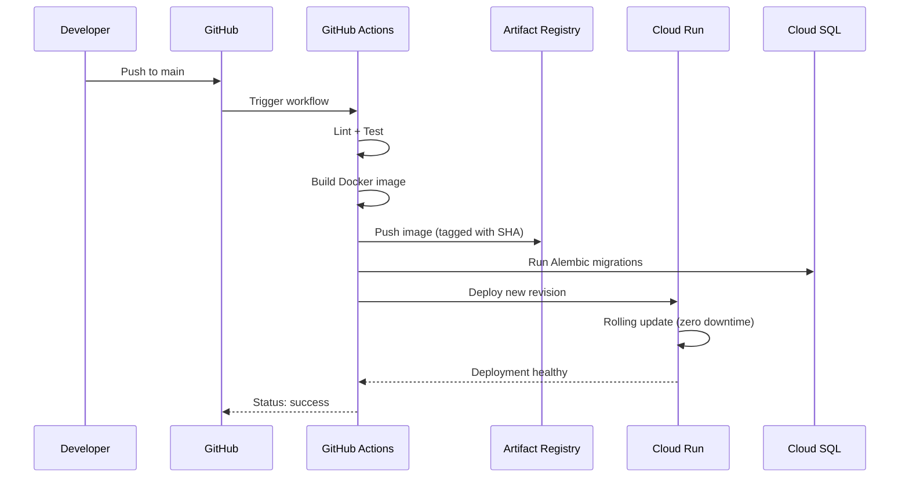

# VettCode Infrastructure & SRE — Detailed Design Document

**Component:** `vettcode-platform-infra`
**Version:** 0.1-draft
**Status:** In Review
**Parent Document:** [00b-product-overview-technical.md](../00b-product-overview-technical.md)
**Milestone:** Runs parallel to all milestones — infra is set up before code ships

---

## Table of Contents

1. [Component Overview](#1-component-overview)
2. [Functional Requirements](#2-functional-requirements)
3. [Technical Requirements](#3-technical-requirements)
4. [Architecture](#4-architecture)
5. [Solution Design](#5-solution-design)
6. [Tech Stack](#6-tech-stack)
7. [Environments](#7-environments)
8. [Diagrams](#8-diagrams)
9. [Testing Plan](#9-testing-plan)
10. [Capacity & Performance](#10-capacity--performance)
11. [Milestones & Tickets](#11-milestones--tickets)

---

## 1. Component Overview

### Purpose

The `vettcode-platform-infra` repo contains all infrastructure-as-code (Terraform), monitoring configuration, and operational runbooks for the VettCode platform. It provisions and manages the GCP project, Vercel deployment, DNS, secrets, and all service configurations. CI/CD workflows for application components live in their respective repos (see FR-07).

### Scope

This component is responsible for **shared, cross-cutting infrastructure**. Component-specific deployment configuration (Cloud Run sizing, CI/CD workflows, environment variables, health checks) lives in each component's own design doc — see the cross-reference table in FR-02 and FR-07.

This component owns:

- **GCP project setup** — IAM, APIs, networking, service accounts
- **Terraform modules** — Cloud Run (reusable), Cloud SQL, Cloud Storage, Cloud Tasks, Secret Manager
- **CI/CD pipeline templates** — Authored here during milestone I4, committed to each app repo; Terraform plan/apply workflows live in this repo
- **Monitoring & alerting** — GCP Cloud Monitoring dashboards, uptime checks, alerting policies
- **Secret management** — Provisioning secrets in GCP Secret Manager, rotation strategy, IAM
- **DNS & domains** — `vettcode.com`, `api.vettcode.com`, `platform.vettcode.com`
- **Environment management** — dev, staging, production configurations
- **Operational runbooks** — Incident response, scaling procedures, disaster recovery

### Boundaries

This component does NOT:

- Contain application code (that lives in `vettcode-platform-be`, `vettcode-platform-fe`, `vettcode-deep-scan`, `vettcode-scanner`)
- Manage Stripe or Clerk configuration (those are configured via their dashboards, not IaC)
- Manage the scanner's GitHub Releases distribution (that's in the scanner repo's CI)

### Provider Strategy

| Layer | Provider | Why |
| --- | --- | --- |
| Frontend hosting | Vercel | Native Next.js, free tier CDN, preview deployments |
| Backend + Workers | GCP Cloud Run | Scale-to-zero (workers), min 1 warm instance (API), same VPC |
| Database | GCP Cloud SQL | Managed Postgres, same VPC |
| Job queue | GCP Cloud Tasks | Serverless, no idle cost |
| Cron scheduling | GCP Cloud Scheduler | Managed cron, OIDC auth to Cloud Run, 3 free jobs |
| Object storage | GCP Cloud Storage | Same region, signed URLs |
| Secrets | GCP Secret Manager | Same project, IAM-based access |
| DNS | Cloudflare (DNS only) | Free tier, fast propagation, no proxying |
| IaC | Terraform | Industry standard |
| CI/CD | GitHub Actions | Same platform as code, free tier generous |
| Monitoring | GCP Cloud Monitoring | Native integration, no extra vendor |

### Provider Strategy Rationale

> Full provider evaluation and trade-off analysis in [00b Section 12](../00b-product-overview-technical.md) (single source of truth). Key decisions summarized here for infra context.

**Why GCP + Vercel:** Cloud Run's true scale-to-zero fits bursty scan workloads. All backend services share one VPC (zero cross-network latency). Vercel is the natural Next.js host. Cross-origin calls (Vercel → GCP API) are standard.

**Report download flow:**
Backend generates a **short-lived signed GCS URL** (valid ~15 min) after auth check. Buyer's browser downloads directly from GCS — no bandwidth through Cloud Run. Auth is enforced before the URL is issued.

**Single-region trade-off (us-central1):** Cross-border deals are common in digital asset M&A (~85% per Flippa data), so some users will be in Europe/Asia. API calls from London add ~100-150ms round-trip vs. US users. This is acceptable because: (1) the frontend is on Vercel's global CDN — page loads are fast everywhere, (2) auth is on Clerk's global CDN, (3) API calls are infrequent per transaction (view report, upload scan) and return small JSON payloads — an extra 100ms is imperceptible, (4) latency-insensitive workflows (deep scan, payments) are async or handled by globally-distributed third parties (Stripe, Anthropic). Multi-region Cloud Run + Cloud SQL replicas would add significant cost and complexity for zero perceptible UX improvement at V1 volumes. Revisit only if user feedback specifically cites API latency.

---

## 2. Functional Requirements

### FR-01: GCP Project & IAM

**User Story:** As an operator, I can provision the GCP project with least-privilege IAM so that each service only accesses what it needs.

**Acceptance Criteria:**

- AC-1.1: Single GCP project per environment (`vettcode-dev`, `vettcode-staging`, `vettcode-prod`)
- AC-1.2: Service accounts per component (naming convention: `vettcode-{service}`):
  - `vettcode-api` — Backend API: Cloud SQL, Cloud Tasks, Cloud Storage, Secret Manager
  - `vettcode-scan-worker` — Scan worker: Cloud Storage (write scan results), no Cloud SQL direct access. The scan worker receives clone credentials from the backend via the Cloud Tasks payload. It does not access Secret Manager directly. Scanner binary signing uses keys embedded at build time (see 01-scanner-design.md).
  - `vettcode-deep-scan-worker` — Deep scan worker: Secret Manager (Anthropic API key). No Cloud Storage access — the worker sends results to the backend via internal API callback, and the backend handles GCS storage.
  - `vettcode-ci` — CI/CD: deploy to Cloud Run, manage Cloud SQL migrations
- AC-1.3: No individual user accounts with production access — all access via service accounts or Terraform
- AC-1.4: Billing alerts at $200, $500, $1,000, $2,500 monthly thresholds

### FR-02: Cloud Run Services

**User Story:** As an operator, I can deploy and manage all Cloud Run services via Terraform.

**Acceptance Criteria:**

- AC-2.1: Three Cloud Run services are provisioned via the shared Terraform module (Section 5.1), plus the frontend on Vercel. Per-service configuration (CPU, memory, scaling, timeouts, concurrency) is documented in each component's deployment section:

  | Service | Component Doc | Deployment Section |
  | --- | --- | --- |
  | `vettcode-api` | [02-platform-backend-design.md](./02-platform-backend-design.md) | Section 12: Deployment & Operations |
  | `vettcode-scan-worker` | [01-scanner-design.md](./01-scanner-design.md) | Section 11: Deployment & Distribution |
  | `vettcode-deep-scan-worker` | [03-deep-scan-design.md](./03-deep-scan-design.md) | Section 11: Deployment & Operations |
  | Frontend (Vercel) | [04-platform-frontend-design.md](./04-platform-frontend-design.md) | Section 11: Deployment & Operations |

- AC-2.2: All Cloud Run services use the same VPC connector (same network as Cloud SQL)
- AC-2.3: Container images stored in GCP Artifact Registry. **Single shared registry** in the prod project (`us-central1-docker.pkg.dev/vettcode-prod/vettcode/`) — dev and staging pull from the same registry using image tags (`:dev-<sha>`, `:staging-<sha>`, `:prod-<sha>`). This avoids duplicate storage costs and simplifies image promotion (same image, different tag).

### FR-03: Cloud SQL (PostgreSQL)

**User Story:** As an operator, I can manage the database lifecycle via Terraform with automated backups.

**Acceptance Criteria:**

- AC-3.1: PostgreSQL 15+ instance, same region as Cloud Run (`us-central1`)
- AC-3.2: Instance sizing by period:
  - Month 1-3: `db-f1-micro` (shared core, 0.6 GB RAM) — $7-10/mo
  - Month 4-6: `db-custom-2-4096` (2 vCPU, 4 GB RAM) — ~$50-80/mo
  - Month 7-12: `db-custom-4-8192` (4 vCPU, 8 GB RAM) — ~$150-200/mo
- AC-3.3: Automated daily backups, 7-day retention
- AC-3.4: Point-in-time recovery enabled
- AC-3.5: Private IP only (no public IP) — accessible only via VPC from Cloud Run
- AC-3.6: Database credentials stored in Secret Manager, rotated quarterly
- AC-3.7: Connection via Cloud SQL Auth Proxy (built into Cloud Run)

### FR-04: Cloud Storage

**User Story:** As an operator, I can manage GCS buckets for report storage.

**Acceptance Criteria:**

- AC-4.1: One bucket per environment: `vettcode-reports-dev`, `vettcode-reports-staging`, `vettcode-reports-prod`
- AC-4.2: Bucket structure: `reports/` (signed static reports), `deep-reports/` (signed deep scan reports)
- AC-4.3: No public access — all reads via signed URLs (15-min expiry, generated by backend)
- AC-4.4: Lifecycle rule: no deletion (reports are permanent)
- AC-4.5: Versioning enabled (protection against accidental overwrites)
- AC-4.6: Standard storage class (not Nearline/Coldline — reports are frequently accessed)

### FR-05: Cloud Tasks

**User Story:** As an operator, I can manage Cloud Tasks queues for async job dispatch.

**Acceptance Criteria:**

- AC-5.1: Cloud Tasks queues are provisioned via Terraform. Per-queue configuration (timeout, retry, concurrency) is documented in each component's deployment section:
  - `github-scan-queue` — see [01-scanner-design.md](./01-scanner-design.md) Section 11.2
  - `deep-scan-queue` — see [03-deep-scan-design.md](./03-deep-scan-design.md) Section 11.2
  - `report-generation-queue` — see [02-platform-backend-design.md](./02-platform-backend-design.md) Section 12.2
- AC-5.2: Queue rate limits match Cloud Run max instances (prevent overwhelming workers)
- AC-5.3: Dead letter configuration: failed tasks after retries are logged to Cloud Logging (no DLQ in V1)

### FR-05b: Cloud Scheduler

**User Story:** As an operator, I can manage cron-triggered jobs via Terraform.

**Acceptance Criteria:**

- AC-5b.1: Cloud Scheduler jobs provisioned via Terraform:
  - `backend-deep-scan-reminders` — `0 9 * * *` (09:00 UTC daily) → `POST /api/v1/internal/deep-scan-reminders` (targets Backend Cloud Run service)
- AC-5b.2: Each job uses OIDC authentication — Cloud Scheduler's service account has `roles/run.invoker` on the target Cloud Run service
- AC-5b.3: Retry config: 3 retries with exponential backoff on failure

### FR-06: Secret Manager

> **Policy reference:** This component owns key *lifecycle* responsibilities (provisioning, storage, rotation, backup, IAM, audit logging) as defined in [00b Section 13 — Ed25519 Key Management](../00b-product-overview-technical.md). Key *usage* (signing, verification, public key registry) is owned by [Platform Backend (02)](./02-platform-backend-design.md).

**User Story:** As an operator, I can manage all secrets centrally with audit trails.

**Acceptance Criteria:**

- AC-6.1: Secrets provisioned via Terraform (secret resource), values set manually or via CI (never in Terraform state)
- AC-6.2: Required secrets (central inventory — per-service secret usage is documented in each component's deployment section):
  - `vettcode-platform-signing-key-{YYYY-MM}` — Ed25519 private key for report signing
  - `stripe-secret-key` — Stripe API key
  - `stripe-webhook-secret` — Stripe webhook signing secret
  - `clerk-secret-key` — Clerk backend API key
  - `clerk-webhook-secret` — Clerk webhook signing secret
  - `github-app-private-key` — GitHub App private key (for installation token requests)
  - `gitlab-oauth-client-id` — GitLab OAuth2 client ID (used by backend for GitLab integration)
  - `gitlab-oauth-client-secret` — GitLab OAuth2 client secret (used by backend for GitLab integration)
  - `git-token-encryption-key` — AES-256-GCM key for encrypting stored Git provider tokens (used by backend; see 02-platform-backend-design.md)
  - `anthropic-api-key` — Claude API key
  - `resend-api-key` — Resend API key for transactional email (used by `vettcode-api`)
  - `database-url` — PostgreSQL connection string
- AC-6.3: IAM: only the specific service account that needs a secret can access it. For the platform signing key, only the `vettcode-api` Cloud Run service account has `secretmanager.versions.access`. No human IAM principals. Per-secret IAM bindings:
  - `vettcode-api`: `vettcode-platform-signing-key-*`, `stripe-secret-key`, `stripe-webhook-secret`, `clerk-secret-key`, `clerk-webhook-secret`, `github-app-private-key`, `gitlab-oauth-client-id`, `gitlab-oauth-client-secret`, `git-token-encryption-key`, `anthropic-api-key`, `resend-api-key`, `database-url`
  - `vettcode-deep-scan-worker`: `anthropic-api-key` (backend handles report signing — see 03-deep-scan-design.md)
- AC-6.4: Signing key rotation: new key created annually (`YYYY-MM` identifies minting date), old keys retained for verification
- AC-6.5: **Backup**: Encrypted backup of the platform signing key stored in a **separate GCP project** (`vettcode-key-backup`), isolated from production. Recovery procedure documented in the infrastructure runbook. Loss of this key is existential — no new reports can be signed, no old reports can be verified.
- AC-6.6: **Audit logging**: GCP Cloud Audit Logs enabled for all Secret Manager access. Alerts configured for unexpected access patterns (access from non-`vettcode-api` principals, access outside of signing operations).

### FR-07: CI/CD Pipelines

**User Story:** As a developer, I can push code and have it automatically tested, built, and deployed.

**Ownership:** Each CI/CD workflow lives in its respective app repo's `.github/workflows/` directory. The infra repo only contains Terraform plan/apply workflows. This ensures each repo is self-contained — a push to the backend repo triggers the backend pipeline without cross-repo dependencies.

**Acceptance Criteria:**

- AC-7.1: Each component's CI/CD pipeline is documented in its own design doc. The infra repo authors these workflow templates during milestone I4 and commits them to each app repo:

  | Pipeline | Repo | Staging Trigger | Prod Trigger | Design Doc |
  | --- | --- | --- | --- | --- |
  | Backend deploy | `vettcode-platform-be` | Push to `main` | Release tag (`v*`) + manual approval | [02](./02-platform-backend-design.md) Section 12.4 |
  | Frontend deploy | `vettcode-platform-fe` | Vercel preview (push/PR) | Vercel production (merge to `main`) | [04](./04-platform-frontend-design.md) Section 11.2 |
  | Scanner release | `vettcode-scanner` | N/A (CLI binary) | Release tag (`v*`) | [01](./01-scanner-design.md) Section 11.3 |
  | Deep scan deploy | `vettcode-deep-scan` | Push to `main` | Release tag (`v*`) + manual approval | [03](./03-deep-scan-design.md) Section 11.3 |

- AC-7.2: **Infrastructure pipeline** (lives in `vettcode-platform-infra` repo):
  - Trigger: push to `main`, PR to `main`
  - Steps: `terraform fmt -check` → `terraform validate` → `terraform plan` (on PR) → `terraform apply` (on merge to main, for staging; manual approval for prod)
- AC-7.3: All pipelines authenticate to GCP via **Workload Identity Federation (WIF)** — no static service account keys. GitHub Actions exchanges its OIDC token for a short-lived GCP access token (valid ~1 hour). No `GCP_SA_KEY` JSON key exists anywhere — nothing to leak, nothing to rotate.
- AC-7.4: WIF configuration:
  - One Workload Identity Pool per GCP project (`vettcode-github-pool`)
  - One OIDC provider pointing to GitHub (`token.actions.githubusercontent.com`)
  - Attribute mapping restricts access by **GitHub organization or owner**: only repos under the VettCode GitHub org/owner matching `<github-org>/vettcode-*` can assume GCP service accounts. The exact org name is configured per environment in `.tfvars` — not hardcoded in Terraform modules.
  - Each app repo's CI workflow uses `google-github-actions/auth@v2` with `workload_identity_provider` — zero static credentials

### FR-08: Monitoring & Alerting

**User Story:** As an operator, I know when something is wrong before users report it.

**Acceptance Criteria:**

- AC-8.1: **Uptime checks** (GCP Cloud Monitoring):
  - `GET https://api.vettcode.com/api/v1/health` — every 1 minute
  - `GET https://platform.vettcode.com` — every 5 minutes
  - Alert on 3 consecutive failures
- AC-8.2: **Cloud Run metrics dashboard**:
  - Request count, latency (p50/p95/p99), error rate (4xx, 5xx)
  - Instance count (auto-scaling behavior)
  - CPU/memory utilization per service
- AC-8.3: **Cloud SQL metrics dashboard**:
  - Active connections, CPU utilization, disk usage
  - Query latency, replication lag (if applicable)
- AC-8.4: **Business metrics dashboard** (custom, built from Cloud Logging):
  - Scans uploaded/day, reports generated/day, deep scans/day
  - Payment success/failure rate
  - GitHub scan success/failure rate
  - Scan-to-paid conversion rate
- AC-8.5: **Alert policies**:
  - API error rate > 5% for 5 minutes → alert
  - API p95 latency > 2s for 5 minutes → alert
  - Cloud SQL CPU > 80% for 10 minutes → alert
  - Cloud SQL disk > 80% capacity → alert
  - Health check failures (3 consecutive) → alert
  - Billing threshold exceeded → alert
- AC-8.5a: **Log-based alert policies** (Cloud Logging → Cloud Monitoring):
  - Payment failure rate > 5% over 1 hour (log filter: `jsonPayload.event="payment.failed"`) → alert. Revenue-critical — a Stripe outage or webhook misconfiguration silently losing payments is the highest-impact business failure.
  - Report generation failure rate > 10% over 1 hour (log filter: `jsonPayload.event="report.generation_failed"`) → alert
  - Deep scan failure rate > 20% over 24 hours (log filter: `jsonPayload.event="deep_scan.failed"`) → alert. Higher threshold because deep scans have legitimate failure modes (LLM outage, oversized repos).
- AC-8.6: Alert channels: email to ops team. V2: add PagerDuty/Slack.

### FR-09: DNS & Domains

**User Story:** As an operator, I can manage all VettCode domains and SSL.

**Acceptance Criteria:**

- AC-9.1: Domain: `vettcode.com` managed via Cloudflare (DNS only, no proxy)
- AC-9.2: DNS records:
  - `vettcode.com` → Vercel (marketing + frontend)
  - `platform.vettcode.com` → Vercel (same Next.js app, alias)
  - `api.vettcode.com` → GCP Cloud Run (backend API)
  - `get.vettcode.com` → GitHub Pages or Vercel (scanner install script)
- AC-9.3: SSL certificates: auto-provisioned by Vercel (frontend) and GCP (Cloud Run)
- AC-9.4: DNS records managed via Terraform (Cloudflare provider)

### FR-10: Database Migrations

**User Story:** As a developer, I can run database migrations safely in all environments.

**Acceptance Criteria:**

- AC-10.1: Migrations run via Alembic (`alembic upgrade head`)
- AC-10.2: In CI: migrations run as a pre-deploy step against the target database
- AC-10.3: In local dev: migrations run via `docker-compose exec api alembic upgrade head`
- AC-10.4: Migration files are version-controlled in `vettcode-platform-be/alembic/versions/`
- AC-10.5: Destructive migrations (drop column, drop table) require manual approval in production
- AC-10.6: Cloud SQL Auth Proxy used for secure migration connections from CI

---

## 3. Technical Requirements

### Availability

| Metric | Target |
| --- | --- |
| API uptime | 99.9% (< 8.77 hours downtime/year) |
| Frontend uptime | 99.99% (Vercel SLA) |
| Database uptime | 99.95% (Cloud SQL SLA) |
| Planned maintenance window | Weekdays 2-4 AM UTC (off-peak) |

### Recovery

| Metric | Target |
| --- | --- |
| Recovery Time Objective (RTO) | < 2 hours (full service recovery); < 1 hour (database restore) |
| Recovery Point Objective (RPO) | < 5 minutes (point-in-time recovery from WAL) |
| Database backup frequency | Daily automated + continuous WAL archiving |
| Database backup retention | 7 days |

### Security

| Requirement | Implementation |
| --- | --- |
| Network isolation | Cloud SQL on private IP, VPC connector for Cloud Run |
| Secret storage | GCP Secret Manager, IAM-restricted per service account |
| Encryption at rest | GCP default (AES-256), Cloud SQL encrypted by default |
| Encryption in transit | TLS 1.2+ everywhere (Cloud Run, Cloud SQL, GCS) |
| Access control | Service accounts with least-privilege IAM roles |
| Audit logging | Cloud Audit Logs enabled for all GCP services |
| Container scanning | Artifact Registry vulnerability scanning enabled |

> **Deferred security hardening (V1.1) — tracked items:**
>
> 1. **Cloud Armor WAF** — Add GCP Cloud Armor in front of the API Cloud Run service for: L7 DDoS mitigation, rate limiting by IP, geographic blocking, OWASP Top 10 WAF rules. Estimated cost: $5-12/mo. Not a V1 blocker because (a) the API is authenticated (Clerk JWTs) — unauthenticated abuse is limited to public endpoints, and (b) Cloud Run's scale-to-max protects against runaway costs.
> 2. **VPC egress controls** — Restrict outbound traffic from Cloud Run services to only required destinations (Anthropic API, Stripe, GitHub, GitLab, Resend, Clerk). V1 relies on service-level controls (API keys, HTTPS-only). V1.1 adds VPC firewall egress rules for defense-in-depth.
> 3. **DB credential rotation automation** — See Section 5.4, database credentials row.

---

## 4. Architecture

### 4.1 Repository Structure

```
vettcode-platform-infra/
├── terraform/
│   ├── environments/
│   │   ├── dev/
│   │   │   ├── main.tf              # Dev environment config
│   │   │   ├── variables.tf
│   │   │   ├── terraform.tfvars
│   │   │   └── backend.tf           # GCS state backend
│   │   ├── staging/
│   │   │   ├── main.tf
│   │   │   ├── variables.tf
│   │   │   ├── terraform.tfvars
│   │   │   └── backend.tf
│   │   └── prod/
│   │       ├── main.tf
│   │       ├── variables.tf
│   │       ├── terraform.tfvars
│   │       └── backend.tf
│   │
│   ├── modules/
│   │   ├── cloud-run/
│   │   │   ├── main.tf              # Cloud Run service resource
│   │   │   ├── variables.tf
│   │   │   └── outputs.tf
│   │   ├── cloud-sql/
│   │   │   ├── main.tf              # Cloud SQL instance + database
│   │   │   ├── variables.tf
│   │   │   └── outputs.tf
│   │   ├── cloud-storage/
│   │   │   ├── main.tf              # GCS bucket
│   │   │   ├── variables.tf
│   │   │   └── outputs.tf
│   │   ├── cloud-tasks/
│   │   │   ├── main.tf              # Cloud Tasks queues
│   │   │   ├── variables.tf
│   │   │   └── outputs.tf
│   │   ├── cloud-scheduler/
│   │   │   ├── main.tf              # Cloud Scheduler jobs (backend cron triggers)
│   │   │   ├── variables.tf
│   │   │   └── outputs.tf
│   │   ├── secret-manager/
│   │   │   ├── main.tf              # Secret resources (not values)
│   │   │   ├── variables.tf
│   │   │   └── outputs.tf
│   │   ├── iam/
│   │   │   ├── main.tf              # Service accounts + role bindings + Workload Identity Federation
│   │   │   ├── variables.tf
│   │   │   └── outputs.tf
│   │   ├── networking/
│   │   │   ├── main.tf              # VPC connector, firewall rules
│   │   │   ├── variables.tf
│   │   │   └── outputs.tf
│   │   ├── monitoring/
│   │   │   ├── main.tf              # Uptime checks, alert policies, dashboards
│   │   │   ├── variables.tf
│   │   │   └── outputs.tf
│   │   └── dns/
│   │       ├── main.tf              # Cloudflare DNS records
│   │       ├── variables.tf
│   │       └── outputs.tf
│   │
│   └── versions.tf                  # Provider versions (google, cloudflare)
│
├── .github/
│   └── workflows/
│       ├── terraform-plan.yml        # PR: fmt check + validate + plan
│       └── terraform-apply.yml       # Merge to main: apply (staging auto, prod manual)
│
│   # Note: App CI/CD workflows live in their respective repos:
│   #   vettcode-platform-be/.github/workflows/deploy.yml
│   #   vettcode-deep-scan/.github/workflows/deploy.yml
│   #   vettcode-scanner/.github/workflows/release.yml
│   #   vettcode-platform-fe uses Vercel's native GitHub integration (no custom workflow)
│
├── runbooks/
│   ├── incident-response.md          # Who to contact, severity levels, escalation
│   ├── database-recovery.md          # Restore from backup, point-in-time recovery
│   ├── scaling.md                    # How to scale Cloud Run, Cloud SQL up/down
│   ├── secret-rotation.md            # Steps to rotate each secret type
│   └── deploy-rollback.md           # How to roll back a bad deploy
│
└── README.md
```

### Runbook Outlines

**Database Recovery (`database-recovery.md`):**
- Cloud SQL automated backups: daily, 7-day retention, point-in-time recovery enabled
- Restore procedure: `gcloud sql backups restore` to a new instance, validate data integrity, swap DNS/connection string
- RTO target: < 1 hour (restore), < 2 hours (full service recovery)
- RPO: < 5 minutes (point-in-time recovery from WAL)
- Test: monthly restore drill to a throwaway instance (already in SRE tests table)

**Signing Key Recovery (`secret-rotation.md` — key compromise section):**
- Primary copy: GCP Secret Manager (`vettcode-prod` project)
- Backup copy: `vettcode-key-backup` GCP project (cross-project, separate IAM)
- Recovery: if primary Secret Manager is compromised, restore from backup project
- If both compromised: generate new keypair, mark old key as revoked in public key registry, re-sign affected reports if forgery suspected
- All old keys retained (never deleted) for historical verification

**GCP Project Compromise:**
- Immediate: revoke all service account keys, rotate all API keys (Stripe, Clerk, GitHub, Anthropic, Resend), disable compromised service accounts
- Assess: review Cloud Audit Logs to determine scope (what was accessed, when, from where)
- Contain: if production project compromised, failover to staging (manual DNS switch) while rebuilding prod
- Rebuild: Terraform can recreate all infrastructure from code — data recovery from Cloud SQL backup
- Notify: affected users if PII was potentially exposed (GDPR requirement)

### 4.2 Infrastructure Diagram

```
                     Cloudflare (DNS Only)
                           │
          ┌────────────────┼────────────────┐
          │                │                │
   vettcode.com    api.vettcode.com  get.vettcode.com
   platform.vettcode.com
          │                │                │
          ▼                ▼                ▼
   ┌────────────┐  ┌──────────────────────────────────────────┐
   │   Vercel    │  │        GCP Project (us-central1)         │
   │             │  │                                           │
   │  Next.js    │  │  ┌──────────────────────────────────┐    │
   │  Frontend   │  │  │  VPC (vettcode-vpc)               │    │
   │             │  │  │                                    │    │
   │  - CDN      │  │  │  ┌────────────┐                   │    │
   │  - SSR/SSG  │  │  │  │ Cloud Run  │                   │    │
   │  - Preview  │  │  │  │            │                   │    │
   │    deploys  │  │  │  │ vettcode-  │  ┌────────────┐   │    │
   └────────────┘  │  │  │ api        │  │ Cloud Run  │   │    │
                    │  │  │ (backend)  │  │            │   │    │
   ┌────────────┐  │  │  └─────┬──────┘  │ scan-worker│   │    │
   │   Clerk     │  │  │       │          └────────────┘   │    │
   │  (Auth)     │  │  │       │                           │    │
   └────────────┘  │  │       │          ┌────────────┐   │    │
                    │  │       │          │ Cloud Run  │   │    │
   ┌────────────┐  │  │       │          │            │   │    │
   │   Stripe    │  │  │       │          │ deep-scan- │   │    │
   │ (Payments)  │  │  │       │          │ worker     │   │    │
   └────────────┘  │  │       │          └────────────┘   │    │
                    │  │       │                           │    │
                    │  │       │          ┌────────────┐   │    │
                    │  │       │          │ Cloud      │   │    │
                    │  │       │          │ Scheduler  │   │    │
                    │  │       │          │ (1 cron:   │   │    │
                    │  │       │          │  Backend)  │   │    │
                    │  │       │          └────────────┘   │    │
                    │  │       │                           │    │
   ┌────────────┐  │  │  ┌────▼──────┐  ┌────────────┐   │    │
   │   GitHub    │  │  │  │Cloud SQL  │  │ Cloud      │   │    │
   │   API       │  │  │  │(Postgres) │  │ Tasks      │   │    │
   └────────────┘  │  │  │ Private IP│  │ 3 queues   │   │    │
                    │  │  └───────────┘  └────────────┘   │    │
   ┌────────────┐  │  │                                    │    │
   │   Claude    │  │  │  ┌───────────┐  ┌────────────┐   │    │
   │   API       │  │  │  │ Cloud     │  │ Secret     │   │    │
   └────────────┘  │  │  │ Storage   │  │ Manager    │   │    │
                    │  │  │ (reports) │  │ (keys,     │   │    │
   ┌────────────┐  │  │  └───────────┘  │  API keys) │   │    │
   │   Resend    │  │  │                 └────────────┘   │    │
   │  (Email)    │  │  │                                    │    │
   └────────────┘  │  └──────────────────────────────────┘    │
                    │                                           │
                    │  ┌──────────────────────────────────┐    │
                    │  │  Cloud Monitoring                  │    │
                    │  │  - Uptime checks                   │    │
                    │  │  - Dashboards                      │    │
                    │  │  - Alert policies                  │    │
                    │  └──────────────────────────────────┘    │
                    │                                           │
                    │  ┌──────────────────────────────────┐    │
                    │  │  Artifact Registry                 │    │
                    │  │  - Backend image                   │    │
                    │  │  - Scan worker image               │    │
                    │  │  - Deep scan worker image          │    │
                    │  └──────────────────────────────────┘    │
                    └──────────────────────────────────────────┘
```

### 4.3 Network Architecture

```
┌─────────────────────────────────────────────────────────────┐
│  GCP VPC: vettcode-vpc (us-central1)                         │
│                                                               │
│  ┌─────────────────────────┐                                  │
│  │  Serverless VPC Access   │                                  │
│  │  Connector               │                                  │
│  │  (10.8.0.0/28)          │                                  │
│  └──────────┬──────────────┘                                  │
│             │                                                  │
│  ┌──────────▼──────────────┐  ┌─────────────────────────┐    │
│  │  Cloud Run services     │  │  Cloud SQL               │    │
│  │  (vettcode-api,         │──│  Private IP: 10.x.x.x   │    │
│  │   scan-worker,          │  │  No public IP             │    │
│  │   deep-scan-worker)     │  └─────────────────────────┘    │
│  └─────────────────────────┘                                  │
│                                                               │
│  Egress (outbound):                                           │
│  - api.stripe.com (payments)                                  │
│  - api.clerk.com (auth verification)                          │
│  - api.github.com (repo access)                               │
│  - gitlab.com + arbitrary self-hosted GitLab instances (repo   │
│    access — scan workers may connect to seller-provided URLs)  │
│  - api.anthropic.com (Claude, deep scan only)                 │
│  - api.resend.com (email)                                     │
│  - storage.googleapis.com (GCS)                               │
│                                                               │
│  Ingress (inbound):                                           │
│  - HTTPS only (443), managed by Cloud Run                     │
│  - Cloud Run handles TLS termination                          │
│  - No SSH, no direct DB access from internet                  │
└─────────────────────────────────────────────────────────────┘
```

> **Egress rules are descriptive, not enforced.** The egress list above documents expected outbound traffic patterns for operational awareness and audit. Cloud Run services can reach any internet endpoint by default — GCP does not enforce egress firewalling on Cloud Run without a VPC egress gateway (Cloud NAT + VPC Connector in `ALL_TRAFFIC` mode), which adds $30-40/mo and operational complexity not justified at V1 scale. This is acceptable for V1 because: (1) all secrets are in Secret Manager (not in application code), (2) outbound traffic is to well-known API endpoints authenticated via API keys, (3) a compromised container cannot exfiltrate data without valid API credentials. For V1.1, evaluate VPC egress restrictions if the security posture requires it. **Note:** Self-hosted GitLab support means scan workers may connect to arbitrary seller-provided URLs — this must be treated as an exception in any future VPC egress allowlist.

---

## 5. Solution Design

### 5.1 Terraform Module: Cloud Run Service

The Cloud Run module is reused for all three services (API, scan worker, deep scan worker) with different parameters:

```hcl
# Cloud Run service configuration (Terraform)
# - Scale-to-zero (min 0, max 10), 512MB/1 vCPU per instance
# - VPC connector for Cloud SQL access (serverless-vpc)
# - Cloud SQL Auth Proxy sidecar (IAM auth, no DB passwords)
# - Env vars from Secret Manager (DATABASE_URL, CLERK_*, STRIPE_*, etc.)
# - Ingress: internal + load balancer only
# Implementation: see infra/modules/cloud-run/
```

> **Environment-specific scaling:** `min_instances` is set to 0 for dev and staging environments (scale-to-zero, no idle cost). Only production uses `min_instances = 1` for the API service to eliminate cold-start latency. This is controlled via per-environment `.tfvars` files. Scan workers and deep scan workers use `min_instances = 0` in all environments (on-demand only).

### 5.2 Terraform Module: Cloud SQL

```hcl
# Cloud SQL PostgreSQL configuration (Terraform)
# - PostgreSQL 15, db-f1-micro (dev) / db-custom-2-4096 (prod)
# - Point-in-time recovery enabled (7 day retention)
# - Automated backups, maintenance window: Weekdays 02:00-04:00 UTC
# - Private IP only (no public access), same VPC as Cloud Run
# - Deletion protection enabled in prod
# Implementation: see infra/modules/cloud-sql/
```

### 5.3 CI/CD Pipeline Templates

CI/CD workflow templates are authored during infra milestone I4 and committed to each app repo. Full workflow definitions (including GitHub Actions YAML) are documented in each component's deployment section:

- **Backend deploy:** [02-platform-backend-design.md](./02-platform-backend-design.md) Section 12.4
- **Scanner release:** [01-scanner-design.md](./01-scanner-design.md) Section 11.3
- **Deep scan deploy:** [03-deep-scan-design.md](./03-deep-scan-design.md) Section 11.3
- **Frontend deploy:** [04-platform-frontend-design.md](./04-platform-frontend-design.md) Section 11.2 (Vercel native)

### 5.4 Secret Rotation Procedure

| Secret | Rotation Frequency | Procedure |
| --- | --- | --- |
| Ed25519 platform signing key | Annually (or immediately on compromise) | 1. Generate new Ed25519 keypair. 2. Store in Secret Manager with `YYYY-MM` key ID. 3. Backup to `vettcode-key-backup` project. 4. Notify backend team to register new public key in the platform's key registry. 5. Old key retained — never deleted. |
| Stripe API keys | On compromise only | Regenerate in Stripe dashboard, update Secret Manager |
| Clerk keys | On compromise only | Regenerate in Clerk dashboard, update Secret Manager |
| GitHub App private key | On compromise only | Regenerate in GitHub, update Secret Manager |
| Anthropic API key | On compromise only | Regenerate in Anthropic dashboard, update Secret Manager |
| Resend API key | On compromise only | Regenerate in Resend dashboard, update Secret Manager |
| Database credentials | Quarterly (manual — V1) | Create new Cloud SQL user, update Secret Manager, drop old user. **V1: manual procedure per `secret-rotation.md` runbook (INFRA-036). V1.1: automate via Cloud Scheduler + Cloud Function (estimated: 0.5 day).** |

**Platform Signing Key — Compromise Response (Infra responsibilities):**

1. **Immediately** generate a new Ed25519 keypair and store in Secret Manager
2. Backup the new key to the `vettcode-key-backup` GCP project
3. Revoke IAM access to the compromised key version (but do not delete the secret version — needed for audit)
4. Notify the backend team to mark the old key as **revoked** in the public key registry and begin signing with the new key
5. Review Cloud Audit Logs to determine scope of compromise (when, how, what was accessed)
6. Coordinate with backend team on re-signing affected reports if forgery is suspected
7. Publish post-incident report

### 5.5 Terraform State Management

```hcl
# Terraform state: GCS backend
# Bucket: vettcode-terraform-state, prefix per environment (prod/, staging/)
# Implementation: see infra/environments/
```

- State stored in a dedicated GCS bucket with versioning enabled
- State locking via GCS (built-in)
- One state file per environment (dev, staging, prod)
- State bucket is in a separate GCP project (`vettcode-infra`) for isolation

### 5.6 Deployment Strategy

> Summary view. Per-component deployment details (Dockerfile, env vars, CI/CD workflow) are in each component's deployment section.

| Component | Strategy | Rollback |
| --- | --- | --- |
| Backend API | Rolling update (Cloud Run handles traffic splitting) | Redeploy previous image revision |
| Scan Worker | Rolling update | Redeploy previous image |
| Deep Scan Worker | Rolling update | Redeploy previous image |
| Frontend | Vercel atomic deploys (instant rollback via dashboard) | Click "Promote" on previous deployment |
| Database migrations | Forward-only (no down migrations in prod) | Fix-forward with a new migration |
| Terraform | Plan on PR, apply on merge (staging auto, prod manual) | `terraform apply` with previous state |

---

## 6. Tech Stack

| Layer | Technology | Version | Rationale |
| --- | --- | --- | --- |
| IaC | Terraform | 1.7+ | Industry standard, GCP + Cloudflare providers |
| CI/CD | GitHub Actions | N/A | Same platform as code repos, free tier (2,000 min/mo). Workflows live in each app repo; only Terraform workflows in infra repo |
| Cron Scheduling | GCP Cloud Scheduler | N/A | Managed cron, OIDC auth to Cloud Run, 3 free jobs |
| Container Registry | GCP Artifact Registry | N/A | Same project, integrated vulnerability scanning |
| Monitoring | GCP Cloud Monitoring | N/A | Native, no extra vendor, free for GCP resources |
| Logging | GCP Cloud Logging | N/A | Structured JSON logs from Cloud Run, 30-day retention (free) |
| DNS | Cloudflare | Free tier | Fast propagation, DNS-only mode (no proxy) |
| SSL | Auto-provisioned | N/A | Vercel (frontend) + Cloud Run (backend) handle TLS |

---

## 7. Environments

### 7.1 Environment Matrix

| Aspect | Dev | Staging | Prod |
| --- | --- | --- | --- |
| GCP project | `vettcode-dev` | `vettcode-staging` | `vettcode-prod` |
| Cloud SQL tier | `db-f1-micro` | `db-f1-micro` | Scales with period |
| Cloud Run min instances (API) | 0 | 0 | 1 |
| Cloud Run min instances (workers) | 0 | 0 | 0 |
| Cloud Tasks | Same config | Same config | Same config |
| Stripe | Test mode | Test mode | Live mode |
| Clerk | Dev instance | Staging instance | Prod instance |
| Vercel | Preview deploys | Staging URL | `platform.vettcode.com` |
| Domain | `dev.vettcode.com` | `staging.vettcode.com` | `vettcode.com` |
| Terraform apply | Auto on merge | Auto on merge | Manual approval |
| Backups | None | Daily, 1-day retention | Daily, 7-day retention + PITR |
| Monitoring | Basic | Basic | Full dashboards + alerts |

### 7.2 Local Development

No GCP services needed locally — Cloud Tasks is mocked, Cloud Storage is mocked (or uses a local bucket emulator), Secret Manager values come from `.env`.

Per-component local development setup is documented in each component's deployment section:

- **Backend:** [02-platform-backend-design.md](./02-platform-backend-design.md) Section 12.9
- **Frontend:** [04-platform-frontend-design.md](./04-platform-frontend-design.md) Section 11.7

---

## 8. Diagrams

### 8.1 CI/CD Pipeline Flow

```mermaid
flowchart LR
    subgraph PR["Pull Request"]
        A[Push to branch] --> B[Lint + Type Check]
        B --> C[Unit Tests]
        C --> D[Integration Tests]
        D --> E[Terraform Plan]
        E --> F[PR Review]
    end

    subgraph Deploy["Merge to Main"]
        F --> G[Build Docker Image]
        G --> H[Push to Artifact Registry]
        H --> I[Deploy to Staging]
        I --> J[Smoke Tests]
    end

    subgraph Prod["Production Release"]
        J --> K[Create Release Tag]
        K --> L[Manual Approval]
        L --> M[Deploy to Prod]
        M --> N[Health Check]
    end
```



### 8.2 Deployment Sequence



---

## 9. Testing Plan

### 9.1 Infrastructure Tests

| Test | Tool | What |
| --- | --- | --- |
| Terraform format | `terraform fmt -check` | All `.tf` files are formatted |
| Terraform validate | `terraform validate` | All configs are syntactically valid |
| Terraform plan (dry run) | `terraform plan` | No unexpected changes in staging/prod |
| Module unit tests | `terratest` (optional V2) | Modules provision expected resources |

### 9.2 CI Pipeline Tests

| Test | What |
| --- | --- |
| Backend pipeline | Verify lint, test, build, deploy steps succeed on sample repo |
| Frontend pipeline | Verify lint, test, build steps succeed |
| Scanner pipeline | Verify cross-compilation produces binaries for all target platforms |
| Infra pipeline | Verify plan runs without errors on PR |

### 9.3 Operational Tests

| Test | Frequency | What |
| --- | --- | --- |
| Database backup restore | Monthly | Restore latest backup to a test instance, verify data integrity |
| Rollback drill | Monthly | Deploy a known-bad revision, practice rollback |
| Failover test | Quarterly | Simulate Cloud Run instance failure, verify auto-recovery |
| Secret rotation drill | Quarterly | Rotate a non-critical secret, verify services pick up the new value |

---

## 10. Capacity & Performance

### 10.1 Cost Projection

| Resource | Month 1-3 | Month 4-6 | Month 7-12 |
| --- | --- | --- | --- |
| Cloud Run (API) | ~$15-30 (1 warm instance) | ~$20-40 | ~$50-100 |
| Cloud Run (scan workers) | ~$0 | ~$5-20 | ~$20-80 |
| Cloud Run (deep scan workers) | ~$0 | ~$5-15 | ~$20-50 |
| Cloud SQL | $7-10 | $50-80 | $150-200 |
| Cloud Storage | ~$0 | ~$0.10 | ~$0.50 |
| Cloud Tasks | ~$0 | ~$0 | ~$0 |
| Secret Manager | ~$0.50 | ~$0.50 | ~$0.50 |
| Cloud Monitoring | ~$0 (free tier) | ~$0 | ~$10-20 |
| Artifact Registry | ~$0 | ~$1 | ~$3 |
| Cloud Logging | ~$0 (free 50GB/mo) | ~$0 | ~$5-15 |
| Cloudflare DNS | $0 (free tier) | $0 | $0 |
| Vercel | $0 (free tier) | $0 | $20 |
| GitHub Actions | $0 (free tier) | $0 | $0 |
| LLM API (deep scan) | $10-75 | $50-375 | $150-1,000 |
| **Total** | **$33-115** | **$125-535** | **$430-1,465** |

### 10.2 Scaling Triggers

| Metric | Current | Trigger | Action |
| --- | --- | --- | --- |
| Cloud SQL CPU | — | > 70% sustained | Upgrade tier (next step in sizing plan) |
| Cloud SQL disk | — | > 70% used | Increase disk size (auto-grow enabled) |
| Cloud Run API latency | — | p95 > 1s sustained | Increase min instances, increase CPU |
| Cloud Run scan worker queue | — | > 10 pending tasks | Increase max instances |
| API error rate | — | > 5% for 10 min | Investigate, potentially scale up or roll back |

### 10.3 Key SRE Metrics to Track

> This section is the **single source of truth** for platform-wide SRE metrics. Component-specific metrics (deep scan LLM error rate, token usage, etc.) are in each component's design doc.

**Platform-wide (this doc owns):**
- API availability (target: 99.9%)
- API p95 latency (target: <500ms)
- Scan completion rate (target: >98%)
- Scan duration p50/p95 (target: <5min / <15min)
- Report generation latency (target: <5s)
- GitHub scan worker queue depth (Cloud Tasks)
- Paid report conversion rate (target: >50% of scans)
- Payment failure rate (target: <2% — see AC-8.5a)

**Component-specific (owned by each doc):**
- Deep scan engine: See [03-deep-scan-design.md, Section 11.7](./03-deep-scan-design.md) (completion rate, duration, LLM error rate, token usage, container lifecycle, quality score)

### 10.4 Infrastructure Capacity Requirements (GCP + Vercel)

> Sizing targets to match usage projections in [00a Section 14a](../00a-product-overview-business.md). **Cost totals** are in Section 10.1 (single source of truth) — not repeated here to avoid drift.

| Resource | Month 1-3 | Month 4-6 | Month 7-12 |
| --- | --- | --- | --- |
| Backend API (Cloud Run) | min 0 (dev/staging), min 1 (prod); auto-scale to 1-2 | min 0 (dev/staging), min 1 (prod); auto-scale to 1-2 | min 0 (dev/staging), min 1 (prod); auto-scale to 2-4 |
| Scan Workers — GitHub scans (Cloud Run) | On-demand, scale-to-zero | On-demand, concurrent limit: 10 | On-demand, concurrent limit: 20 |
| Deep Scan Workers (Cloud Run) | On-demand, scale-to-zero | On-demand, concurrent limit: 2 | On-demand, concurrent limit: 5 |
| Cloud Tasks (job queue) | Serverless, near-zero cost | Serverless, near-zero cost | Serverless, near-zero cost |
| Cloud Scheduler (backend crons) | 1 active job, $0 (free tier) | Same | Same |
| PostgreSQL (Cloud SQL) | db-f1-micro (shared core) | db-custom-2-4096 | db-custom-4-8192 |
| Report Storage (GCS) | <1 GB | 2-10 GB | 10-50 GB |
| Frontend (Vercel) | Free tier | Free tier | Pro ($20/mo) |

---

## 11. Milestones & Tickets

### I0: Bootstrap (prerequisite — manual, before any Terraform)

> **Blocker for all INFRA tickets.** These steps cannot be performed by Terraform because Terraform needs a state bucket and service account to run — a bootstrapping problem. All tasks in I0 must be completed manually before any `terraform init` or `terraform apply` is run.

| # | Task | Est. |
| --- | --- | --- |
| INFRA-000 | Bootstrap: manually create `vettcode-infra` project (Terraform state bucket) and `vettcode-key-backup` project (Ed25519 signing key backup). These projects must exist before any Terraform runs. Includes: create projects, enable billing, create state bucket with versioning, create backup bucket, configure cross-project IAM for key backup. | 2h |

### I1: GCP Project Setup (1 day)

| # | Task | Est. |
| --- | --- | --- |
| INFRA-001 | Create GCP projects (dev, staging, prod), enable APIs (Cloud Run, Cloud SQL, Cloud Tasks, Cloud Storage, Secret Manager, Artifact Registry, Cloud Scheduler) | 2h |
| INFRA-002 | Configure Terraform backends per environment (dev, staging, prod) — state bucket already created manually in INFRA-000 | 1h |
| INFRA-003 | Create service accounts with least-privilege IAM bindings | 2h |
| INFRA-004 | Set up billing alerts ($200, $500, $1,000, $2,500) | 0.5h |
| INFRA-005 | Create VPC, Serverless VPC Access connector | 1h |

### I2: Core Infrastructure (2 days)

| # | Task | Est. |
| --- | --- | --- |
| INFRA-006 | Terraform module: Cloud SQL (Postgres 15, private IP, backups, PITR) | 3h |
| INFRA-007 | Terraform module: Cloud Storage (reports bucket, versioning, no public access) | 1h |
| INFRA-008 | Terraform module: Cloud Tasks (3 queues: `github-scan-queue`, `deep-scan-queue`, `report-generation-queue`; rate limits, retry config) | 2h |
| INFRA-009 | Terraform module: Secret Manager (all 14 secrets, IAM per service account) | 2h |
| INFRA-010 | Terraform module: Cloud Run (reusable for API, scan worker, deep scan worker) | 3h |
| INFRA-010b | Terraform module: Cloud Scheduler (1 cron job with OIDC auth per FR-05b: Backend deep scan reminders) | 0.5h |
| INFRA-011 | Terraform module: Artifact Registry — single shared Docker repo in prod project, vulnerability scanning enabled, cross-project IAM grants for dev/staging service accounts to pull images (see AC-2.3) | 1.5h |
| INFRA-012 | Wire all modules together in `environments/dev/main.tf`, apply | 2h |

### I3: DNS & Domains (0.5 day)

| # | Task | Est. |
| --- | --- | --- |
| INFRA-013 | Terraform module: Cloudflare DNS records | 1h |
| INFRA-014 | Configure Cloud Run custom domain mapping (`api.vettcode.com`) | 1h |
| INFRA-015 | Configure Vercel custom domain (`platform.vettcode.com`, `vettcode.com`) | 1h |
| INFRA-016 | Verify SSL certificates auto-provisioned for all domains | 0.5h |

### I4: CI/CD Pipelines (2 days)

| # | Task | Est. |
| --- | --- | --- |
| INFRA-017 | Author backend deploy workflow → commit to `vettcode-platform-be` repo | 3h |
| INFRA-018 | Author deep scan deploy workflow → commit to `vettcode-deep-scan` repo | 2h |
| INFRA-019 | Author scanner release workflow → commit to `vettcode-scanner` repo | 3h |
| INFRA-020 | GitHub Actions: Terraform pipeline (plan on PR, apply on merge) — lives in infra repo | 2h |
| INFRA-021 | Configure Workload Identity Federation: create pool + OIDC provider in each GCP project, bind to app repo service accounts, verify `google-github-actions/auth@v2` in each workflow | 2h |
| INFRA-022 | Verify Vercel GitHub integration for frontend auto-deploy (no custom workflow) | 0.5h |

### I5: Monitoring & Alerting (1 day)

| # | Task | Est. |
| --- | --- | --- |
| INFRA-023 | Terraform module: uptime checks (API health, frontend) | 1h |
| INFRA-024 | Terraform module: alert policies (error rate, latency, CPU, disk, billing) | 2h |
| INFRA-025 | Cloud Monitoring dashboard: Cloud Run metrics (request count, latency, errors, instances) | 2h |
| INFRA-026 | Cloud Monitoring dashboard: Cloud SQL metrics (connections, CPU, disk) | 1h |
| INFRA-027 | Cloud Monitoring dashboard: business metrics (scans, reports, payments from logs) | 2h |
| INFRA-028 | Configure alert notification channels (email) | 0.5h |

### I6: Staging + Prod Deploy (1 day)

| # | Task | Est. |
| --- | --- | --- |
| INFRA-029 | Apply Terraform to staging environment, verify all resources | 2h |
| INFRA-030 | Apply Terraform to production environment (manual approval) | 2h |
| INFRA-031 | Seed production secrets in Secret Manager | 1h |
| INFRA-032 | End-to-end smoke test: deploy dummy backend, verify health check, domain, DB connectivity | 2h |

### I7: Runbooks (0.5 day)

| # | Task | Est. |
| --- | --- | --- |
| INFRA-033 | Write incident response runbook | 1h |
| INFRA-034 | Write database recovery runbook | 1h |
| INFRA-035 | Write scaling + deploy rollback runbook | 1h |
| INFRA-036 | Write secret rotation runbook | 0.5h |

**Total estimated time: ~7.5 working days (~1.5 weeks)**

### Dependencies

| Infra Task | Depends On |
| --- | --- |
| INFRA-001 and all subsequent tickets | **INFRA-000** (bootstrap projects + state bucket must exist first) |
| INFRA-010 (Cloud Run module) | Application Dockerfiles from backend, deep scan repos |
| INFRA-017 (backend CI) | Backend repo exists with Dockerfile + tests |
| INFRA-019 (scanner CI) | Scanner repo exists with build system |
| INFRA-031 (prod secrets) | Stripe, Clerk, GitHub App, GitLab OAuth app, Resend accounts created |

**Parallelization:** I1-I3 (GCP setup, core infra, DNS) can run in Week 1 alongside M1 (scanner) and M2 (platform). I4 (CI/CD) runs as soon as app repos have Dockerfiles. I5-I6 (monitoring, prod deploy) run in parallel with M3-M4 app development. Infra is not on the critical path — it's set up incrementally as app components ship.

---

## 12. Incident Severity Classification

| Severity | Definition | Response Time | Examples |
| --- | --- | --- | --- |
| **P1 — Critical** | Service fully unavailable or data integrity at risk | < 15 minutes | API down, database unresponsive, signing key compromise, data breach |
| **P2 — High** | Major feature broken, significant user impact | < 1 hour | Payment processing failing, report generation broken, scan workers stuck, auth failures |
| **P3 — Medium** | Feature degraded, workaround exists | < 4 hours | Email delivery delays, slow report generation (> 60s), elevated error rates |
| **P4 — Low** | Minor issue, no user impact | Next business day | Dashboard metrics gap, staging environment issue, non-critical alert noise |

---

## 13. Third-Party Dependency SLA Analysis

| Service | In Critical Path? | Impact if Unavailable | Degraded Mode |
| --- | --- | --- | --- |
| **Clerk** (auth) | Yes — all authenticated endpoints | API returns 401 for all authenticated requests | None — auth is a hard dependency. Monitor Clerk status page. |
| **Stripe** (payments) | Yes — payment flow only | Sellers cannot purchase reports. Scans and existing reports unaffected. | Show "payments temporarily unavailable" banner. Queue payment intents for retry. |
| **GitHub API** | Yes — connected scans only | Connected scans fail. CLI scans and existing reports unaffected. | Show provider error message. Seller can fall back to CLI scan. |
| **GitLab API** | Yes — connected scans only | Same as GitHub. | Same as GitHub. |
| **Anthropic API** (Claude) | Yes — deep scans only | Deep scans fail. Static scans, reports, and platform unaffected. | Mark deep scan as `failed` with retry option. Cloud Tasks handles retries. |
| **Resend** (email) | No — notifications only | Emails not delivered. Reports are still accessible via dashboard. | Log failure. Report delivery email should retry once after 30s (see backend doc). |
| **Vercel** (frontend) | Yes — all UI | Users cannot access platform UI. API still functional. | None — monitor Vercel status. Historical uptime: 99.99%. |

---

## 14. Log Retention Policy

| Log Source | Retention | Rationale |
| --- | --- | --- |
| Cloud Logging (application logs) | 30 days (default free tier) | Sufficient for operational debugging in V1. |
| Cloud Logging (audit logs — Admin Activity) | 400 days (GCP default, no cost) | Required for security audit trail. |
| Cloud Logging (audit logs — Data Access) | 30 days (default) | Upgrade to 365 days in V1.1 if compliance requires it. |
| Cloud SQL query logs | Disabled in V1 (performance cost) | Enable selectively for debugging. |
| Payment-related application logs | Archive to GCS after 30 days, retain 7 years | Tax/accounting requirements for financial transactions. Implement in V1.1 via a log sink to GCS. |
| Deep scan deletion evidence | Stored in database (`code_deletion_attestation` JSONB) | Queryable without Cloud Logging. Retained as long as the deep scan record exists. |

> **V1.1 ticket:** Add a Cloud Logging log sink that exports payment-related logs (filter: `jsonPayload.event_type =~ "payment.*"`) to a dedicated GCS bucket with a 7-year lifecycle rule.

---

## 15. Load Testing Strategy (V1.1)

Load testing validates the capacity projections in Section 10.4 before the Month 4-6 scale-up.

**Approach:** Use [k6](https://k6.io/) (open-source, scriptable) to simulate expected traffic patterns against the staging environment.

**Scenarios:**

| Scenario | Target | Success Criteria |
| --- | --- | --- |
| Steady-state API | 10 concurrent users, mixed read/write for 10 min | p95 latency < 200ms, 0 errors |
| Scan upload burst | 5 concurrent scan uploads (5-10MB JSON each) | All complete within 30s, no OOM |
| Report generation | 3 concurrent report generations | All complete within 30s, valid PDFs |
| Scale-to-zero recovery | Cold start after 15 min idle | First request completes < 15s |

**Timing:** Run before Month 4 scale-up. Add as ticket INFRA-037 to V1.1 backlog.
